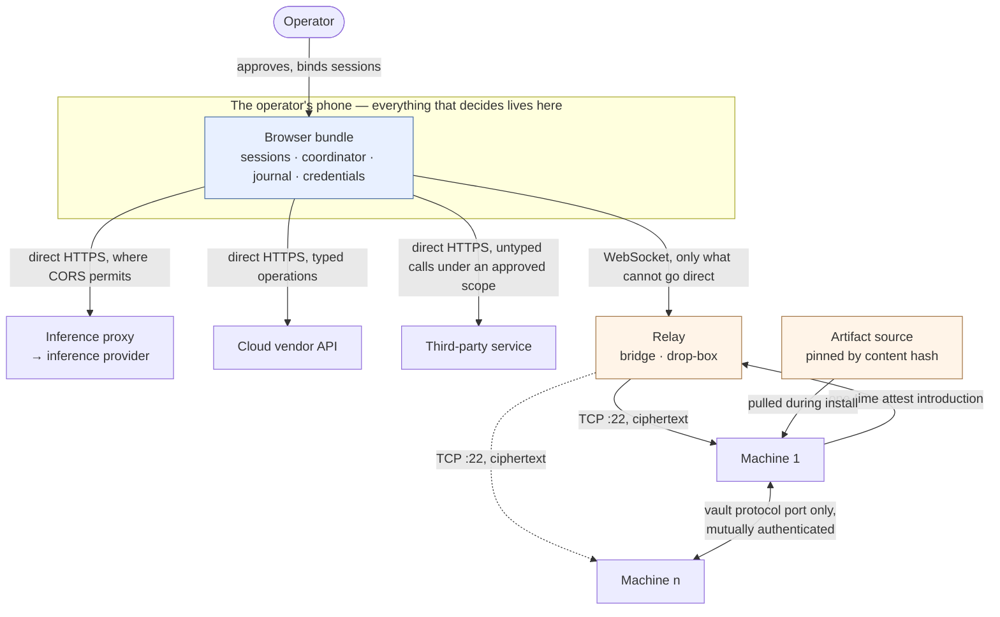

# 00 — Overview

tau-web is a client-side AI harness: an application that runs entirely in a phone browser
and provisions real infrastructure on its operator's behalf. Nothing provisions a machine
except the operator's own device — there is no server-side agent and no hosted
orchestrator. It exists so that a non-technical person can stand up and operate machines
whose value depends on not handing any one party the ability to act on all of them.

That is the goal, not an achieved property. Several parties remain trusted, and
[`05-trust.md`](./05-trust.md) names every one of them by hand rather than claiming the
list is empty.

There is no code in this repository. `tau-web` is a working name.

## How to read this

| Where | What it holds |
|---|---|
| [`00-overview.md`](./00-overview.md) | The problem, the audience, and the six constraints (`OVR-*`) |
| [`01-architecture.md`](./01-architecture.md) | How the system is put together (`ARC-*`) |
| [`02-channel.md`](./02-channel.md) | Reaching a machine: SSH, the five routes to a fingerprint, the relay (`CHN-*`) |
| [`03-state-and-recovery.md`](./03-state-and-recovery.md) | Durable state, crash recovery, and what survives a lost phone (`STA-*`) |
| [`04-security-model.md`](./04-security-model.md) | The invariants, the credential inventory, and the security claim (`SEC-*`) |
| [`05-trust.md`](./05-trust.md) | Who must still be trusted, in three tiers (`TRU-*`) |
| [`06-first-stage.md`](./06-first-stage.md) | What the first stage must demonstrate (`STG-*`) |
| [`07-conformance.md`](./07-conformance.md) | What an implementation must show before touching a real account (`CNF-*`) |
| [`08-open-questions.md`](./08-open-questions.md) | Everything still unknown (`OPN-*`) |
| [`CONTEXT.md`](./CONTEXT.md) | The domain glossary. Definitions only |
| [`docs/adr/`](./docs/adr/) | The decisions, and for most of them the alternatives rejected and why |
| [`docs/review/`](./docs/review/) | Review records, kept as history |
| [`docs/design/`](./docs/design/) | The design session of 2026-08-07, kept as history |
| [`docs/archive/`](./docs/archive/) | The original Rust/WASM PWA specification. Superseded as a plan, retained as prior art |

[`executive-summary.md`](./executive-summary.md) is a shorter read for someone who wants
the shape without the detail. [`TASKS.md`](./TASKS.md) is the open work.

**Requirements carry stable identifiers.** `OVR-4` means the same requirement forever,
wherever it moves. Cross-references go by identifier, never by position in a list, because
two renumberings have already cost review rounds spent re-verifying what pointed where.

One document referred to here lives outside this repository: **`ai-vps-harness`**, the
proof of concept, which established that a browser can call a cloud vendor's API directly.
Its `§` numbers are its own. The archived specification's `§` numbers are also its own, and
neither belongs to this document.

**Where this repository and the archived specification disagree, this one wins.** The
archive is the execution layer in far more detail — a Rust-first PWA compiled to
WebAssembly, a harness kernel, an asynchronous Bash interpreter, WASI guests,
capability-scoped tools, a dedicated worker owning mutable state. It carries 15
architectural decisions of its own, 10 numbered invariants, 14 MVP criteria, a 29-crate
workspace and milestones M0 through M6, none of which are the decisions or requirements
recorded here.

## The problem

Agentic AI is desktop-gated. Technical users run real harnesses against the best models and
get an AI that *acts*; everyone else gets a chat box, because installing and configuring a
harness takes technical knowledge and usually a desktop. The people who would gain the most
have only a phone.

**That gap is widening, not closing.** Most people are mobile-only and will stay that way,
and both mobile platforms keep tightening what may be installed outside their stores. The
browser is therefore not a compromise accepted for convenience — it is the last route by
which a non-technical person reaches real compute, and real AI, without a third party
configuring it for them. That is why `OVR-1` is a constraint and not a preference.

The obvious fix is a hosted agent platform, and for one class of task it is unavailable in
principle. Anything whose value depends on *not* trusting a host cannot be delegated to a
host, because the host becomes the party you were trying not to need. Self-custody, key
management, sovereign infrastructure: a vault whose members were all provisioned by one
party has been defeated by that party whatever its intentions, and the same shape recurs
anywhere the point is that nobody else can act for you.

So: a harness that runs in the browser, provisions and operates machines the operator rents
and controls, and makes authenticated calls on their behalf. **Tenants build on it** —
supplying their own briefs, their own software, and their own security requirements
([ADR-0016](./docs/adr/0016-the-harness-isolates-and-counts-tenants-set-thresholds.md)).
Two are intended, and ad hoc use is a third that needs neither of them:

- **[btc-policy](https://github.com/douglaz/btc-policy)** — self-hosted Bitcoin custody:
  multisig plus Miniscript descriptors, a federation of policy co-signers that inspect
  exact PSBTs, delayed sovereign recovery. Standing the federation up means provisioning
  and hardening several machines at several vendors.
- **[lnrent](https://github.com/douglaz/lnrent)** — server rental over Bitcoin. Operators
  run a daemon, publish over Nostr, buyers pay Lightning or Fedimint. An operator who
  cannot stand up the daemon cannot participate, and the project keeps AI out of its
  serving path by design, so any AI help has to live on the user's side.

  **tau-web is the replacement for that project's current provisioning path.** As
  implemented today the daemon holds a cloud vendor token and creates and destroys machines
  itself, which is exactly the arrangement `SEC-3` forbids. Under the replacement the
  harness holds the vendor credential in the browser and provisions through typed
  operations, the daemon holds no cloud credential, and the project's existing provisioning
  scripts move into the harness as briefs and adapters.

  **The operator's machine is then the capacity being sold** — the daemon rents slices of
  the hardware it runs on, so fulfilling an order needs no cloud-plane action and no open
  browser (`ARC-35`, [ADR-0023](./docs/adr/0023-a-tenants-runtime-obligations-belong-to-its-machines.md)).
  That is what makes dedicated hardware the right shape for this tenant rather than merely
  a cheap place to park a control plane.

The second turns out to be load-bearing for the first rather than merely a second tenant,
for the reason given in [`01-architecture.md`](./01-architecture.md#money).

## Who it is for

Someone who is mobile-only and wants a machine — or a service, or an authenticated call —
that is theirs rather than a hosted product's. That is deliberately wider than any single
tenant, and the harness has no narrower answer to give.

**Each tenant's economics differ sharply, and they are tenant facts rather than product
facts.**

- **btc-policy.** 3-of-5 by default
  ([ADR-0008](./docs/adr/0008-three-of-five-default-and-its-economic-floor.md)) means five
  machines, which at the `cx22` reference price of €4.59/month is **€275 per year** before
  inference; a 2-of-3 federation is €165. At a willingness to pay roughly 1% per year for
  custody, those imply holdings near €27,500 and €16,500. No vault configuration makes sense
  for someone holding €1,000 — the floor is three machines and three machines cost what they
  cost. *That tenant's* target is a non-technical person with meaningful Bitcoin, worth
  stating plainly rather than letting someone discover it after budgeting for a hobby.
- **lnrent.** The arithmetic inverts. An operator is one machine, not five, and dedicated
  hardware is the best value per unit of capacity for rental — so the cost that makes a
  vault expensive makes a rental server sensible.
- **Ad hoc use.** One machine, no threshold, no federation, and none of the above.

## System context

The relay is **direct-first**: it carries only what the browser cannot do alone. See
`ARC-14`.

## Constraints

Six constraints bound every decision here. `OVR-4` is satisfied only where a host key can
be pinned out of band — the first stage's dedicated path, not yet the cloud path — and
`OVR-6` is counted and displayed rather than enforced.

**OVR-1** The mobile browser MUST be the runtime. No install, no extension, no native
package, no desktop, no terminal. A normal HTTPS URL on Android Chrome and iOS Safari.

**OVR-2** The AI MUST be free to act. Future adversity on a machine is not enumerable in
advance. Restricting the AI's authority to keep it safe breaks the only reason it is there.

**OVR-3** Credentials MUST live only where the credential inventory (`SEC-5`) names, with
the lifetime it states. No credential is written to storage in cleartext, sent to the
application's own origin, included in a model request, or persisted in a log.

**OVR-4** Beyond the application itself, this product MUST add **one** component in every
session's path — the relay, publisher-run by default and so a capability of an
already-trusted party rather than a new one
([ADR-0019](./docs/adr/0019-the-publisher-operates-the-default-relay.md)) — and it MUST NOT
be able to read or inject. A transport that can only stall or drop is acceptable.

This constrains what the *product introduces*, not trust the operator already carries:
their phone, their cloud vendor, the model they chose. That distinction is the whole of
[`05-trust.md`](./05-trust.md), and stating the constraint any other way makes it
unsatisfiable rather than unsatisfied — everything runs on something. On the default
inference path the publisher additionally selects the models — a wider role for a party
already trusted for the bundle, not a second added party — and bring-your-own inference
removes that role.

**Satisfied under any route that pins the host key out of band; violated under
trust-on-first-use**, where the relay is trusted at first contact and can have its own key
pinned. No out-of-band route exists on the cloud path today: `CHN-R1` is dedicated-only and
a separate integration, **`CHN-R2` does not exist**, and `CHN-R3` is blocked behind
`OPN-13`. That is why the first stage runs on dedicated hardware
([ADR-0018](./docs/adr/0018-first-stage-is-one-lnrent-box-on-dedicated.md)). For the cloud
path, **`CHN-R5` — attest** — is designed to close exactly this gap; it has not yet run,
and `OPN-3` tracks the probe. Passing the SSH spike is necessary and does not by itself
satisfy this; the routes are what make it sufficient.

**OVR-5** Members MUST NOT share a cloud vendor. The vendor owns its machine's memory and
disk and is trusted under every design considered, so two members at one vendor is one
party able to act on both — the correlated fault a threshold cannot absorb. Nothing in the
design forces vendor sharing, so unlike the proxy layer this one is enforced: at the
shipped default of one vendor per machine, relaxable by the tenant toward its own
quorum-relative bound and never past it (`SEC-T3`). What makes it hard is the account floor
under [`01-architecture.md`](./01-architecture.md#money) — a reason it is expensive, not a
reason it is optional.

**OVR-6** Independence between members MUST be counted per layer and shown, not enforced.
Weights and proxy are counted separately, the provider is counted as observed, and a
collision at any counted layer is displayed rather than blocked
([ADR-0007](./docs/adr/0007-trust-is-counted-in-two-layers-and-shown.md)). Blocking would
make the default configuration impossible, because procured inference routes every member
through one proxy by design — so at the proxy layer the default product *does* share a
domain, deliberately and visibly. Independence is the security parameter; it is not a
precondition this product can enforce.

## The decisions

Each is a consequence of the ones above it. Where a decision had a real alternative, the
record carries it and the grounds for rejecting it. This document states *what* was decided;
an ADR is where *why* lives.

| ADR | Decision |
|---|---|
| [0001](./docs/adr/0001-briefs-are-instructions-not-scripts.md) | Briefs are instructions the AI reads, not scripts it executes |
| [0002](./docs/adr/0002-cloud-plane-and-box-plane.md) | Cloud-plane actions are typed operations, box-plane actions are free shell |
| [0003](./docs/adr/0003-the-ai-runs-only-in-the-browser.md) | The AI runs only in the browser; a machine is a target, never an actor |
| [0004](./docs/adr/0004-one-model-one-machine.md) | One model, one machine, and an honest-majority assumption |
| [0005](./docs/adr/0005-briefs-ship-in-the-signed-bundle.md) | Briefs ship in the signed app bundle |
| [0006](./docs/adr/0006-single-origin-with-reproducible-builds.md) | One origin, with reproducible builds |
| [0007](./docs/adr/0007-trust-is-counted-in-two-layers-and-shown.md) | Trust is counted per layer, and shown rather than scored |
| [0008](./docs/adr/0008-three-of-five-default-and-its-economic-floor.md) | 3-of-5 as btc-policy's default, and the economic floor it implies |
| [0009](./docs/adr/0009-one-device-concurrent-sessions-batched-approval.md) | One device, concurrent sessions, approvals batched up front |
| [0010](./docs/adr/0010-members-reach-each-other-on-one-authenticated-port.md) | Members reach each other on one authenticated port, everything else denied |
| [0011](./docs/adr/0011-the-ai-delivers-a-locked-down-machine.md) | The AI delivers a locked-down machine and demonstrates it, per vendor |
| [0012](./docs/adr/0012-a-federation-is-created-only-when-every-member-works.md) | A federation is created only when every member works |
| [0013](./docs/adr/0013-ongoing-operation-periodic-pentest-and-advisory-watch.md) | Ongoing operation: periodic pentest and advisory watch |
| [0014](./docs/adr/0014-the-app-relays-invoices-and-never-holds-funds.md) | The app relays invoices and never holds funds |
| [0015](./docs/adr/0015-the-browser-reaches-a-machine-over-pinned-ssh.md) | The browser reaches a machine over SSH, pinned at the application layer |
| [0016](./docs/adr/0016-the-harness-isolates-and-counts-tenants-set-thresholds.md) | The harness isolates and counts; tenants set thresholds |
| [0017](./docs/adr/0017-off-machine-calls-and-scope-approval.md) | Off-machine calls generalize the cloud plane; untyped ones are approved by scope |
| [0018](./docs/adr/0018-first-stage-is-one-lnrent-box-on-dedicated.md) | The first stage is one lnrent box on a dedicated server, over the full channel |
| [0019](./docs/adr/0019-the-publisher-operates-the-default-relay.md) | The publisher operates the default relay; bring-your-own is the escape hatch |
| [0020](./docs/adr/0020-recovery-roots-in-the-vendor-account.md) | Recovery roots in the vendor account; the cloud pin is introduced by attestation |
| [0021](./docs/adr/0021-the-surface-pentest-is-outside-in.md) | The surface pentest is outside-in, and may use a specialist model |
| [0022](./docs/adr/0022-durable-state-is-an-append-only-journal.md) | Durable state is an append-only journal in origin-private storage |
| [0023](./docs/adr/0023-a-tenants-runtime-obligations-belong-to-its-machines.md) | A tenant's runtime obligations belong to its machines |
