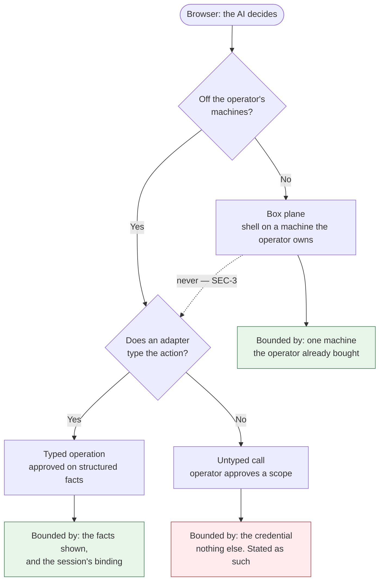
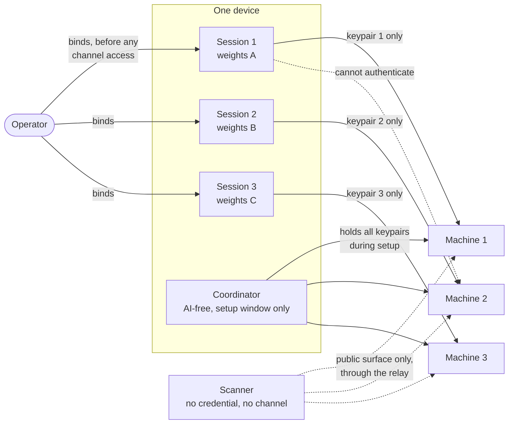
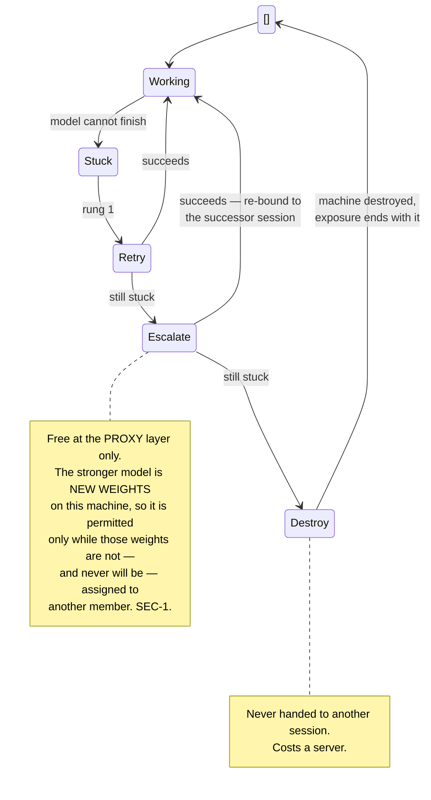

# 01 — Architecture

## The AI runs only in the browser

**ARC-1** The AI MUST run in the operator's browser. A provisioned machine is a target,
never an actor: it MUST NOT hold an inference key or a vendor API token belonging to the
harness, and it MUST NOT initiate work
([ADR-0003](./docs/adr/0003-the-ai-runs-only-in-the-browser.md)).

The one machine-originated message *to the harness* is the attest introduction (`CHN-R5`),
which acts on nothing on the machine's behalf; its only authority is the one-time
introduction, handled as the short-lived credential `SEC-5` classifies. An inference key on
a machine is a credential living outside browser memory, and a machine that can call a
model unprompted is a machine that can act unprompted — which is the thing this project
exists to avoid.

**ARC-2** Nothing runs while the app is closed. This is accepted rather than worked around.
Every step MUST be resumable across a locked phone, and progress MUST survive the harness
worker being killed — which is what `03-state-and-recovery.md` specifies and `STA-9`
constrains.

## Two planes

**ARC-3** Actions split into two planes with different rules
([ADR-0002](./docs/adr/0002-cloud-plane-and-box-plane.md)).

**Cloud plane** covers any action taken **off** the operator's machines with a credential
they supplied — creating, destroying, resizing, firewalling or paying at a vendor, and
equally a call to any other third-party service
([ADR-0017](./docs/adr/0017-off-machine-calls-and-scope-approval.md)). It has two approval
modes:

- **Typed operations**, where an adapter exists: the action carries structured metadata and
  each one is approved on its own facts rather than on command text.
- **Untyped calls**, where none does: the operator approves a *scope* — this credential,
  this origin — every call is recorded before it is sent, and the harness **claims nothing
  about what the credential can do.** It usually cannot know: most services publish no
  machine-readable statement of what a key authorizes, and a bound stated on a guess is
  worse than none.

**Box plane** covers shell execution on a machine the operator already owns. It is
free-form, never pre-approved, always recorded.

The split is **off-machine versus on-machine**, and each side carries its own reasoning
rather than sharing one. Box-plane work can be free-form because the worst case is ruining
one machine the operator already bought — that bound is what makes it tolerable. Cloud-plane
work has no such bound: it can spend a credit card, publish irreversibly, or read an entire
account.

**ARC-4** Approval means two different things and the interface MUST NOT blur them.
Approving an *operation* means seeing structured facts about one action and permitting it —
available only where an adapter types the action. Approving a *scope* means permitting a
class of activity in advance, which is what box-plane work runs under, because its contents
are not known beforehand, and what an untyped call runs under, because nothing types it.

**ARC-5** A scope names where a credential goes, not what it can do. Box-plane work is
bounded by the machine. An untyped call is bounded only by the credential — so approving
one is approving that key's full authority at that host, for as long as it is valid,
whatever the brief intended at the time. Where a service offers a scoped or read-only key,
using one is the only thing that actually narrows this, and it is the operator's move
rather than the harness's.

**ARC-6** A scope MUST be an exact origin, and a redirect that leaves it MUST end the call.
Browsers follow redirects automatically, and a credential riding in a custom header rides
along to the new origin — a body does too, under 307/308 — so an approved host with an open
redirect would otherwise launder the credential to an origin nobody approved, in a request
never recorded. (A query-string credential is not replayed by the browser; only a server
that echoes it into the redirect target forwards it.) The mechanics force the strict form:
under browser fetch, following is automatic unless disabled, and the redirected request
would be sent before any check could run. So **every scoped call is sent with redirect
following disabled**, and a redirect response simply ends the call. The browser returns a
blocked redirect opaque, destination hidden, so nothing can be auto-surfaced for approval:
reaching wherever the service moved starts from what the service documents, as a new scope.

## Box-plane execution is command-granular

**ARC-7** Remote box-plane execution MUST be command-at-a-time: the harness sends one
command, captures its output, and returns to the model. It is not an interactive terminal
session.

**ARC-8** Recording commits **per command**, before transmission. "Every byte recorded
before transmission" would otherwise imply a granularity nobody chose, resting on an
execution model nobody had stated, and the two plausible readings differ by orders of
magnitude in cost on a phone. Command granularity also produces a transcript an operator
can read, which is what an action transcript is for.

The cost is stated: anything genuinely interactive — an installer that stops to prompt —
MUST be handled by the brief rather than answered live.

## Briefs

**ARC-9** A brief is a document of prose plus example commands, in the shape of an agent
skill. The AI reads it and decides what to actually run; it MUST NOT be executed verbatim
([ADR-0001](./docs/adr/0001-briefs-are-instructions-not-scripts.md)). A script stops dead
at the first surprise — a changed image name, a package that will not install, a service
that will not start — and the AI exists precisely for the surprises. A setup nobody can
finish sends the operator back to a custodian, which is worse than the risks this design
accepts.

The cost is paid honestly: what runs is not known before it runs, which is what forces
approval to draw on structured facts from the cloud plane rather than on command text.
Adaptations also do not accumulate — the same problem may be solved differently on two runs,
and the library does not improve on its own.

**ARC-10** A brief MUST be safe to re-run from the top. Since the AI improvises, there is
no fixed step list to resume against; the recovery path for an interrupted brief is
**reconnect, read the machine's state, and continue from what is found**. Convergence is
therefore an authoring rule, not a subsystem, and a declarative distribution (`ARC-24`)
makes it close to free.

**ARC-11** Briefs MUST ship inside the signed application bundle
([ADR-0005](./docs/adr/0005-briefs-ship-in-the-signed-bundle.md)). Nothing fetches a brief
at runtime and operators cannot supply their own. A brief is prose that steers a model,
which is prompt injection by design, and every member reads the same brief — so whoever can
change one reaches every member at once. That defeats the honest-majority assumption rather
than being absorbed by it: n honest, competent models faithfully following poisoned
instructions all produce the wrong machine, and agree with each other perfectly while doing
it. The brief is the one component where diversity buys nothing, so it is locked instead.

The format is **not** shared with lnrent. That project's *recipes* are executables its
daemon runs with high privilege; these are prose that must never be run as written, and no
format spans both. The real relationship is a **layering** — one of these documents can tell
the AI to invoke an lnrent hook as a deterministic tool. The library is not shared either:
each project ships its own set inside its own bundle.

## Sessions, binding, and diversity

**ARC-12** A **session** is one run of the harness under one set of model weights,
responsible for exactly one machine. A federation is provisioned by several concurrent
sessions on a single device
([ADR-0009](./docs/adr/0009-one-device-concurrent-sessions-batched-approval.md)). The
binding rule and its enforcement are `SEC-1`.

**Why one device.** The separation that matters is between models, not between pieces of
hardware. The device is already a trusted party, so putting five sessions on it adds no
party that was not already trusted. Requiring five devices would defend against a
compromised phone while guaranteeing that an operator who owns one phone never finishes
setup.

**Why concurrent.** Nothing runs while the app is closed, so sequential provisioning would
multiply the time the operator must hold a phone awake by the member count. A twenty-minute
install becomes a hundred-minute one. Concurrency costs nothing in security, since `SEC-1`
binds each session to exactly one machine, and simultaneity does not change which session
touches which machine.

**ARC-13** Concurrency MUST be bounded for mobile. The archived specification already rates
mobile memory pressure as a high risk and defaults its command-worker pool to one on
mobile; five concurrent sessions each holding a model stream and a remote session need the
same treatment. **No number has ever been measured**, and the first stage runs exactly one
session, which makes it the only cheap opportunity to learn whether five is possible —
`CNF-24` requires the measurement.

**ARC-14** A trust domain MUST be counted at two configured layers plus one observed, never
as one blended number
([ADR-0007](./docs/adr/0007-trust-is-counted-in-two-layers-and-shown.md)):

- **Weights** — the model itself. Two members on different weights survive one set of
  weights being backdoored, even through a shared proxy.
- **Proxy** — the aggregator routing the request. A compromised proxy can alter every
  prompt and response it carries, whatever weights sit behind it.
- **Provider, observed** — the party that actually served each response, read from
  `X-Provider-Name`. Chosen per request by the proxy, not configured by anyone, so this
  count is historical: it says how many distinct providers the witnessed traffic landed at,
  and it never promises the next request lands the same way.

A 3-of-5 federation on five sets of weights behind one proxy is 3-of-5 against backdoored
weights and 1-of-1 against a backdoored proxy. Both numbers are true; one number would be a
lie about whichever layer is thin, and the thin layer is the one that gets exploited. A
**collision** — two machines sharing a domain at any counted layer — is *shown, not
blocked*, because procured inference shares a proxy by design.

**ARC-15** Every machine creation is known before anything starts, so approvals MUST batch:
one screen showing the whole federation and its true recurring cost. An untyped call's scope
rides the same rules — approved with the up-front batch when the brief names the service,
joining the mid-flight queue when one is discovered later. **No untyped call runs before its
scope is approved.** Five concurrent workers producing interleaved popups on a phone is
modal fatigue in its purest form, and the operator cannot tell which member is asking.

**ARC-16** Recovery is a ladder. Retry; then escalate to a stronger model behind the same
proxy; then destroy the machine and restart under a different domain, which costs a server.

Partial failure is the normal case and MUST be a coherent state the operator can act on,
not an error.

## What a session delivers

**ARC-17** A session's deliverable is a machine that is provisioned, hardened, running the
software its tenant calls for, reachable, and **shown to be locked down** by a lightweight
self-directed pentest — open ports, default credentials, sshd posture, exposed services
([ADR-0011](./docs/adr/0011-the-ai-delivers-a-locked-down-machine.md)). Hardening is a
property the session demonstrates, not a step it reports having performed.

**The pentest is a competence check, not an integrity check.** A model examining its own
machine proves nothing against a malicious model. Where the tenant has a threshold it does
not need to — malice is what the threshold absorbs. On a single-machine tenant nothing
absorbs malice and the pentest does not pretend to: that risk is accepted, as `SEC-CLAIM`
states plainly. Either way, honest-but-sloppy is the likely failure on a first-time setup,
and it is the one this catches. It never runs from another member.

**ARC-18** The job MUST NOT assume uniformity across vendors. Hetzner Cloud has no image
upload API at all and requires a rescue-and-write approach, while others offer import paths
that differ from each other and from that. That heterogeneity is an argument *for* the AI,
not against it.

## The coordinator and federation creation

**ARC-19** The **coordinator** is AI-free deterministic code running from the signed bundle
on the operator's device. It takes member endpoints plus operator-supplied recovery
descriptors and forms the federation by calling member APIs. It is the only party that
reaches **inside** every member, which is permitted precisely because it is not a model —
the scanner, which is one, touches only the public surfaces the whole internet already sees
([ADR-0021](./docs/adr/0021-the-surface-pentest-is-outside-in.md)).

Its channel access is a **distinct grant** with its own lifetime, not a borrowed session
binding: see `SEC-1`.

**ARC-20** Federation creation MUST be all-or-nothing
([ADR-0012](./docs/adr/0012-a-federation-is-created-only-when-every-member-works.md)). A
partially-formed federation has no honest description: a 3-of-5 vault with four working
members is not "80% set up" — its real threshold, failure modes, and security claim are all
different from the thing the operator approved, and none of those differences are visible
from a progress bar.

**ARC-21** Abandonment MUST be a first-class action — a cloud-plane operation with the same
approval treatment as creation — because all machines exist and bill from the moment they
are created, while one member is retried or replaced.

**ARC-22** An unfinished setup MUST own the first screen. Nothing runs while the app is
closed and no push channel exists, so the moment the app opens is the only moment the
product can speak, and it spends that moment on the thing that is costing money.
Resume-or-abandon *is* the opening screen, not a badge: it shows roughly what has been
billed so far and what it bills per month until finished or abandoned. After roughly a week
without progress the emphasis flips and abandonment leads. Abandonment destroys every
machine of the setup through typed operations, and the screen states plainly what stops
billing — the machines — and what does not: the vendor accounts themselves.

**An unfinished setup is device-bound.** It is resumed on the device that started it, or
abandoned. That follows from all-or-nothing plus exposure ending with the machine (`SEC-1`),
and needs no new mechanism. A second device shows a clean app while the first device's
machines keep billing, which the abandonment screen's cost figures are the only defence
against.

## Member networking

**ARC-23** Members MUST open connections to each other only on the vault protocol port,
mutually authenticated. No SSH between members, no arbitrary traffic, everything else
denied at the vendor firewall
([ADR-0010](./docs/adr/0010-members-reach-each-other-on-one-authenticated-port.md)).

**Network reachability is a foothold on the same terms as a credential.** If the machines
can reach each other, a model controlling machine 1 can attack machines 2 through 5
directly, and `SEC-1` is broken by the network rather than by any grant. A k-of-n threshold
assumes faults are **independent**, and one model able to attack four other machines
produces *correlated* faults — the one assumption a Byzantine threshold cannot survive
losing.

The vault protocol must therefore be safe against actively hostile peers, not merely faulty
ones. This is confirmed to be btc-policy's own premise rather than a new requirement.
Because firewall rules are cloud-plane, the deny-by-default posture is visible to the
operator, and a brief cannot quietly widen it.

**The firewall MUST NOT privilege the relay's source addresses** — no allowlist, no
relay-only port — because a privileged source would make the relay-side surface larger than
the world's, and the scanner's no-access argument (`ARC-26`) depends on it being equal.

## The operating system, and where it comes from

**ARC-24** The chosen distributions are **Alpine and NixOS**. Neither is offered by the
dedicated vendor's automatic installer, so **custom image installation is mandatory on that
path**, not the optimisation ADR-0011 calls it. That is one of the two reasons the install
runs from inside a rescue session; the other is that rescue is what publishes the host key
(`CHN-R1`).

A declarative distribution also repays `ARC-10`: a system whose state is described rather
than accumulated is one a reconnecting session can converge on rather than reconstruct. And
two machines running the same image hash is a stronger statement than two machines that ran
the same brief.

**ARC-25** The **artifact source** — an image, a mirror, a channel — MUST be treated as an
untrusted dependency **pinned by content hash supplied from the browser**. The rescue
session pulls from a URL; the browser supplies the expected hash; a mismatch halts the
install. This is the same shape as the relay pinned by host key and the bundle pinned by
published hash, and it is the third instance of a pattern already in use. The source is a
named party in `TRU-E8`, because whoever decides what every machine runs has the same blast
radius as the bundle.

## Ongoing operation

**ARC-26** A machine MUST be periodically re-checked, and upstream releases and security
advisories for the software it runs reviewed
([ADR-0013](./docs/adr/0013-ongoing-operation-periodic-pentest-and-advisory-watch.md)). The
re-check has an inside and an outside, with different owners
([ADR-0021](./docs/adr/0021-the-surface-pentest-is-outside-in.md)):

- **Inside** — anything needing the channel — belongs to the machine's own session and
  nobody else, because access composes.
- **Outside** — the public surface through the relay: which ports answer, whether
  deny-everything-but-one-port holds — is the **scanner's**: a specialist model of the
  operator's choosing, run after first-online and periodically, holding member addresses and
  no credential, no channel, no binding. **The model never composes probe traffic**: the
  probes are a deterministic allowlisted toolset, and the model picks targets and reads
  observations, so even a malicious specialist cannot attack through the probe. The tool
  contract bounds invocation too — per-run and per-target call limits, pacing, cancellation,
  bounded output.

What the scanner costs is **topology**: its full inference path sees the member set, model,
proxy and provider alike, a named row in the trust display (`TRU-E6`). What it produces is
reports: observations that never gate, never act, and are never called verified.

**ARC-27** How much of the re-check is possible follows from the tenant's **access model**,
exactly as the threshold does. On **maintained** machines — lnrent boxes, ad hoc use — the
machine is re-entered by a later session bound to it. On **sealed** machines nothing
re-enters, by the tenant's own design: btc-policy uninstalls SSH after setup and forbids
upgrade-in-place, precisely so nobody can be forced back into a vault node. There the inside
half does not exist and the re-check *is* the scanner's surface probe, plus an advisory
watch whose only remedy is rotating to a successor vault.

**ARC-28** Fetched external content MUST be typed as untrusted, advisory review **reports
rather than acts**, and the set of feeds MUST ship signed like the briefs. An advisory
reading "critical: upgrade immediately to package X from repository Y" is a supply-chain
attack delivered through the feature meant to make the vault safer. The first of those is a
general rule, not a rule about advisories: any box-plane command already returns
attacker-influenceable text, and the archived specification types *all* tool output as
untrusted (§20.5) for that reason.

## Money

**ARC-29** Recurring costs — the machines — are billed by the cloud vendor to the operator's
own account on their own payment method. The app never mediates this and cannot stop it;
only the operator can.

**ARC-30** One-off costs — inference credits — are assisted. The app retrieves an invoice
from the provider and hands it to the operator's wallet to pay. It relays an invoice; it
MUST NOT hold, forward, or custody funds
([ADR-0014](./docs/adr/0014-the-app-relays-invoices-and-never-holds-funds.md)). A payment
intermediary would be the one place in the design where the operator is asked to trust
*more* rather than less.

**ARC-31** Payment evidence MUST NOT be overstated. A **settled invoice** proves the
operator funded credits at a provider and bounds which proxies are available; it does not
prove which member used which proxy, because one top-up buys many queries. Per-member
routing evidence is separate and comes from response metadata.

**Inference has two paths.** *Procured* is the default: the operator pays one fee and the
publisher selects the models, reaching them through one aggregator, so every member is
routed through a single proxy. *Bring-your-own* is the advanced path: the operator supplies
provider tokens or runs inference locally, removing the publisher from model selection and,
locally, the proxy layer entirely.

**This is where lnrent becomes structural.** Paying for inference is *nearly* solved — an
aggregator that takes Lightning with no registration would make funding several providers a
few invoices, subject to the browser reachability `OPN-7` records as unprobed. Cloud vendors
are not: they want an account, a card, and a recurring billing relationship, and a 3-of-5
federation across distinct vendors means several of those. Without something like lnrent,
`OVR-5` collides with the operator's willingness to open billing relationships, and vendor
diversity quietly collapses to whatever account they already had.

## Distribution

**ARC-32** The application MUST be served from a **single origin**, as a static HTTPS host.
No app store, no package manager, no install step — that is the product. Builds MUST be
reproducible and their hashes published, so a third party can verify that the served bundle
matches the published source
([ADR-0006](./docs/adr/0006-single-origin-with-reproducible-builds.md)).

Origin diversity — a different mirror per member — was considered and **rejected on user
safety, not security.** Instructing someone to open a second URL on a second device is
behaviourally identical to phishing, and the target operator is precisely the person least
equipped to tell the difference.

So the bundle remains a common-mode component — the largest, and the one that carries the
briefs, though not the only one: the software signer is another (`TRU-E7`). Reproducible
builds make a compromised bundle detectable, not preventable, and the target operator will
not verify a hash on a phone. The mitigation that matters is **third-party watchdogs** —
independent parties routinely fetching and comparing the served bundle, so an attacker
cannot know who is checking. Neither reproducible builds nor watchdogs exist today
(`OPN-15`).

**ARC-33** Content-Security-Policy is **not** the security boundary for off-machine calls —
approval and recording are (`SEC-4`, `SEC-12`) — but it is the boundary for code the harness
never meant to run, and the two are different directives.

- **`connect-src` is permissive** for `https:` and `wss:` alike. The design does not restrict
  what the harness can *reach*; it restricts what runs without the operator's say. Exactness
  for the relay was only free while its origin was a constant, and the bring-your-own and
  self-hosted trajectories make it configuration.
- **`script-src`, `object-src` and `base-uri` stay strict** (`script-src 'self'
  'wasm-unsafe-eval'`, `object-src 'none'`, `base-uri 'self'`). Approval and recording are
  functions inside the bundle; **injected code never calls them.** The bundle is already the
  largest concentrated risk, with no reproducible builds and no watchdogs today, so this is
  the one control that binds that risk and it costs nothing.

**ARC-34** Continuous integration MUST run the CORS probe on every push, because browser
reachability is an external dependency that can regress silently.
