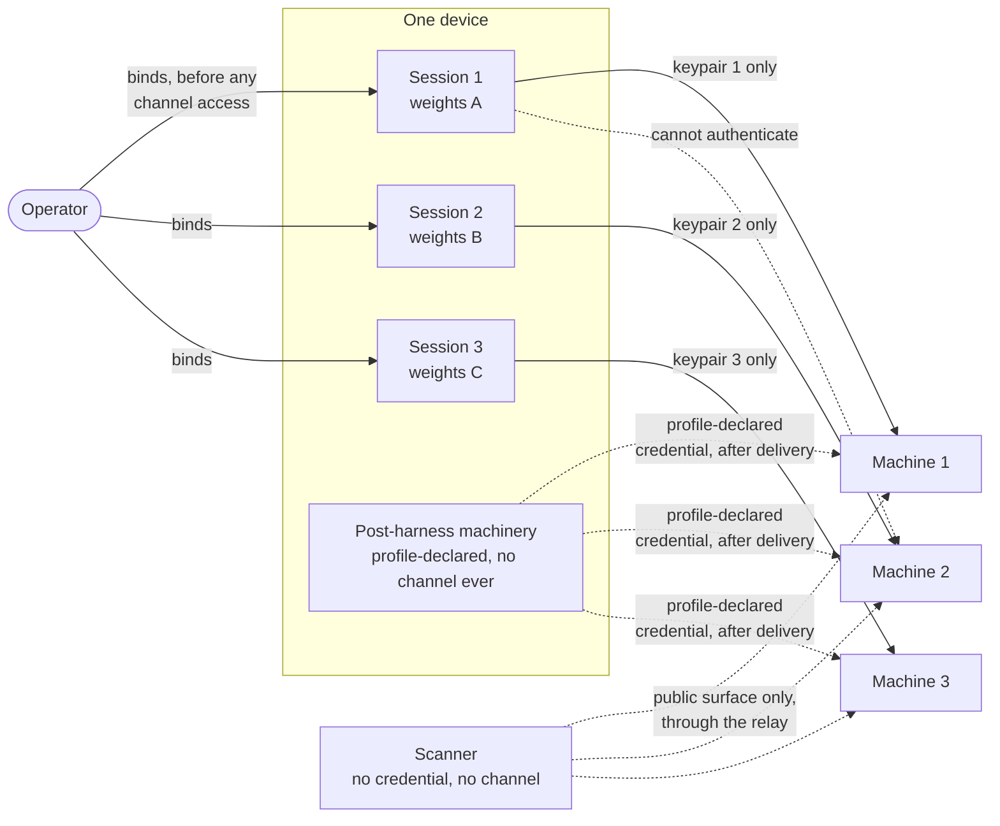
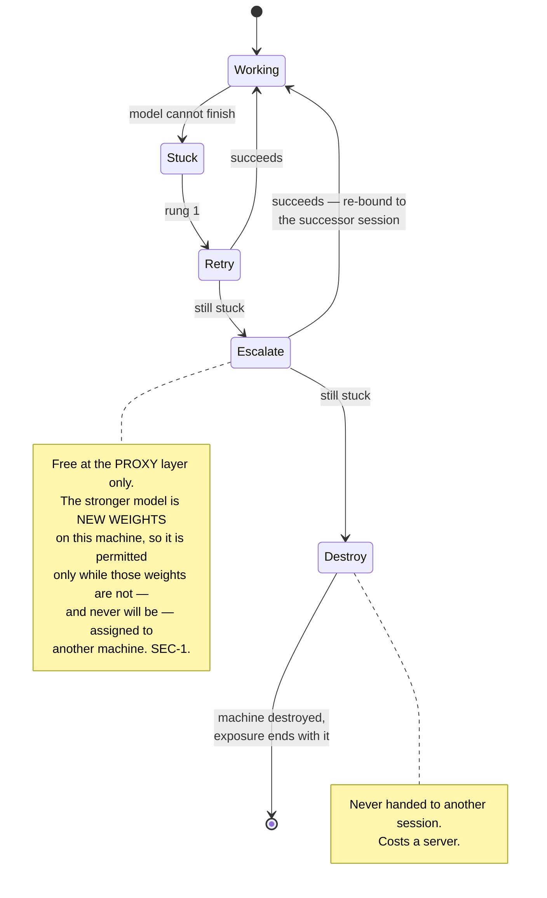

# 01 — Architecture

## The AI runs only in the browser

**ARC-1** The AI MUST run in the operator's browser. A provisioned machine is a target,
never an actor: it MUST NOT hold an inference key or a vendor API token belonging to the
harness, and it MUST NOT initiate work
([ADR-0003](./docs/adr/0003-the-ai-runs-only-in-the-browser.md)).

A machine may *tell* the harness something over the notify channel (`CHN-17`), and what it
tells is an **observation**: typed untrusted, never gating, never acting. The channel's one
use today is the attest introduction (`CHN-R5`), which acts on nothing on the machine's behalf;
its only authority is the one-time introduction, handled as the credential `SEC-5` classifies.
An inference key on a machine is a credential living outside browser memory, and a machine that
can call a model unprompted is a machine that can act unprompted — which is the thing this
project exists to avoid. A machine that can send an event the browser treats as content is not
that, and the typing is what makes the difference.

**ARC-2** Nothing runs while the app is closed. This is accepted rather than worked around.
Every step MUST be resumable across a locked phone, and progress MUST survive the harness
worker being killed — which is what `03-state-and-recovery.md` specifies and `STA-9`
constrains.

## What the harness does not do

**ARC-35** The harness provisions and operates; it MUST NOT serve. Any obligation a tenant
must meet **while the operator's browser is closed** has to be met on the machine, by the
tenant's own software, without a harness credential
([ADR-0023](./docs/adr/0023-a-tenants-runtime-obligations-belong-to-its-machines.md)).

This is a constraint on what can be a tenant, and it is worth checking before building rather
than after. A project whose value depends on answering the outside world while the operator is
away must put that answer on the machine — with no **harness** credential, since `SEC-3`
forbids that and `SEC-6` notes a model with root would read it anyway — or accept that it is
not a fit. A tenant's *own* credential on its own machine is permitted (`SEC-3`'s note on what
it binds, `SEC-5` row 12) and is what `ARC-38`'s delegated receiving needs in order to authenticate to
the service it delegates to. For lnrent that resolves to the machine being the capacity it sells.

**ARC-36** A machine that serves parties the operator has never met is **multi-tenant**. This
is a definition rather than a rule: it names the class `ARC-37` binds, and what such a machine
must demonstrate is whatever its tenant declares under `ARC-39` — including its listening
surface, since `SEC-T1`'s deny-everything-but-one-port is btc-policy's rule and binds only
there.

*What this requirement used to say* was that hardening a multi-tenant machine is a different
problem and that `ARC-17` and `OPN-14` were written for the single-purpose case. Both are now
handled: the declaration covers the difference, and the harness does not need to know what a
guest boundary looks like in order to check that the declared one holds.

**ARC-37** A multi-tenant machine MUST NOT hold **spendable** key material. Receiving is
watch-only or delegated:

- **Watch-only receiving** holds public material and nothing else: enough to derive receive
  addresses and observe settlement, never enough to spend, so an escaped guest finds nothing
  to take.
- **Receiving that cannot be watch-only** is **delegated** to a receiving service the
  operator chose, which takes the payment and notifies the machine (`ARC-38`). The profile
  names the mechanism either way.

The rule is stated as removal rather than as isolation on purpose. A boundary between a
stranger and a hot wallet is a boundary that has to hold every time; a machine with no
spending authority has nothing for the boundary to protect. This is the same move `SEC-13`
makes for the app and `ARC-30` makes for inference credits, applied to a machine that sells.

**ARC-38** A runtime obligation (`ARC-35`) may be discharged **at a third party the operator
chose, which notifies the machine**, rather than on the machine itself. This is the disposition
that keeps a credential off a box hosting strangers. Its price is an elective trusted party
(`TRU-E9`) which must be named under `SEC-10` rather than absorbed, and which custodies value
between receipt and sweep — a real exposure, bounded by sweep frequency and by the operator's
own choice of service, and far smaller than the alternative it replaces.

## Two planes

**ARC-3** Actions split into two planes with different rules
([ADR-0002](./docs/adr/0002-cloud-plane-and-box-plane.md)).

**Cloud plane** covers any action taken **off** the operator's machines with a credential
they supplied — creating, destroying, resizing, firewalling or paying at a vendor, and
equally a call to any other third-party service
([ADR-0017](./docs/adr/0017-off-machine-calls-and-scope-approval.md)). It has two approval
modes:

- **Typed operations**, where an adapter exists: the action carries structured metadata and
  each one is approved on its own facts rather than on command text.
- **Untyped calls**, where none does: the operator approves a *scope* — this credential,
  this origin — every call is recorded before it is sent, and the harness **claims nothing
  about what the credential can do.** It usually cannot know: most services publish no
  machine-readable statement of what a key authorizes, and a bound stated on a guess is
  worse than none.

One off-machine call is neither: an **inference request** is composed by the harness's own
adapter, never chosen by the model, and is approved once at session creation rather than per
call or by scope. `ARC-31a` states how it is recorded.

**Box plane** covers shell execution on a machine the operator already owns. It is
free-form, never pre-approved, always recorded.

The split is **off-machine versus on-machine**, and each side carries its own reasoning
rather than sharing one. Box-plane work can be free-form because the worst case is ruining
one machine the operator already bought — that bound is what makes it tolerable. Cloud-plane
work has no such bound: it can spend a credit card, publish irreversibly, or read an entire
account.

**ARC-4** Approval means two different things and the interface MUST NOT blur them.
Approving an *operation* means seeing structured facts about one action and permitting it —
available only where an adapter types the action. Approving a *scope* means permitting a
class of activity in advance, which is what box-plane work runs under, because its contents
are not known beforehand, and what an untyped call runs under, because nothing types it.

**ARC-5** A scope names where a credential goes, not what it can do. Box-plane work is
bounded by the machine. An untyped call is bounded only by the credential — so approving
one is approving that key's full authority at that host, for as long as it is valid,
whatever the brief intended at the time. Where a service offers a scoped or read-only key,
using one is the only thing that actually narrows this, and it is the operator's move
rather than the harness's.

**ARC-6** A scope MUST be an exact origin, and a redirect that leaves it MUST end the call.
Browsers follow redirects automatically, and a credential riding in a custom header rides
along to the new origin — a body does too, under 307/308 — so an approved host with an open
redirect would otherwise launder the credential to an origin nobody approved, in a request
never recorded. (A query-string credential is not replayed by the browser; only a server
that echoes it into the redirect target forwards it.) The mechanics force the strict form:
under browser fetch, following is automatic unless disabled, and the redirected request
would be sent before any check could run. So **every scoped call is sent with redirect
following disabled**, and a redirect response simply ends the call. The browser returns a
blocked redirect opaque, destination hidden, so nothing can be auto-surfaced for approval:
reaching wherever the service moved starts from what the service documents, as a new scope.

**ARC-42** A vendor's CORS configuration constrains what the browser may send and read, and
those constraints are facts to be probed rather than assumed. Measured against the cloud vendor
the proof of concept tested, and recorded because the specification lost them once already:

- **Only headers the destination allow-lists survive the preflight.** That vendor permits
  exactly `X-Requested-With`, `Authorization` and `Content-Type`. A typed adapter therefore
  cannot rely on adding a header of its own; anything else fails the preflight and the request
  is never sent.
- **Only exposed headers are readable.** That vendor exposes `Link` and `X-Correlation-ID` and
  nothing more, so rate-limit headers and `Retry-After` are invisible to the harness even when
  sent. **Backoff must be driven by the status code alone.**
- **The origin is echoed unconditionally and no `Allow-Credentials` is returned.** Any origin
  may call the API, so **the token is the entire security boundary** — which is why the account
  behind it should be dedicated and disposable, and why nothing may ever be sent with
  `credentials: include`.

**One consequence reaches `SEC-12`.** Its mechanism for ensuring no simple request is ever
transmitted — every untyped call carrying a custom header, so a preflight always happens —
works only where the destination allow-lists that header. Against a service with a fixed
allow-list it fails the preflight instead, which is the *safe* failure: nothing is sent, and
`SEC-12`'s harmless probe routes that origin to the tunnel. The design is sound, but **more
destinations will route to the tunnel than the corpus assumed**, which raises what `CHN-12` and
`OPN-20` are worth.

## Box-plane execution is command-granular

**ARC-7** Remote box-plane execution MUST be command-at-a-time: the harness sends one
command, captures its output, and returns to the model. It is not an interactive terminal
session.

**Every model-issued command is one stateless, detached job** (`STA-20`, `STA-20b`). No shell
state — working directory, variables, an entered chroot — survives from one job to the next.
A brief is therefore authored so that each example block is self-contained: a block that needs
the installed root wraps its own `chroot /mnt sh -c '…'`, and a value one step needs from
another has a named source rather than a variable — the bundle (`bundle/`), a per-session value
the harness shows the model (the bound machine's client public key), a decision the model made
and composed into the command it issues (which `ARC-8` journals as sent), or a machine-derived
value recomputed inside the consuming command. Nothing is carried.

**ARC-8** Recording commits **per command**, before transmission. "Every byte recorded
before transmission" would otherwise imply a granularity nobody chose, resting on an
execution model nobody had stated, and the two plausible readings differ by orders of
magnitude in cost on a phone. Command granularity also produces a transcript an operator
can read, which is what an action transcript is for.

The cost is stated: anything genuinely interactive — an installer that stops to prompt —
MUST be handled by the brief rather than answered live.

**ARC-43 Values the harness checks come from jobs the harness composed, never from model
text.** The artifact hash (`ARC-25`, `CNF-24`) and the installed host keys (`CHN-R1`, `CNF-22`)
are read by **harness-owned box-plane jobs the model requests** through the same path as a typed
operation, and the values are taken from the job record's captured output. Two exist in the
first stage:

- `fetch_artifact` — downloads the pinned URL to a harness-fixed path on the machine, hashes it,
  compares against the bundle's value and halts the install on a mismatch (`STG-6`).
- `ready_to_reset` — reads `/mnt/etc/ssh/ssh_host_*_key.pub`, journals the pins, unmounts the
  target, and only then offers the reset typed operation (`STA-20b`'s planned-reset ordering).

Where a host-key pin may come from is `TauWeb.Pins.Source` and what each source may pin is
`TauWeb.Pins.admits` (ADR-0032), with `TauWeb.Pins.installed_pin_from_job` over every trace and
`TauWeb.Pins.installed_pin_from_model_text_refused` and
`TauWeb.Pins.installed_pin_from_model_text_admitted` its pair.

These jobs are **box-plane work**: they run under the box-plane scope like any `exec`, recorded
before transmission (`ARC-8`) and never approved per call — what distinguishes them is that the
harness composed the command, not that the operator sees it. Only the reset that
`ready_to_reset` goes on to offer is a cloud-plane typed operation.

The model's tool set in the first stage is exactly four: `exec` (a box-plane command it
composed), `request_harness_job` (one of the jobs above, by name), `request_typed_operation`
(a cloud-plane operation, approved on facts), and `done`. There is no tool by which the model
reports a value, so a wrong or hostile report cannot pass `CNF-24` or pin a key.

## Briefs

**ARC-9** A brief is a document of prose plus example commands, in the shape of an agent
skill. The AI reads it and decides what to actually run; it MUST NOT be executed verbatim
([ADR-0001](./docs/adr/0001-briefs-are-instructions-not-scripts.md)). A script stops dead
at the first surprise — a changed image name, a package that will not install, a service
that will not start — and the AI exists precisely for the surprises. A setup nobody can
finish sends the operator back to a custodian, which is worse than the risks this design
accepts.

The cost is paid honestly: what runs is not known before it runs, which is what forces
approval to draw on structured facts from the cloud plane rather than on command text.
Adaptations also do not accumulate — the same problem may be solved differently on two runs,
and the library does not improve on its own.

**ARC-10** A brief MUST be safe to re-run from the top. Since the AI improvises, there is
no fixed step list to resume against; the recovery path for an interrupted brief is
**reconnect, read the machine's state, and continue from what is found**. Convergence is
therefore an authoring rule, not a subsystem, and a declarative distribution (`ARC-24`)
makes it close to free.

**ARC-11** Briefs MUST ship inside the signed application bundle
([ADR-0005](./docs/adr/0005-briefs-ship-in-the-signed-bundle.md)). Nothing fetches a brief
at runtime and operators cannot supply their own. A brief is prose that steers a model,
which is prompt injection by design, and every machine reads the same brief — so whoever can
change one reaches every machine at once. That defeats the honest-majority assumption rather
than being absorbed by it: n honest, competent models faithfully following poisoned
instructions all produce the wrong machine, and agree with each other perfectly while doing
it. The brief is the one component where diversity buys nothing, so it is locked instead.

**ARC-40 The publisher writes and signs every brief today, and that is a power worth naming.**
("Signs" is the glossary's *Signed bundle*: compiled into the served build until `OPN-15`
closes.)
Because briefs ship in the bundle (`ARC-11`), the publisher decides **which tenants can exist**
and **when a tenant's change reaches operators**. A tenant is otherwise independent — it supplies
its own software and its own security requirements
([ADR-0016](./docs/adr/0016-the-harness-isolates-and-counts-tenants-set-thresholds.md)) — but it
cannot ship a brief fix, add a vendor, or appear at all without the publisher agreeing and
cutting a release.

This is a **bootstrap seat**, in the same sense as `CHN-11`'s relay: held because there is nobody
else yet, not because the design wants it there. The trajectory is the one agent skills took, and
`ARC-9` already borrows their shape — a curated first-party set first, third-party authorship
after. `ADR-0005` reaches the same place from the other direction when it rejects multi-author
briefs "for now" because an ecosystem cannot be bootstrapped by one project.

**What must survive every step is `ARC-11`'s actual property**: briefs are locked and never
fetched at runtime. What changes as third-party briefs arrive is *who the operator trusts for a
brief's content*, and that is a trust-tier question to answer when it arrives rather than to
guess at now. Until then the honest statement is that the publisher's entry in the added tier
covers governance as well as compromise (`TRU-A1`).

The format is **not** shared with lnrent. That project's *recipes* are executables its
daemon runs with high privilege; these are prose that must never be run as written, and no
format spans both. The real relationship is a **layering** — one of these documents can tell
the AI to invoke an lnrent hook as a deterministic tool. The library is not shared either:
each project ships its own set inside its own bundle.

## Sessions, binding, and diversity

**ARC-12** A **session** is one run of the harness under one set of model weights,
responsible for exactly one machine. A federation is provisioned by several concurrent
sessions on a single device
([ADR-0009](./docs/adr/0009-one-device-concurrent-sessions-batched-approval.md)). The
binding rule and its enforcement are `SEC-1`.

**Why one device.** The separation that matters is between models, not between pieces of
hardware. The device is already a trusted party, so putting five sessions on it adds no
party that was not already trusted. Requiring five devices would defend against a
compromised phone while guaranteeing that an operator who owns one phone never finishes
setup.

**Why concurrent.** Nothing runs while the app is closed, so sequential provisioning would
multiply the time the operator must hold a phone awake by the machine count. A twenty-minute
install becomes a hundred-minute one. Concurrency costs nothing in security, since `SEC-1`
binds each session to exactly one machine, and simultaneity does not change which session
touches which machine.

**ARC-13** Concurrency MUST be bounded for mobile. The archived specification already rates
mobile memory pressure as a high risk and defaults its command-worker pool to one on
mobile; five concurrent sessions each holding a model stream and a remote session need the
same treatment. **No number has ever been measured**, and the first stage runs exactly one
session, which makes it the only cheap opportunity to learn whether five is possible —
`CNF-45` requires the measurement.

**ARC-14** A trust domain MUST be counted at **three configured layers**, never as one blended
number ([ADR-0007](./docs/adr/0007-trust-is-counted-in-two-layers-and-shown.md)):

- **Weights** — the model itself. Two machines on different weights survive one set of
  weights being backdoored, even through a shared proxy.
- **Proxy** — the aggregator routing the request. A compromised proxy can alter every
  prompt and response it carries, whatever weights sit behind it.
- **Provider, requested** — the party that actually runs the inference behind the aggregator.
  The harness **requests** a provider per machine in the call itself, the same way it requests a
  model, using the aggregator's routing object — `order`, `only`, `ignore`, `zdr` among its
  fields, documented on its `api-docs` page and absent from its `llms.txt`, both read
  2026-09-23. The display shows what was requested.
  **The aggregator may override it**, and its documentation scopes that to the few models with
  routing rules it enforces — some Anthropic and Gemini variants — while keeping the `zdr`
  request; when measured, an unsatisfiable request was refused rather than rerouted
  (`docs/findings/2026-09-22-provider-routing.md`). Either way it is no new trust, since
  `TRU-E2` already names the proxy as able to alter everything it carries.
  This is the same shape `OPN-4` reached for weights: configured and unverifiable is a
  better-shaped gap than observed with no source.

*What this layer used to be.* It was **observed** — read off a response header after the fact —
and the header it was specified around was a **different aggregator's**, recorded while that one
was still the candidate. The chosen aggregator exposed no equivalent when checked on 2026-09-05
(`TRU-E3`); on 2026-09-22 a `provider` field appeared in its responses to a `provider.only`
request, following the pin (`docs/findings/2026-09-22-provider-routing.md`). Requesting the
provider replaces a signal that did not exist with one the harness controls. Whether the request
was honoured is still not observable independently of the proxy — the field is its report
(`TRU-E2`), compared and never counted (`SEC-9`) — and nothing a response carries can make it
so; `OPN-23`'s standing ask is now for the report's semantics and its name mapping.

A 3-of-5 federation on five sets of weights behind one proxy is 3-of-5 against backdoored
weights and 1-of-1 against a backdoored proxy. Both numbers are true; one number would be a
lie about whichever layer is thin, and the thin layer is the one that gets exploited. A
**collision** — two machines sharing a domain at any counted layer — is *shown, not
blocked*, because procured inference shares a proxy by design.

**ARC-15** Every machine creation is known before anything starts, so approvals MUST batch:
one screen showing the whole setup and its true recurring cost. An untyped call's scope
rides the same rules — approved with the up-front batch when the brief names the service,
joining the mid-flight queue when one is discovered later. **No untyped call runs before its
scope is approved.** Five concurrent workers producing interleaved popups on a phone is
modal fatigue in its purest form, and the operator cannot tell which machine is asking.

**ARC-16** Recovery is a ladder. Retry; then escalate to a stronger model behind the same
proxy; then destroy the machine and restart under a different domain, which costs a server.

Partial failure is the normal case and MUST be a coherent state the operator can act on,
not an error.

## What a session delivers

**ARC-17** A session's deliverable is a machine that is provisioned, hardened, running the
software its tenant calls for **in the state that tenant's declaration calls for**, reachable,
and **shown to be locked down** by a lightweight self-directed pentest — default credentials,
sshd posture, and everything `ARC-39`'s declaration names
([ADR-0011](./docs/adr/0011-the-ai-delivers-a-locked-down-machine.md)). Hardening is a
property the session demonstrates, not a step it reports having performed.

**ARC-39** A tenant MUST supply a **delivery declaration**: a statement of what must be true of
a finished machine. The lockdown check and the scanner measure the machine against it, and
**the finding is a difference from the declaration**, never a property the harness assumed.

**The harness does not know what a finished machine looks like, and must not guess.** One tenant
needs a service enabled and surviving every reboot, because it has to answer while the operator
sleeps (`ARC-35`). Another needs a node that is running now and dies on the first reboot, because
sealing is what makes its duress protection real. Both are correct, and any general rule the
harness invented would contradict one of them. This is the same move the design already makes for
the threshold (ADR-0016), the access model (`ARC-27`), and now everything else it needs to
demonstrate.

**Its structured form is
[`docs/design/delivery-declaration-v1.md`](./docs/design/delivery-declaration-v1.md)**, which is
normative: every field is present, as a concrete value, an explicit empty set, or the marker
`unspecified`. An absent field is a schema error; `unspecified` blocks delivery (ADR-0030). The
harness invents no default for any field. Presence and meaning are carried as
`TauWeb.Declaration.check` (ADR-0032): `TauWeb.Declaration.delivered_specified` proves over every
trace, declaration and machine that no path reaches delivered while any field is missing or
unspecified, and the 2026-09-16 rule that an empty list's meaning is the field's own is the
parameter whose pair is `TauWeb.Declaration.empty_inbound_refused` and
`TauWeb.Declaration.empty_inbound_admitted`.

A declaration covers at least:

- **The listening surface.** What should answer, so that *undeclared* surface is the finding
  rather than open ports as such. Checking against a fixed deny-everything rule only works for a
  machine that serves nothing; `SEC-T1` is that rule and it is btc-policy's. A vault node declares
  its one protocol port and loses no strictness; a machine selling slices declares its range and
  gains a check that finds a guest who escaped their slice, a service a brief started and forgot,
  or a debug port left by the install.
- **Service lifecycle.** Whether the tenant's software must merely be running at delivery, or be
  enabled and survive a restart. The harness has no opinion; it demonstrates whichever was
  declared.

**What the check does not find** is hostile use of *declared* surface, or a machine that satisfies
a declaration which is itself wrong. A vague or wide declaration buys a weak check. That is the
tenant's choice to make and the operator's to see, and it may not be reported as more than it is
(`SEC-2`).

**The pentest is a competence check, not an integrity check.** A model examining its own
machine proves nothing against a malicious model. Where the tenant has a threshold it does
not need to — malice is what the threshold absorbs. On a single-machine tenant nothing
absorbs malice and the pentest does not pretend to: that risk is accepted, as `SEC-CLAIM`
states plainly. Either way, honest-but-sloppy is the likely failure on a first-time setup,
and it is the one this catches. It never runs from another machine.

**ARC-18** The job MUST NOT assume uniformity across vendors. Hetzner Cloud has no image
upload API at all and requires a rescue-and-write approach, while others offer import paths
that differ from each other and from that. That heterogeneity is an argument *for* the AI,
not against it.

## Post-harness machinery, and finishing a setup

**ARC-19** **Post-harness machinery** — whatever a profile declares in its post-harness
handoff slot — is AI-free deterministic code running from the signed bundle on the operator's
device.

**It is the tenant's machinery, and it runs only after the harness is finished.** What it does
belongs to the tenant the way the threshold does (ADR-0016) and the delivery declaration does
(`ARC-39`): the harness does not know what the machinery is forming. It begins when every
machine of the setup is provisioned, locked down, delivered and — where the profile's access
model seals (`ARC-27`) — **sealed**, and that ordering is what makes the rest of this
requirement possible to state.

**ARC-19a** Post-harness machinery therefore **never holds a channel to any machine, at any
point**. Where the profile seals there is no channel to hold: SSH is uninstalled at sealing
([ADR-0013](./docs/adr/0013-ongoing-operation-periodic-pentest-and-advisory-watch.md)). Where it
does not seal, the channel exists and the machinery is simply never given one, which `CNF-8`
verifies by inspection rather than by SSH's refusal. What it holds is **at most the credential
the profile's handoff slot declares**, used over the relay like any other TCP (`CHN-10`), and
that credential MUST be one the tenant's own protocol already assumes a hostile holder of: a
peer's worth of reach, never administrative reach the tenant does not design against. `SEC-1`
has **no exception window**
([ADR-0026](./docs/adr/0026-the-coordinator-is-the-tenants-and-runs-after-sealing.md)).

**Where that credential comes from, stated because the obvious source is closed.** The
machinery's credential is never a private key a machine generated for itself handed over —
no `SEC-5` row is one, and the rule above bars a machine's channel key. It is a **distinct keypair the
browser derives from the seed** (`STA-22`, `SEC-5` row 17); its public half is installed **during
setup, before the handoff point**, over the bound session's own channel, with its private half
staying in the browser to re-derive. It is a credential the harness places, so it is a row in
`SEC-5` rather than an unlisted grant, and being seed-derived it survives a lost phone the way
every other per-machine key now does: the handoff can be finished or rebuilt without it having
been stored.

**ARC-20** Moved to the btc-policy tenant profile,
[`docs/tenants/btc-policy/profile.md`](./docs/tenants/btc-policy/profile.md), slot
"Machine set" (ADR-0030). The identifier is kept so existing references resolve.

**ARC-21** Abandonment MUST be a first-class action — a cloud-plane operation with the same
approval treatment as creation — because all machines exist and bill from the moment they
are created, while one machine is retried or replaced. It runs as the **deterministic operator
flow** `STA-18` already defines, before or outside any session, never through a session: a
session's typed operations reach its own machine and nothing else (`SEC-4`, `CNF-26`), so no
session can destroy its siblings, and borrowing one to do so would be the exception `SEC-1` does
not have. Against a machine with an unresolved call it is an operator disposition (`STA-24`),
recorded as one and never as evidence of what the call did.

**ARC-22** An unfinished setup MUST own the first screen. Nothing runs while the app is
closed and no push channel exists, so the moment the app opens is the only moment the
product can speak, and it spends that moment on the thing that is costing money.
Resume-or-abandon *is* the opening screen, not a badge: it shows roughly what has been
billed so far and what it bills per month until finished or abandoned. After roughly a week
without progress the emphasis flips and abandonment leads. Abandonment destroys every
machine of the setup through typed operations, and the screen states plainly what stops
billing — the machines — and what does not: the vendor accounts themselves. It names every
machine carrying an unresolved call and what that call was, and it says of an unresolved
create that no vendor listing matches that it **cannot be destroyed from here and may still
exist and bill**: an allocation index is not a deletion target, and destroying the known
machines is not a complete abandonment while that one is outstanding. The inventory listing
that looks for it is a read and is permitted (`STA-24`); on Robot the match is by the
registered key fingerprint the entry holds.

**An unfinished setup is device-bound.** It is resumed on the device that started it, or
abandoned. That follows from all-or-nothing plus exposure ending with the machine (`SEC-1`),
and needs no new mechanism. A second device shows a clean app while the first device's
machines keep billing, which the abandonment screen's cost figures are the only defence
against.

## Machine networking

**ARC-23** Moved to the btc-policy tenant profile,
[`docs/tenants/btc-policy/profile.md`](./docs/tenants/btc-policy/profile.md), slot
"Delivery declaration" (ADR-0030). The identifier is kept so existing references resolve.

**ARC-41** The relay-side view of a machine MUST **equal** the world's, and equality has two
sides. The firewall MUST NOT privilege the relay's source addresses — no allowlist, no
relay-only port — because a privileged source makes that view larger than the world's. And the
relay MUST NOT narrow it either: a pass reaches a recorded destination on any port (`CHN-16`),
because a relay forwarding only port 22 makes the view smaller than the world's and turns the
scan into a check that cannot fail. The scanner's no-access argument (`ARC-26`) rests on
equality; only one side of it used to be written down.

**One accepted narrowing, with numbers.** OpenSSH since 9.8 penalises a source address that
misbehaves: 1 s for a connection closed before authentication, 5 s for a refused key,
enforced once 15 s have accrued, growing to a 10-minute refusal. A pin halt (`SEC-11`) is a
preauth close and a refused key is exactly `STG-13`'s test, so a harness can trip this against
its own machine, and it does so from the relay's address. The penalty is kept **per machine**,
and only one operator's session and the scanner ever reach a given machine through the relay
(`SEC-1`, `ARC-12`), so the cost is a **self-lockout** of up to ten minutes, during which a
scan of that machine reports port 22 refused while the world sees it open. This is accepted
as-is: exempting the relay's addresses would be the privilege the sentence above forbids, and
disabling the penalty would remove a default from a machine `ADR-0011` says is locked down.
Two consequences follow. A refused authentication or a halted key check **ends the attempt**;
the harness does not reconnect on its own, and the reconnect-after-network-loss path (`STA-20`)
is not reused after a refusal. And a scan finding of "22 refused" on a machine whose channel
was refused in the last ten minutes is the penalty, not the world's view. Observed 2026-09-08
on the channel spike (`docs/findings/2026-09-07-wasm-spikes.md`).

## The operating system, and where it comes from

**ARC-24** The chosen distributions are **Alpine and NixOS**. Neither is offered by the
dedicated vendor's automatic installer — verified against the live API on 2026-08-31, whose
catalogue is AlmaLinux, Arch, CentOS Stream, Debian, openSUSE, Rocky and Ubuntu — so **custom
image installation is mandatory on that path**, not the optimisation ADR-0011 calls it. That is one of the two reasons the install
runs from inside a rescue session; the other is that rescue is what publishes the host key
(`CHN-R1`).

A declarative distribution also repays `ARC-10`: a system whose state is described rather
than accumulated is one a reconnecting session can converge on rather than reconstruct. And
two machines built from the same pinned revision is a stronger statement than two machines
that ran the same brief — though it is a statement about the **build**, not a hash of the
installed system, for the reason `ARC-25a` gives.

**ARC-25** The **artifact source** — an image, a mirror, a channel — MUST be treated as an
untrusted dependency, **pinned as tightly as the distribution allows and never trusted on
retrieval**. The rescue session pulls from a URL; the browser supplies the expected value; a
mismatch halts the install. This is the same shape as the machine pinned by host key and the
bundle pinned by published hash, and it is the third instance of a pattern already in use.
The source is a named party in `TRU-E8`, because whoever decides what every machine runs has
the same blast radius as the bundle.

**The expected value ships in the signed bundle**, alongside the briefs
([ADR-0005](./docs/adr/0005-briefs-ship-in-the-signed-bundle.md)). No party is added: the pin
is worth exactly what the bundle is worth, which is the concentration `TRU-A1` already names.
Fetching the expected value at provisioning time instead would not be a pin but a lookup, and
it would hand `TRU-E7` the blast radius `TRU-E8` exists to name — a second party with
bundle-scale reach, of which only one would be written down.

**The pinned URL MUST be an immutable versioned path, never a moving alias.** Alpine serves
both: `.../v3.24/releases/x86_64/alpine-virt-3.24.1-x86_64.iso` accumulates beside its
predecessors, while `latest-stable/` and `latest-releases.yaml` are rewritten in place. Against
a moving alias the mismatch is continuous rather than occasional, and a halt that fires on every
install is a halt the operator learns to route around.

**A mismatch is an outage, not a warning to bypass.** An upstream release does not invalidate
an older immutable URL by itself. Provisioning with the older artifact remains possible while
that exact artifact is available and allowed by the bundle's release policy. If it disappears,
changes, or is withdrawn from the allowed policy, provisioning halts until a new signed bundle
carries an acceptable pin. The publisher must track releases and refresh this policy.

**ARC-25a Both installation paths combine a pinned bootstrap with signature-admitted packages**
([ADR-0027](./docs/adr/0027-the-artifact-pin-is-per-distribution.md)). The first-stage Alpine
brief made the previously claimed hash-only distinction false.

- **Alpine:** the signed bundle pins the immutable minirootfs URL and its hash. The installed
  kernel, SSH server, bootloaders and dependencies then come from `apk` repositories. The
  bundle declares their release branch, repository URLs and accepted signing keys
  (`bundle/artifact-alpine.toml`). **The key list is declared, then verified at build time:**
  the build extracts `/etc/apk/keys` from the pinned minirootfs and fails if the set differs
  from the declaration, so a new bootstrap with a changed keyring is reviewed rather than
  inherited, and the pre-install check is not a tautology. Check `/etc/apk/keys` against that
  set before fetching packages, require signature checking, and never enable
  `--allow-untrusted`. Branch indexes may advance within the declared branch;
  the minirootfs hash does not pin their contents. Record index digests, accepted signer
  fingerprints and installed package versions in the transcript. These are observations,
  not a preapproved content hash of the resulting system.
- **NixOS:** pin the installer image hash, source/flake revision and binary-cache signing
  keys. Require signature checking for substituted paths. Paths already carried by the
  pinned installer are covered by its image hash; additional outputs are admitted by the
  cache signature. A source revision fixes the requested build graph, not the received
  binaries. A moving channel name does not satisfy the source-revision requirement.

**Both paths trust package signers (`TRU-E8a`).** A signed bundle bounds which keys are
accepted; it does not remove those key holders' authority over later packages. Choosing
Alpine does not avoid this party. Pinning the entire installed package closure would be a
separate design, and the current first-stage brief does not implement it. The trust display
names the distribution, bootstrap hash, package policy and accepted signers rather than
calling the resulting installation hash-pinned.

## Ongoing operation

**ARC-26** A machine MUST be periodically re-checked, and upstream releases and security
advisories for the software it runs reviewed
([ADR-0013](./docs/adr/0013-ongoing-operation-periodic-pentest-and-advisory-watch.md)). The
re-check has an inside and an outside, with different owners
([ADR-0021](./docs/adr/0021-the-surface-pentest-is-outside-in.md)):

- **Inside** — anything needing the channel — belongs to the machine's own session and
  nobody else, because access composes.
- **Outside** — the public surface through the relay: which ports answer, and whether that
  matches `ARC-39`'s declaration — is the **scanner's**: a specialist model of the
  operator's choosing, run after first-online and periodically, holding machine addresses and
  no credential, no channel, no binding. **The model never composes probe traffic**: the
  probes are a deterministic allowlisted toolset, and the model picks targets and reads
  observations, so even a malicious specialist cannot attack through the probe. **The relay
  pass stays in the browser too** (`CHN-15`): the harness opens the connection and runs the
  probe toolset, and the model receives observations. The relay key that opens a pass is a
  credential, and a scanner holding it would break the addresses-and-nothing-else rule. The tool contract bounds
  invocation too — per-run and per-target call limits, pacing, cancellation, bounded output.
  Pacing is load-bearing beyond politeness: it is what `CHN-16` relies on to keep a wide port
  range from being a scanning service.

  **Every scan target is a machine the harness provisioned.** The scan is not a general
  capability pointed anywhere; it reaches the destinations recorded against the operator's own
  pass and nothing else.

What the scanner costs is **topology**: its full inference path sees the machine set, model,
proxy and provider alike, a named row in the trust display (`TRU-E5`). What it produces is
reports: observations that never gate, never act, and are never called verified.

**ARC-27** How much of the re-check is possible follows from the tenant's **access model**,
exactly as the threshold does. On **maintained** machines — lnrent boxes, ad hoc use — the
machine is re-entered by a later session bound to it. On **sealed** machines nothing
re-enters, by the tenant's own design: btc-policy uninstalls SSH after setup and forbids
upgrade-in-place, precisely so nobody can be forced back into a vault node. There the inside
half does not exist and the re-check *is* the scanner's surface probe, plus an advisory
watch whose only remedy is rotating to a successor vault.

**ARC-28** Fetched external content MUST be typed as untrusted, advisory review **reports
rather than acts**, and the set of feeds MUST ship signed like the briefs. An advisory
reading "critical: upgrade immediately to package X from repository Y" is a supply-chain
attack delivered through the feature meant to make the vault safer. The first of those is a
general rule, not a rule about advisories: any box-plane command already returns
attacker-influenceable text, and the archived specification types *all* tool output as
untrusted (§20.5) for that reason.

## Money

**ARC-29** Recurring costs — the machines — are billed by the cloud vendor to the operator's
own account on their own payment method. The app never mediates this and cannot stop it;
only the operator can.

**ARC-30** One-off costs — inference credits — are assisted. The app retrieves an invoice
from the provider and hands it to the operator's wallet to pay. It relays an invoice; it
MUST NOT hold, forward, or custody funds
([ADR-0014](./docs/adr/0014-the-app-relays-invoices-and-never-holds-funds.md)). A payment
intermediary would be the one place in the design where the operator is asked to trust
*more* rather than less.

**ARC-31** Payment evidence MUST NOT be overstated. A **settled invoice** proves the
operator funded credits at a provider and bounds which proxies are available; it does not
prove which machine used which proxy, because one top-up buys many queries. Per-machine routing
is **requested** in each call, and what the display shows is what was asked for (`ARC-14`). A
response may carry the aggregator's own report of the provider — it did on the `provider.only`
path, measured 2026-09-22 (`docs/findings/2026-09-22-provider-routing.md`) — but that report is
the proxy's word (`TRU-E2`), not evidence read back from the party that served.

**Inference has two paths.** *Procured* is the default: the operator funds an account-free
balance at one aggregator, and the publisher selects the models, so every machine is routed
through a single proxy. **The publisher handles neither the money nor the credential** — it
supplies the model choice in the signed bundle (`bundle/inference.toml`) and nothing else
([ADR-0028](./docs/adr/0028-procured-inference-is-the-operators-balance.md)). *Bring-your-own*
is the advanced path: the operator supplies provider tokens or runs inference locally, removing
the publisher from model selection and, locally, the proxy layer entirely.

**ARC-31a The procured credential is two-tier, and a session holds only the lower tier.**

- The **account credential** funds and governs. It mints and revokes session keys, and it is the
  only thing that can attach a funding source. It is the operator's, held encrypted at rest and
  exported in the recovery sheet (`STA-16`), because it is spendable balance and nothing
  re-derives it.
- A **session inference key** is minted per session with a spend cap and an expiry, and revoked
  when the session ends. It MUST NOT be able to raise its own cap, mint another, or attach
  funding. Verified 2026-09-05 to be a property of the chosen aggregator rather than a
  convention: its key-management endpoints reject the session key and require the account
  credential.
- **A session MUST NOT receive the account credential, and no model sees either tier.** The key
  is used by harness code, exactly as `CHN-15` keeps the relay key out of the scanner's hands.
- **Automatic top-up MUST NOT be enabled.** It converts a prepaid bound into an open draw on a
  connected wallet. It is off by default and only the account credential can turn it on, which
  is one more reason a session never holds one.
- **The retention tier MUST be requested explicitly on every call.** The aggregator's API
  defaults to the weaker tier even where its own web app defaults to the stronger, so a harness
  that omits the flag gets prompt retention at the upstream and is not told. It is also
  documented to drop silently on at least one model-plus-web-search combination.
- **An inference request is the inference adapter's own off-machine call**, composed by harness
  code and approved once at session creation. It is neither a typed operation the operator sees
  nor an untyped scope: no scope object exists for it and the aggregator is `TRU-E2`, not a
  `TRU-E6` entry. `SEC-12` applies in this shape: before sending, an **intent** record with a
  local call id in unresolved state; on response, a **terminal** record with model, requested
  provider, the reported provider when the response carries one (`SEC-9`), token counts, spend
  and the aggregator's request id. Prompt bodies are not
  journaled — the action transcript already records every command the model chose. `ARC-6`'s
  redirect rule and `CNF-32`'s route probe apply to the aggregator origin as to any other.

The exposure from a leaked session key is the lesser of the remaining balance and that key's
cap. That bound is the whole reason the tiering is worth building, and it holds only while
top-up stays off.

**One limit is stated rather than solved.** A session key can read the *account's* usage
history — timestamps, model names and costs across every key, with no prompt content. So a
session observes that its siblings ran and what they cost. `SEC-1` binds what a session can
reach on machines and says nothing about what it can learn about other sessions; this is
weaker than access and is not nothing. There is no remedy available at the aggregator, and the
information carries no address, no content and no credential.

**This is where lnrent becomes structural.** Paying for inference is **solved**, and verified
rather than assumed (2026-09-05): the default aggregator issues a working credential from a
single unauthenticated call with no email address, funds over Lightning from ten cents, and
answers a browser origin directly. Cloud vendors
are not: they want an account, a card, and a recurring billing relationship, and a 3-of-5
federation across distinct vendors means several of those. Without something like lnrent,
`OVR-5` collides with the operator's willingness to open billing relationships, and vendor
diversity quietly collapses to whatever account they already had.

## Distribution

**ARC-32** The application MUST be served from a **single origin**, as a static HTTPS host.
No app store, no package manager, no install step — that is the product. Builds MUST be
reproducible and their hashes published, so a third party can verify that the served bundle
matches the published source
([ADR-0006](./docs/adr/0006-single-origin-with-reproducible-builds.md)). The build is made in
the implementation repository from this one pinned at a commit; the publisher-chosen inputs it
compiles in live here under `bundle/`
([ADR-0031](./docs/adr/0031-the-specification-and-the-implementation-are-separate-repositories.md)).

Origin diversity — a different mirror per machine — was considered and **rejected on user
safety, not security.** Instructing someone to open a second URL on a second device is
behaviourally identical to phishing, and the target operator is precisely the person least
equipped to tell the difference.

So the bundle remains a common-mode component — the largest, and the one that carries the
briefs, though not the only one: the software signer is another (`TRU-E7`). Reproducible
builds make a compromised bundle detectable, not preventable, and the target operator will
not verify a hash on a phone. The mitigation that matters is **third-party watchdogs** —
independent parties routinely fetching and comparing the served bundle, so an attacker
cannot know who is checking. Neither reproducible builds nor watchdogs exist today
(`OPN-15`).

**ARC-33** Content-Security-Policy is **not** the security boundary for off-machine calls —
approval and recording are (`SEC-4`, `SEC-12`) — but it is the boundary for code the harness
never meant to run, and the two are different directives.

- **`connect-src` is permissive** for `https:` and `wss:` alike. The design does not restrict
  what the harness can *reach*; it restricts what runs without the operator's say. Exactness
  for the relay was only free while its origin was a constant, and the bring-your-own and
  self-hosted trajectories make it configuration.
- **`script-src`, `object-src` and `base-uri` stay strict** (`script-src 'self'
  'wasm-unsafe-eval'`, `object-src 'none'`, `base-uri 'self'`). Approval and recording are
  functions inside the bundle; **injected code never calls them.** The bundle is already the
  largest concentrated risk, with no reproducible builds and no watchdogs today, so this is
  the one control that binds that risk and it costs nothing.

**ARC-34** Continuous integration MUST run the CORS probe on every push, because browser
reachability is an external dependency that can regress silently.
