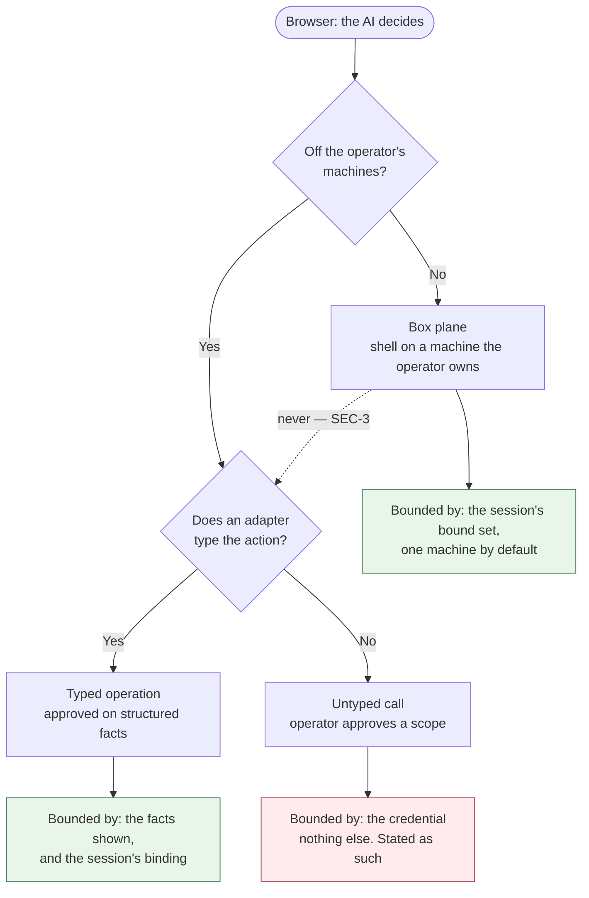
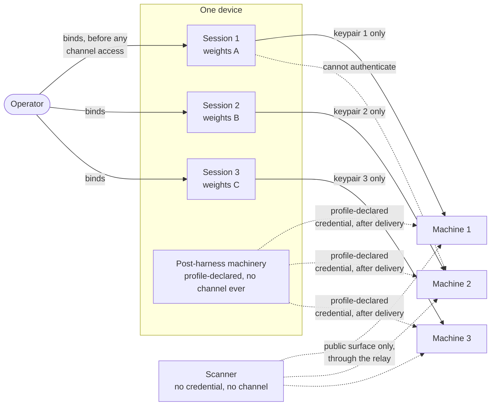
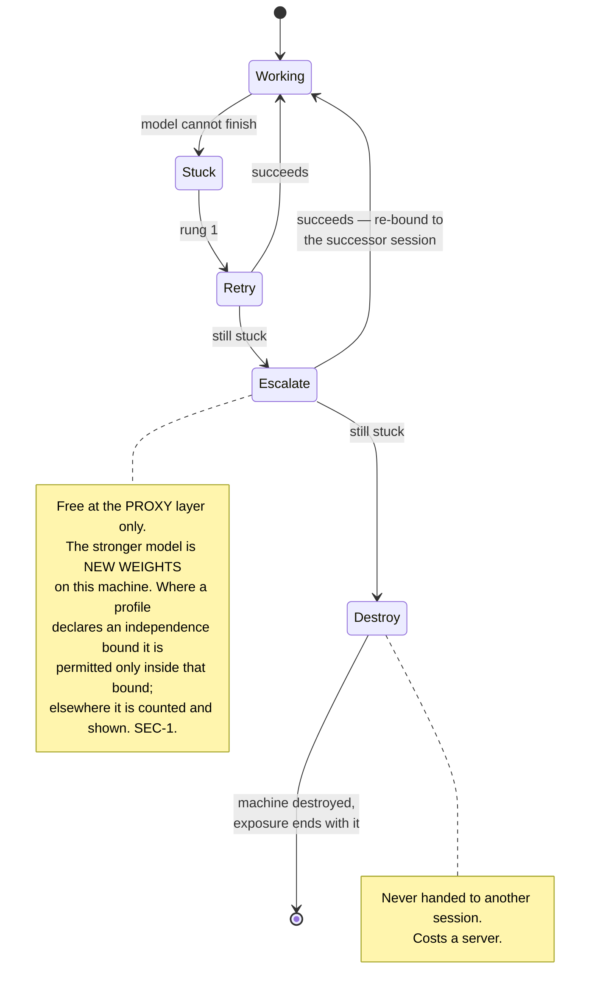

# 01 — Architecture

## The AI runs only in the browser

**ARC-1** The harness's AI MUST run in the operator's browser, and only there. A provisioned
machine is a target of the harness, never an actor for it: it MUST NOT hold a credential
belonging to the harness — an inference key, a vendor API token, the key of an untyped vendor
scope (`SEC-3`, `CNF-11`) — and the harness MUST NOT ask a machine to act: nothing a machine
sends starts work in the harness
([ADR-0003](./docs/adr/0003-the-ai-runs-only-in-the-browser.md), narrowed by
[ADR-0039](./docs/adr/0039-installed-agents-are-the-operators-applications.md)).

A machine may *tell* the harness something over the notify channel (`CHN-17`), and what it
tells is an **observation**: typed untrusted, never gating, never acting. The channel's one
use today is the attest introduction (`CHN-R5`), which acts on nothing on the machine's behalf;
its only authority is the one-time introduction, handled as the credential `SEC-5` classifies.
A harness inference key on a machine is a harness credential living outside browser memory, and
a machine that can call the harness's model unprompted is the harness acting unprompted — which
is the thing this project exists to avoid. A machine that can send an event the browser treats
as content is not that, and the typing is what makes the difference.

*What this requirement used to say* was that the AI runs in the browser and that a machine
"MUST NOT initiate work". Read as a rule about every AI and every machine, that forbids the
operator from installing software that acts — which is most of what anybody installs. It was
narrowed on 2026-10-05 to what the harness can answer for: its own model and its own
credentials.

**ARC-1a An always-on agent the operator installs is the operator's application, not the
harness's AI.** Software the operator has the harness install may act on its own on its
machine; Hermes, an always-on agent with a model of its own, is the first. `ARC-1` binds the
harness's AI and the harness's credentials and says nothing against it. What the harness owes
about one:

- **Its key is an application secret** (`SEC-5` row 12), placed by `place_secret` (`ARC-43`).
  It is the operator's credential for the application, never a harness credential.
- **Its outbound destinations and its always-on service are stated in the machine's delivery
  declaration** (`ARC-39`). The harness does not constrain an installed agent's reach beyond
  what that declaration states.
- **Its model provider is an elective party** (`TRU-E12`), listed in the trust display.
- **The delivery card MUST say so**, with the application's name where this example has
  Hermes: "Hermes is an AI that acts on this server by itself. tau-web's promises cover what
  tau-web's AI does, not what Hermes does." Beside it the card MUST explain that Delivered
  covers the declared machine state and the fixed lockdown checks, and MUST say, substituting
  the application's name: "It does not mean Hermes works".

**ARC-2** Nothing runs while the app is closed. This is accepted rather than worked around.
Every step MUST be resumable across a locked phone, and progress MUST survive the harness
worker being killed — which is what `03-state-and-recovery.md` specifies and `STA-9`
constrains.

## What the harness does not do

**ARC-35** The harness provisions and operates; it MUST NOT serve. Any obligation a tenant
must meet **while the operator's browser is closed** has to be met on the machine, by the
tenant's own software, without a harness credential
([ADR-0023](./docs/adr/0023-a-tenants-runtime-obligations-belong-to-its-machines.md)).

This is a constraint on what can be a tenant, and it is worth checking before building rather
than after. A project whose value depends on answering the outside world while the operator is
away must put that answer on the machine — with no **harness** credential, since `SEC-3`
forbids that and `SEC-6` notes a model with root would read it anyway — or accept that it is
not a fit. A tenant's *own* credential on its own machine is permitted (`SEC-3`'s note on what
it binds, `SEC-5` row 12) and is what `ARC-38`'s delegated receiving needs in order to authenticate to
the service it delegates to. For lnrent that resolves to the machine being the capacity it sells.
An operator's application (`ARC-1a`) is the same shape with no tenant: it answers while the
browser is closed, on the machine, with its own credential and none of the harness's.

**ARC-36** A machine that serves parties the operator has never met is **multi-tenant**. This
is a definition rather than a rule: it names the class `ARC-37` binds, and what such a machine
must demonstrate is whatever its declaration states under `ARC-39` — including its listening
surface, since `SEC-T1`'s deny-everything-but-one-port is btc-policy's rule and binds only
there.

**ARC-36a Machine class is asked, never inferred.** Every machine carries a class,
single-purpose or multi-tenant. A tenant's profile presets it. With no tenant, the operator
answers for each machine, to questions the harness wrote: they ship in the signed bundle, and
nothing is preselected. The model MUST NOT word the questions, answer them or preselect an
answer. An operator who answers "not sure" has a **multi-tenant** machine — the class whose
costs are `ARC-37`'s removal, which a machine needing no wallet never notices, and being bound
alone (`SEC-1`), which a one-machine session never notices. The model MAY
propose a tightening, single-purpose to multi-tenant, and nothing else: it never relaxes a
class. The answer is journaled with the machine before anything is installed (`ARC-44`). A
multi-tenant machine is always bound alone (`SEC-1`).

*What this requirement used to say* was that hardening a multi-tenant machine is a different
problem and that `ARC-17` and `OPN-14` were written for the single-purpose case. Both are now
handled: the declaration covers the difference, and the harness does not need to know what a
guest boundary looks like in order to check that the declared one holds.

**ARC-37** A multi-tenant machine MUST NOT hold **spendable** key material. Receiving is
watch-only or delegated:

- **Watch-only receiving** holds public material and nothing else: enough to derive receive
  addresses and observe settlement, never enough to spend, so an escaped guest finds nothing
  to take.
- **Receiving that cannot be watch-only** is **delegated** to a receiving service the
  operator chose, which takes the payment and notifies the machine (`ARC-38`). The profile
  names the mechanism either way.

The rule is stated as removal rather than as isolation on purpose. A boundary between a
stranger and a hot wallet is a boundary that has to hold every time; a machine with no
spending authority has nothing for the boundary to protect. This is the same move `SEC-13`
makes for the app and `ARC-30` makes for inference credits, applied to a machine that sells.

**ARC-38** A runtime obligation (`ARC-35`) may be discharged **at a third party the operator
chose, which notifies the machine**, rather than on the machine itself. This is the disposition
that keeps a credential off a box hosting strangers. Its price is an elective trusted party
(`TRU-E9`) which must be named under `SEC-10` rather than absorbed, and which custodies value
between receipt and sweep — a real exposure, bounded by sweep frequency and by the operator's
own choice of service, and far smaller than the alternative it replaces.

## Two planes

**ARC-3** Actions split into two planes with different rules
([ADR-0002](./docs/adr/0002-cloud-plane-and-box-plane.md)).

```mermaid
flowchart TD
    B([Browser: the AI decides]) --> Q{Off the operator's<br/>machines?}
    Q -->|No| BOX["Box plane<br/>shell on a machine the operator owns"]
    Q -->|Yes| CLOUD{Does an adapter<br/>type the action?}
    CLOUD -->|Yes| TYPED["Typed operation<br/>approved on structured facts"]
    CLOUD -->|No| UNTYPED["Untyped call<br/>operator approves a scope"]
    BOX --> BB["Bounded by: the session's bound set,<br/>one machine by default"]
    TYPED --> TB["Bounded by: the facts shown,<br/>and the session's binding"]
    UNTYPED --> UB["Bounded by: the credential<br/>nothing else. Stated as such"]
    BOX -.->|"never — SEC-3"| CLOUD
    classDef bound fill:#e8f5e9,stroke:#4a7c59
    classDef unbound fill:#ffebee,stroke:#a54a4a
    class BB,TB bound
    class UB unbound
```

**Cloud plane** covers any action taken **off** the operator's machines with a credential
they supplied — creating, destroying, resizing, firewalling or paying at a vendor, and
equally a call to any other third-party service
([ADR-0017](./docs/adr/0017-off-machine-calls-and-scope-approval.md)). It has two approval
modes:

- **Typed operations**, where an adapter exists: the action carries structured metadata and
  each one is approved on its own facts rather than on command text.
- **Untyped calls**, where none does: the operator approves a *scope* — this credential,
  this origin — every call is recorded before it is sent, and the harness **claims nothing
  about what the credential can do.** It usually cannot know: most services publish no
  machine-readable statement of what a key authorizes, and a bound stated on a guess is
  worse than none. A vendor with no adapter is reached this way too, under the conditions
  `SEC-4` attaches to an untyped vendor scope.

One off-machine call is neither: an **inference request** is composed by the harness's own
adapter, never chosen by the model, and is approved once at session creation rather than per
call or by scope. `ARC-31a` states how it is recorded.

**Box plane** covers shell execution on a machine the operator already owns. It is
free-form, never pre-approved, always recorded.

The split is **off-machine versus on-machine**, and each side carries its own reasoning
rather than sharing one. Box-plane work can be free-form because the worst case is ruining
the machines of one bound set — one machine by default, already bought (`SEC-1`) — and that
bound is what makes it tolerable. Cloud-plane
work has no such bound: it can spend a credit card, publish irreversibly, or read an entire
account.

**ARC-4** Approval means two different things and the interface MUST NOT blur them.
Approving an *operation* means seeing structured facts about one action and permitting it —
available only where an adapter types the action, or where the harness composed the job itself
and shows its facts on a card (`ARC-43`'s `place_secret`). Approving a *scope* means permitting a
class of activity in advance, which is what box-plane work runs under, because its contents
are not known beforehand, and what an untyped call runs under, because nothing types it.

**ARC-5** A scope names where a credential goes, not what it can do. Box-plane work is
bounded by the session's bound set. An untyped call is bounded only by the credential — so approving
one is approving that key's full authority at that host, for as long as it is valid,
whatever the brief intended at the time. Where a service offers a scoped or read-only key,
using one is the only thing that actually narrows this, and it is the operator's move
rather than the harness's.

**ARC-6** A scope MUST be an exact origin, and a redirect that leaves it MUST end the call.
Browsers follow redirects automatically, and a credential riding in a custom header rides
along to the new origin — a body does too, under 307/308 — so an approved host with an open
redirect would otherwise launder the credential to an origin nobody approved, in a request
never recorded. (A query-string credential is not replayed by the browser; only a server
that echoes it into the redirect target forwards it.) The mechanics force the strict form:
under browser fetch, following is automatic unless disabled, and the redirected request
would be sent before any check could run. So **every scoped call is sent with redirect
following disabled**, and a redirect response simply ends the call. The browser returns a
blocked redirect opaque, destination hidden, so nothing can be auto-surfaced for approval:
reaching wherever the service moved starts from what the service documents, as a new scope.

**ARC-42** A vendor's CORS configuration constrains what the browser may send and read, and
those constraints are facts to be probed rather than assumed. Measured against the cloud vendor
the proof of concept tested, and recorded because the specification lost them once already:

- **Only headers the destination allow-lists survive the preflight.** That vendor permits
  exactly `X-Requested-With`, `Authorization` and `Content-Type`. A typed adapter therefore
  cannot rely on adding a header of its own; anything else fails the preflight and the request
  is never sent.
- **Only exposed headers are readable.** That vendor exposes `Link` and `X-Correlation-ID` and
  nothing more, so rate-limit headers and `Retry-After` are invisible to the harness even when
  sent. **Backoff must be driven by the status code alone.**
- **The origin is echoed unconditionally and no `Allow-Credentials` is returned.** Any origin
  may call the API, so **the token is the entire security boundary** — which is why the account
  behind it should be dedicated and disposable, and why nothing may ever be sent with
  `credentials: include`.

**One consequence reaches `SEC-12`.** Its mechanism for ensuring no simple request is ever
transmitted — every untyped call carrying a custom header, so a preflight always happens —
works only where the destination allow-lists that header. Against a service with a fixed
allow-list it fails the preflight instead, which is the *safe* failure: nothing is sent, and
`SEC-12`'s harmless probe routes that origin to the tunnel. The design is sound, but **more
destinations will route to the tunnel than the corpus assumed**, which raises what `CHN-12` and
`OPN-20` are worth.

## Box-plane execution is command-granular

**ARC-7** Remote box-plane execution MUST be command-at-a-time: the harness sends one
command, captures its output, and returns to the model. It is not an interactive terminal
session.

**Every model-issued command is one stateless, detached job** (`STA-20`, `STA-20b`). No shell
state — working directory, variables, an entered chroot — survives from one job to the next.
A brief is therefore authored so that each example block is self-contained: a block that needs
the installed root wraps its own `chroot /mnt sh -c '…'`, and a value one step needs from
another has a named source rather than a variable — the bundle (`bundle/`), a per-session value
the harness shows the model (a bound machine's client public key), a decision the model made
and composed into the command it issues (which `ARC-8` journals as sent), or a machine-derived
value recomputed inside the consuming command. Nothing is carried.

**Every command and every harness job names its machine.** The model names the target; the
harness resolves that name against the session's bound set, and a command or job naming a
machine outside the set is not sent (`SEC-1`). With a set of one this costs nothing. With a
larger set it is what stands between an honest, confused model and the wrong disk: a job's
record, the values captured from it and the pins it yields belong to the machine it named, and
satisfy no check about another.

**ARC-8** Recording commits **per command**, before transmission. "Every byte recorded
before transmission" would otherwise imply a granularity nobody chose, resting on an
execution model nobody had stated, and the two plausible readings differ by orders of
magnitude in cost on a phone. Command granularity also produces a transcript an operator
can read, which is what an action transcript is for.

The cost is stated: anything genuinely interactive — an installer that stops to prompt —
MUST be handled by the brief rather than answered live.

**ARC-43 Values the harness checks come from jobs the harness composed, never from model
text.** The artifact hash (`ARC-25`, `CNF-24`) and the installed host keys (`CHN-R1`, `CNF-22`)
are read by **harness-owned box-plane jobs**, requested by the model where permitted or
initiated by the harness itself. Values come from the job record's captured output. The jobs are:

- `fetch_artifact` — downloads the pinned URL to a harness-fixed path on the machine, hashes it,
  compares against the bundle's value and halts the install on a mismatch (`STG-6`).
- `ready_to_reset` — reads `/mnt/etc/ssh/ssh_host_*_key.pub`, journals the pins, unmounts the
  target, and only then offers the reset typed operation (`STA-20b`'s planned-reset ordering).
- `place_secret` — writes one **application secret** (`SEC-5` row 12) to a file on a named
  machine of the bound set. Its rules are below.
- `digest_secret` — a harness-initiated read of a recorded placement, under the rules below.
  The model MUST NOT request it through `request_harness_job` or supply its command.

Listener observations and service state/enablement observations used for delivery also MUST
come from harness-composed reads. The signed checklist (`OPN-14`) owes the concrete reads,
the evidence for `enabled-survives-reboot`, and a service-name grammar whose validated values
are passed as arguments, never interpolated as shell syntax. The model proposes values,
not the measuring procedure.

Where a host-key pin may come from is `TauWeb.Pins.Source` and what each source may pin is
`TauWeb.Pins.admits` (ADR-0032), with `TauWeb.Pins.installed_pin_from_job` over every trace and
`TauWeb.Pins.installed_pin_from_model_text_refused` and
`TauWeb.Pins.installed_pin_from_model_text_admitted` its pair. The companion carries the sources
the dedicated path walks; a pin taken at a jump-host first contact (`CHN-R6`) is not among them.

`fetch_artifact` and `ready_to_reset` are **box-plane work**: they run under the box-plane
scope like any `exec`, recorded before transmission (`ARC-8`) and never approved per call —
what distinguishes them is that the harness composed the command, not that the operator sees
it. Only the reset that `ready_to_reset` goes on to offer is a cloud-plane typed operation.

**`place_secret` differs on both counts, and says so.** It takes arguments from the model —
which machine, a path, an owner, a mode, a name and a purpose — and never the value; and each
placement is approved by the operator on a card the harness composes, which makes it an
operation approved on facts (`ARC-4`). The operator enters the value on that card. Every rule
here is non-waivable:

- **The value is the job's standard input and never an argument.** `STA-20` says the machine's
  record holds "the **command as received**", so a value in the command line is a value on the
  machine's disk and in the journal. It is not put in an environment variable, in shell text or
  in a diagnostic either.
- **The job wrapper's duty is `STA-20`'s.** `STA-20` says "the job wrapper MUST NOT write that
  input to any file but the job's destination". The destination receives exactly the entered
  bytes: no added newline, wrapper, or `KEY=` prefix.
- **The value never enters model context on the way in**, and never appears in cleartext in the
  journal, the transcript, the job record, a log or a request to the app's origin. What is
  recorded before the bytes leave (`ARC-8`) is the command, the machine, the destination and the
  approval — and that a value was sent, not the value.
- **A value equal to a credential the harness holds is refused** (`SEC-5`). Without that, a
  steered model asks for the vendor credential or the seed to be written where it has root, and
  `CNF-12` has something to send after all.
- **An unsafe destination is refused**: a mode that lets any account but the owner read the
  file, and a path that is a symbolic link or passes through one. An existing file MUST be
  refused unless the placement records name it as this placement; placing a new secret must
  not overwrite unrelated data.
- **`ARC-17`'s placement gates hold** — the fixed lockdown checks first, and the findings that
  refuse a secret. The card lists every lifecycle finding standing on the machine and says that
  placement clears none of them.
- **The card restates every acceptable weaker mode standing on the machine's bound set**
  (`SEC-14`), states the root-shell caveat `SEC-5` attaches to row 12, and shows the name and
  purpose as what the model asked for, not as the harness's description.
- **The placed secret is listed in the trust display** until it is rotated or the machine is
  destroyed (`SEC-6`). After a Restore the display starts from the placement records the sheet
  holds (`STA-16`). Machine records may add entries, visibly labelled as machine-reported and
  advisory, but MUST NOT remove any. An absent file stays listed; absence, scan re-arm and
  a machine's claim of removal are not rotation or destruction.

A key the operator minted at its service with a cap, or one the operator can revoke there, is
the best practice, and the card says so. The harness mints nothing for an application: a key
minted from the inference account would be a harness credential on a machine (`ARC-1`).

**Re-arming after store loss is harness work.** On binding a session after local-store loss,
`digest_secret` MUST run for every placement recorded in the sheet before any model command
or collection of old or new job records can release output to either the model or the
transcript on that bound set. It reads the recorded path, refuses a symbolic link or a path
traversing one, writes nothing to the placement, and outputs only SHA-256 of the file's bytes
and their byte count, never the bytes. Normal machine-side capture remains `STA-20`'s; its
raw digest output MUST reach neither model context nor transcript, which receive status only.
The browser constructs the reference with a fresh browser-only key under `SEC-5` row 23;
no harness secret is sent to the machine. An entry known only from machine records requires
an explicit operator act before arming its reference.

The same job MUST run immediately after placement, cross-checking the browser-held value's
hash and byte count. A mismatch is visible and MUST NOT silently replace the browser's
reference. With an intact store, later sessions retain that reference: a machine report cannot
overwrite it. After store loss there is no old reference with which to detect every rewrite.
A machine-derived reference MUST be labelled **"re-armed from the machine's report"**, never
"protected" or proof that the original value was recovered. It covers no forgotten placement.
Further changed-file detection policy remains open in T48.

If the file is absent, changed against an intact reference, or the digest job fails, the
harness MUST offer a visible fallback card: the operator may paste the secret locally to
create a fresh reference under `SEC-5`. This act writes nothing to the machine and is not a
placement or rotation. Rotation goes through the full `place_secret` ceremony. Re-arming
neither reapproves the restored declaration nor any weaker mode; until the operator does,
`place_secret`'s card restates the restored state as "unknown since export" (`STA-16`).

Model `exec` across the bound set MUST wait while any known required placement reference is
unarmed. Only harness jobs whose output goes to **neither** model nor transcript are exempt;
read-only work, reconnect records and a job merely hidden from the model are not loopholes.
Unscanned output is withheld under `SEC-5`, with no automatic retry authority added to `STA-6`.
After Restore the harness asks whether secrets were placed since export, with no answer
preselected; **"Not sure" is treated as yes**. It displays unknown coverage and restates it at
later irreversible acts under `STA-16`, but that unknown inventory does not itself block
work once all known required references are armed.

The model's tool set in the first stage is exactly four: `exec` (a box-plane command it composed),
`request_harness_job` (`fetch_artifact`, `ready_to_reset` or `place_secret`, by name, with the
arguments that job admits),
`request_typed_operation` (a cloud-plane operation, approved on facts), and `done`. Each names
its machine (`ARC-7`). There is no tool by which the model
reports a value, so a wrong or hostile report cannot pass `CNF-24` or pin a key. A model in
`ARC-31b`'s candidate order MUST be able to call this tool set — on the aggregator's list that
is the `tools` entry of `supported_parameters`, which `eligible-set.py` reads
(`docs/findings/2026-09-22-provider-routing/`).

## Briefs

**ARC-9** A brief is a document of prose plus example commands, in the shape of an agent
skill. The AI reads it and decides what to actually run; it MUST NOT be executed verbatim
([ADR-0001](./docs/adr/0001-briefs-are-instructions-not-scripts.md)). A script stops dead
at the first surprise — a changed image name, a package that will not install, a service
that will not start — and the AI exists precisely for the surprises. A setup nobody can
finish sends the operator back to a custodian, which is worse than the risks this design
accepts.

The cost is paid honestly: what runs is not known before it runs, which is what forces
approval to draw on structured facts from the cloud plane rather than on command text.
Adaptations also do not accumulate — the same problem may be solved differently on two runs,
and the library does not improve on its own.

**ARC-10** A brief MUST be safe to re-run from the top. Since the AI improvises, there is
no fixed step list to resume against; the recovery path for an interrupted brief is
**reconnect, read the machine's state, and continue from what is found**. Convergence is
therefore an authoring rule, not a subsystem, and a declarative distribution (`ARC-24`)
makes it close to free.

**ARC-11** Briefs MUST ship inside the signed application bundle
([ADR-0005](./docs/adr/0005-briefs-ship-in-the-signed-bundle.md)). Nothing fetches a brief
at runtime and operators cannot supply their own; an operator's **goal** is not a brief
(`ARC-11a`). A brief is prose that steers a model,
which is prompt injection by design, and every machine reads the same brief — so whoever can
change one reaches every machine at once. That defeats the honest-majority assumption rather
than being absorbed by it: n honest, competent models faithfully following poisoned
instructions all produce the wrong machine, and agree with each other perfectly while doing
it. The brief is the one component where diversity buys nothing, so it is locked instead.

**ARC-11a A goal is the operator's own instruction, and no brief is required to act on one.**
A session MAY work from the operator's **goal** alone — what they want, in their words — with
no brief keyed on any of it and no tenant
([ADR-0034](./docs/adr/0034-general-case-first-tenants-are-optional-skills.md)). What keeps
that from being the runtime-supplied brief `ARC-11` locks out is what a goal reaches:

- **A goal steers one session's bound set and nothing else.** It MUST be journaled with that
  session, together with where it came from. It is never shipped.
- **A goal is never imported, shared or reused.** The harness MUST NOT offer a way to load a
  goal from elsewhere, send one to another operator, or apply a stored one to another session:
  the same words steering many sessions are an unsigned brief.
- **A goal MUST be refused for a machine under a profile that declares an independence bound.**
  There the same instruction would steer several members at once, which is the common mode
  the bound exists to exclude; such a tenant ships briefs.
- **What the model reads while acting on a goal informs and never authorizes.** A project's
  README is fetched external content (`SEC-8`, `ARC-28`); its source is recorded with the goal.

Acting with no brief is an acceptable weaker mode (`SEC-14`): a brief is the best practice,
used when the bundle has one and shown as missing when it does not.

**ARC-40 The publisher writes and signs every brief today, and that is a power worth naming.**
("Signs" is the glossary's *Signed bundle*: compiled into the served build until `OPN-15`
closes.)
Because briefs ship in the bundle (`ARC-11`), the publisher decides **which tenants can exist**
and **when a tenant's change reaches operators**. A tenant is otherwise independent — it supplies
its own software and its own security requirements
([ADR-0016](./docs/adr/0016-the-harness-isolates-and-counts-tenants-set-thresholds.md)) — but it
cannot ship a brief fix, add a vendor, or appear at all without the publisher agreeing and
cutting a release. What the publisher does not decide is whether an operator can act at all: a
goal needs no tenant (`ARC-11a`, `ARC-44`).

This is a **bootstrap seat**, in the same sense as `CHN-11`'s relay: held because there is nobody
else yet, not because the design wants it there. The trajectory is the one agent skills took, and
`ARC-9` already borrows their shape — a curated first-party set first, third-party authorship
after. `ADR-0005` reaches the same place from the other direction when it rejects multi-author
briefs "for now" because an ecosystem cannot be bootstrapped by one project.

**What must survive every step is `ARC-11`'s actual property**: briefs are locked and never
fetched at runtime. What changes as third-party briefs arrive is *who the operator trusts for a
brief's content*, and that is a trust-tier question to answer when it arrives rather than to
guess at now. Until then the honest statement is that the publisher's entry in the added tier
covers governance as well as compromise (`TRU-A1`).

The format is **not** shared with lnrent. That project's *recipes* are executables its
daemon runs with high privilege; these are prose that must never be run as written, and no
format spans both. The real relationship is a **layering** — one of these documents can tell
the AI to invoke an lnrent hook as a deterministic tool. The library is not shared either:
each project ships its own set inside its own bundle.

**ARC-44 Every machine runs under a profile, and a tenant is optional.** A tenant is
skill-shaped content compiled into the signed bundle — briefs, and presets for the facts its
machines carry — and the harness works with none
([ADR-0034](./docs/adr/0034-general-case-first-tenants-are-optional-skills.md)). A machine with
no tenant runs under the publisher's built-in **ad-hoc profile**
([`docs/tenants/ad-hoc/profile.md`](./docs/tenants/ad-hoc/profile.md)), whose per-machine slots
the operator fills by answering the harness's own questions.

Three facts the harness acts on exist for every machine either way: its machine class
(`ARC-36a`), its access model (`ARC-27`) and its delivery declaration (`ARC-39`). Each is preset
by a tenant's profile or approved by the operator in plain language, and each MUST be journaled
with the machine before anything is installed on it. A tenant's presets make that path faster
and more reliable; they are never a precondition for it.

## Sessions, binding, and diversity

**ARC-12** A **session** is one run of the harness under one set of model weights,
responsible for its **bound set** — one machine by default. It is one context: whatever any
machine of the set returns is read by the model that commands all of them. A federation is
provisioned by several concurrent sessions on a single device
([ADR-0009](./docs/adr/0009-one-device-concurrent-sessions-batched-approval.md)). The
binding rule and its enforcement are `SEC-1`. The figure shows the default, a set of one per
session.

```mermaid
flowchart LR
    OP([Operator]) -->|"binds, before any<br/>channel access"| S1
    OP -->|binds| S2
    OP -->|binds| S3
    subgraph DEV["One device"]
        S1["Session 1<br/>weights A"]
        S2["Session 2<br/>weights B"]
        S3["Session 3<br/>weights C"]
        CO["Post-harness machinery<br/>profile-declared, no channel ever"]
    end
    S1 -->|"keypair 1 only"| M1["Machine 1"]
    S2 -->|"keypair 2 only"| M2["Machine 2"]
    S3 -->|"keypair 3 only"| M3["Machine 3"]
    S1 -.->|"cannot authenticate"| M2
    CO -.->|"profile-declared<br/>credential, after delivery"| M1
    CO -.->|"profile-declared<br/>credential, after delivery"| M2
    CO -.->|"profile-declared<br/>credential, after delivery"| M3
    SC["Scanner<br/>no credential, no channel"] -.->|"public surface only,<br/>through the relay"| M1
    SC -.-> M2
    SC -.-> M3
```

**Why one device.** The separation that matters is between models, not between pieces of
hardware. The device is already a trusted party, so putting five sessions on it adds no
party that was not already trusted. Requiring five devices would defend against a
compromised phone while guaranteeing that an operator who owns one phone never finishes
setup.

**Why concurrent.** Nothing runs while the app is closed, so sequential provisioning would
multiply the time the operator must hold a phone awake by the machine count. A twenty-minute
install becomes a hundred-minute one. Concurrency *between sessions* adds no reach: `SEC-1`
gives each session the keys of its own bound set and no other, and simultaneity does not change
which session touches which machine. Inside one session it is otherwise — a set of more than
one machine is one model context, and that is the weaker mode `SEC-1` names.

**ARC-13** Concurrency MUST be bounded for mobile. The archived specification already rates
mobile memory pressure as a high risk and defaults its command-worker pool to one on
mobile; five concurrent sessions each holding a model stream and a remote session need the
same treatment, and so does one session holding a channel to each machine of a larger bound
set. **No number has ever been measured**, and the first stage runs exactly one
session with one machine, which makes it the only cheap opportunity to learn whether five is
possible — `CNF-45` requires the measurement.

**ARC-14** A trust domain MUST be counted at **three configured layers**, never as one blended
number ([ADR-0007](./docs/adr/0007-trust-is-counted-in-two-layers-and-shown.md)):

- **Weights** — the model itself. Two machines on different weights survive one set of
  weights being backdoored, even through a shared proxy.
- **Proxy** — the aggregator routing the request. A compromised proxy can alter every
  prompt and response it carries, whatever weights sit behind it.
- **Provider, requested** — the party that actually runs the inference behind the aggregator.
  The harness **requests** a provider in the call itself, the same way it requests a model —
  per session, and so one for every machine of that session's bound set — using the aggregator's routing object — `order`, `only`, `ignore`, `zdr` among its
  fields, documented on its `api-docs` page and absent from its `llms.txt`, both read
  2026-09-23. On the procured path this is the selected candidate's provider (`ARC-31b`).
  The display shows what was requested.
  **The aggregator may override it**, and its documentation scopes that to the few models with
  routing rules it enforces — some Anthropic and Gemini variants — while keeping the `zdr`
  request; when measured, an unsatisfiable request was refused rather than rerouted
  (`docs/findings/2026-09-22-provider-routing.md`). Either way it is no new trust, since
  `TRU-E2` already names the proxy as able to alter everything it carries.
  This is the same shape `OPN-4` reached for weights: configured and unverifiable is a
  better-shaped gap than observed with no source.

*What this layer used to be.* It was **observed** — read off a response header after the fact —
and the header it was specified around was a **different aggregator's**, recorded while that one
was still the candidate. The chosen aggregator exposed no equivalent when checked on 2026-09-05
(`TRU-E3`); on 2026-09-22 a `provider` field appeared in its responses to a `provider.only`
request, following the pin (`docs/findings/2026-09-22-provider-routing.md`). Requesting the
provider replaces a signal that did not exist with one the harness controls. Whether the request
was honoured is still not observable independently of the proxy — the field is its report
(`TRU-E2`), compared and never counted (`SEC-9`) — and nothing a response carries can make it
so; `OPN-23`'s standing ask is now for the report's semantics and its name mapping.

A 3-of-5 federation on five sets of weights behind one proxy is 3-of-5 against backdoored
weights and 1-of-1 against a backdoored proxy. Both numbers are true; one number would be a
lie about whichever layer is thin, and the thin layer is the one that gets exploited. A
**collision** — two machines sharing a domain at any counted layer — is *shown, not
blocked*, because procured inference shares a proxy by design. The machines of one bound set
share every layer by construction, and are shown as one unit (`SEC-1`).

**ARC-15** The machine creations a setup names are known before anything starts, so their
approvals MUST batch:
one screen showing the whole setup and its true recurring cost — each session's bound set,
machine by machine, and any jump host a first contact will need (`CHN-R6`), with what it
costs. A machine added to a bound set afterwards is one operator act per machine, through the
mid-flight queue, on the card `SEC-1` describes. An untyped call's scope
rides the same rules — approved with the up-front batch when the brief names the service,
joining the mid-flight queue when one is discovered later. **No untyped call runs before its
scope is approved.** Five concurrent workers producing interleaved popups on a phone is
modal fatigue in its purest form, and the operator cannot tell which machine is asking.

**ARC-16** Recovery is a ladder. Retry; then escalate to a stronger model behind the same
proxy; then destroy the machine and restart under a different domain, which costs a server.

```mermaid
stateDiagram-v2
    [*] --> Working
    Working --> Stuck: model cannot finish
    Stuck --> Retry: rung 1
    Retry --> Working: succeeds
    Retry --> Escalate: still stuck
    Escalate --> Working: succeeds — re-bound to<br/>the successor session
    note right of Escalate
        Free at the PROXY layer only.
        The stronger model is NEW WEIGHTS
        on this machine. Where a profile
        declares an independence bound it is
        permitted only inside that bound;
        elsewhere it is counted and shown. SEC-1.
    end note
    Escalate --> Destroy: still stuck
    Destroy --> [*]: machine destroyed,<br/>exposure ends with it
    note right of Destroy
        Never handed to another session.
        Costs a server.
    end note
```

Partial failure is the normal case and MUST be a coherent state the operator can act on,
not an error.

## What a session delivers

**ARC-17** A session's deliverable is a machine that is provisioned, hardened, running the
software its declaration calls for **in the state that declaration calls for**, reachable,
and **shown to be locked down** by a lightweight self-directed pentest — default credentials,
sshd posture, and everything `ARC-39`'s declaration names
([ADR-0011](./docs/adr/0011-the-ai-delivers-a-locked-down-machine.md)). Hardening is a
property the session demonstrates, not a step it reports having performed.

**Delivered, or handed over with findings — never something between.** A machine is
**delivered** only when the delivery check finds no difference from its declaration in force
and the fixed lockdown checks — default credentials and sshd posture, from the signed lockdown
checklist (`OPN-14`) — pass. A finding is cleared by a re-check and by nothing else: after the
machine is fixed, or after the operator amends its declaration by a journaled act. A finding is
never accepted in place of an amendment, and an amendment cannot widen what the harness gates —
it cannot declare spendable key material on a multi-tenant machine (`ARC-37`, ADR-0030's first
guard). A machine restored from a sheet after store loss does not carry its findings: the sheet
holds none, so its findings show as unknown, and no secret is placed on it,
until a re-check (`STA-16`). The
operator MAY take a machine while findings stand. That machine is **handed over
with findings**: it is not delivered, it MUST NOT be described as locked down, each finding
stays shown until a later check clears it, and no application secret is placed on it while a
finding other than a lifecycle finding stands — the rule below, applied by `ARC-43`'s
`place_secret`.

**A stopped service is a finding, and it does not refuse a secret.** A declared service that a
harness-composed read does not find in its declared lifecycle is a **lifecycle finding**
whenever that read runs — at a delivery check or a later re-check, whether or not any secret is
placed on the machine, and whether or not the service needs one to start. It is a finding like
any other: the machine is not delivered while it stands, it stays shown, and only a re-check
clears it. It does not refuse `place_secret`, in the session that built the machine or in any
later one: the harness does not know which service a secret is for, and a refusal would block a
first key and a rotated one alike. Every other finding, a lockdown finding included, still
refuses placement, and the fixed lockdown checks MUST have passed first. Whether a finding is a
lifecycle finding follows from the declaration field that produced it (`services`), never from
the model. A session that places secrets demonstrates the declared lifecycle after its
placements, and delivery rests on that demonstration; placement itself clears no finding. A
session that ends before its final demonstration leaves the verdict of its last check standing,
shown with any placement made since.

**ARC-39** Every machine MUST have a **delivery declaration**: a statement of what must be true
of the finished machine, approved before anything is installed on it. A tenant's profile presets
it. With no tenant the model proposes it from the operator's goal (`ARC-11a`), starting from
the ad-hoc profile's signed minimum — sshd and nothing else — and the operator approves it in
plain language. Either way the approved declaration is journaled with the machine, and the
journaled one is the declaration in force (ADR-0030's second guard). The lockdown check and the
scanner measure the machine against it, and **the finding is a difference from the
declaration**, never a property the harness assumed.

**A proposed declaration carries no check the model wrote.** The model proposes typed values
such as ports, service names and hosts; the operator approves them. It never supplies the
procedure that measures them. Its `required` and `drift_checks` fields are the explicit empty
set or entries drawn from the signed bundle. A check the model composes may run through its
own `exec` and be shown beside the declaration as a report (`SEC-2`). Neither success nor
failure counts toward Delivered, creates or clears a finding, or blocks delivery or secret
placement. Such commands MUST NOT be retained for automatic re-execution. Their historical
command records remain; a later session may choose its own commands,
subject to the same report-only rule. The source of measured values is `ARC-43`.

**The harness does not know what a finished machine looks like, and must not guess.** One tenant
needs a service enabled and surviving every reboot, because it has to answer while the operator
sleeps (`ARC-35`). Another needs a node that is running now and dies on the first reboot, because
sealing is what makes its duress protection real. Both are correct, and any general rule the
harness invented would contradict one of them. This is the same move the design already makes for
the threshold (ADR-0016), the access model (`ARC-27`), and now everything else it needs to
demonstrate.

**Its structured form is
[`docs/design/delivery-declaration-v1.md`](./docs/design/delivery-declaration-v1.md)**, which is
normative: every field is present, as a concrete value, an explicit empty set, or the marker
`unspecified`. An absent field is a schema error; `unspecified` blocks delivery (ADR-0030). The
harness invents no default for any field. Presence and meaning are carried as
`TauWeb.Declaration.check` (ADR-0032): `TauWeb.Declaration.delivered_specified` proves over every
trace, declaration and machine that no path reaches delivered while any field is missing or
unspecified, and the 2026-09-16 rule that an empty list's meaning is the field's own is the
parameter whose pair is `TauWeb.Declaration.empty_inbound_refused` and
`TauWeb.Declaration.empty_inbound_admitted`.

A declaration covers at least:

- **The listening surface.** What should answer, so that *undeclared* surface is the finding
  rather than open ports as such. Checking against a fixed deny-everything rule only works for a
  machine that serves nothing; `SEC-T1` is that rule and it is btc-policy's. A vault node declares
  its one protocol port and loses no strictness; a machine selling slices declares its range and
  gains a check that finds a guest who escaped their slice, a service a brief started and forgot,
  or a debug port left by the install.
- **Service lifecycle.** Whether the tenant's software must merely be running at delivery, or be
  enabled and survive a restart. The harness has no opinion; it demonstrates whichever was
  declared.

**What the check does not find** is hostile use of *declared* surface, or a machine that satisfies
a declaration which is itself wrong. A vague or wide declaration buys a weak check. That is the
choice of whoever wrote it — a tenant, or the model whose proposal the operator approved — and
the operator's to see, and it may not be reported as more than it is (`SEC-2`).

**The pentest is a competence check, not an integrity check.** A model examining its own
machine proves nothing against a malicious model. Where the tenant has a threshold it does
not need to — malice is what the threshold absorbs. On a machine with no threshold nothing
absorbs malice and the pentest does not pretend to: that risk is accepted, as `SEC-CLAIM`
states plainly. Either way, honest-but-sloppy is the likely failure on a first-time setup,
and it is the one this catches. It never runs from another machine.

**ARC-18** The job MUST NOT assume uniformity across vendors. Hetzner Cloud has no image
upload API at all and requires a rescue-and-write approach, while others offer import paths
that differ from each other and from that. That heterogeneity is an argument *for* the AI,
not against it.

## Post-harness machinery, and finishing a setup

**ARC-19** **Post-harness machinery** — whatever a profile declares in its post-harness
handoff slot — is AI-free deterministic code running from the signed bundle on the operator's
device.

**It is the tenant's machinery, and it runs only after the harness is finished.** What it does
belongs to the tenant the way the threshold does (ADR-0016) and the delivery declaration does
(`ARC-39`): the harness does not know what the machinery is forming. It begins when every
machine of the setup is provisioned, locked down, delivered and — where the profile's access
model seals (`ARC-27`) — **sealed**, and that ordering is what makes the rest of this
requirement possible to state.

**ARC-19a** Post-harness machinery therefore **never holds a channel to any machine, at any
point**. Where the profile seals there is no channel to hold: SSH is uninstalled at sealing
([ADR-0013](./docs/adr/0013-ongoing-operation-periodic-pentest-and-advisory-watch.md)). Where it
does not seal, the channel exists and the machinery is simply never given one, which `CNF-8`
verifies by inspection rather than by SSH's refusal. What it holds is **at most the credential
the profile's handoff slot declares**, used over the relay like any other TCP (`CHN-10`), and
that credential MUST be one the tenant's own protocol already assumes a hostile holder of: a
peer's worth of reach, never administrative reach the tenant does not design against. `SEC-1`
says "no party other than a machine's bound session — or, for a jump host, which has none, the
harness flow that makes the contact (`CHN-R6`) — ever holds that machine's client key", and
post-harness machinery is neither
([ADR-0026](./docs/adr/0026-the-coordinator-is-the-tenants-and-runs-after-sealing.md)).

**Where that credential comes from, stated because the obvious source is closed.** The
machinery's credential is never a private key a machine generated for itself handed over —
no `SEC-5` row is one, and the rule above bars a machine's channel key. It is a **distinct keypair the
browser derives from the seed** (`STA-22`, `SEC-5` row 17); its public half is installed **during
setup, before the handoff point**, over the bound session's own channel, with its private half
staying in the browser to re-derive. It is a credential the harness places, so it is a row in
`SEC-5` rather than an unlisted grant, and being seed-derived it survives a lost phone the way
every other per-machine key now does: the handoff can be finished or rebuilt without it having
been stored.

**ARC-20** Moved to the btc-policy tenant profile,
[`docs/tenants/btc-policy/profile.md`](./docs/tenants/btc-policy/profile.md), slot
"Machine set" (ADR-0030). The identifier is kept so existing references resolve.

**ARC-21** Abandonment MUST be a first-class action — a cloud-plane operation with the same
approval treatment as creation — because all machines exist and bill from the moment they
are created, while one machine is retried or replaced. It runs as the **deterministic operator
flow** `STA-18` already defines, before or outside any session, never through a session: a
session's typed operations reach the machines of its own bound set and nothing else (`SEC-4`,
`CNF-26`), so no session can destroy a machine outside its set, and borrowing one to do so would
be reach `SEC-1` does not grant. Against a machine with an unresolved call it is an operator disposition (`STA-24`),
recorded as one and never as evidence of what the call did.

**ARC-22** An unfinished setup MUST own the first screen. Nothing runs while the app is
closed and no push channel exists, so the moment the app opens is the only moment the
product can speak, and it spends that moment on the thing that is costing money.
Resume-or-abandon *is* the opening screen, not a badge: it shows roughly what has been
billed so far and what it bills per month until finished or abandoned. After roughly a week
without progress the emphasis flips and abandonment leads. Abandonment destroys every
machine of the setup through typed operations, and the screen states plainly what stops
billing — the machines — and what does not: the vendor accounts themselves. It names every
machine carrying an unresolved call and what that call was, and it says of an unresolved
create that no vendor listing matches that it **cannot be destroyed from here and may still
exist and bill**: an allocation index is not a deletion target, and destroying the known
machines is not a complete abandonment while that one is outstanding. The inventory listing
that looks for it is a read and is permitted (`STA-24`); on Robot the match is by the
registered key fingerprint the entry holds. A jump host whose destroy is unresolved (`CHN-R6`)
is named the same way: it may still exist and bill.

**An unfinished setup is device-bound.** It is resumed on the device that started it, or
abandoned. That follows from all-or-nothing plus exposure ending with the machine (`SEC-1`),
and needs no new mechanism. A second device shows a clean app while the first device's
machines keep billing, which the abandonment screen's cost figures are the only defence
against.

## Machine networking

**ARC-23** Moved to the btc-policy tenant profile,
[`docs/tenants/btc-policy/profile.md`](./docs/tenants/btc-policy/profile.md), slot
"Delivery declaration" (ADR-0030). The identifier is kept so existing references resolve.

**ARC-41** The relay-side view of a machine MUST **equal** the world's, and equality has two
sides. The firewall MUST NOT privilege the relay's source addresses — no allowlist, no
relay-only port — because a privileged source makes that view larger than the world's. And the
relay MUST NOT narrow it either: a pass reaches a recorded destination on any port (`CHN-16`),
because a relay forwarding only port 22 makes the view smaller than the world's and turns the
scan into a check that cannot fail. The scanner's no-access argument (`ARC-26`) rests on
equality; only one side of it used to be written down.

**One accepted narrowing, with numbers.** OpenSSH since 9.8 penalises a source address that
misbehaves: 1 s for a connection closed before authentication, 5 s for a refused key,
enforced once 15 s have accrued, growing to a 10-minute refusal. A pin halt (`SEC-11`) is a
preauth close and a refused key is exactly `STG-13`'s test, so a harness can trip this against
its own machine, and it does so from the relay's address. The penalty is kept **per machine**,
and only one operator's session and the scanner ever reach a given machine through the relay
(`SEC-1`, `ARC-12`), so the cost is a **self-lockout** of up to ten minutes, during which a
scan of that machine reports port 22 refused while the world sees it open. This is accepted
as-is: exempting the relay's addresses would be the privilege the sentence above forbids, and
disabling the penalty would remove a default from a machine `ADR-0011` says is locked down.
Two consequences follow. A refused authentication or a halted key check **ends the attempt**;
the harness does not reconnect on its own, and the reconnect-after-network-loss path (`STA-20`)
is not reused after a refusal. And a scan finding of "22 refused" on a machine whose channel
was refused in the last ten minutes is the penalty, not the world's view. Observed 2026-09-08
on the channel spike (`docs/findings/2026-09-07-wasm-spikes.md`).

## The operating system, and where it comes from

**ARC-24** The chosen distributions are **Alpine and NixOS**: the two the bundle is designed to
pin. Today it carries Alpine's (`bundle/artifact-alpine.toml`); NixOS is not offered until the
bundle carries its pin and its evidence exists (`07-conformance.md`'s stage-1 row). Another distribution an operator's goal names — Arch, Omarchy — is installed
**unpinned** under `ARC-25`'s rule until the bundle carries a pin for it (`OPN-25`). Neither
chosen distribution is offered by the
dedicated vendor's automatic installer — verified against the live API on 2026-08-31, whose
catalogue is AlmaLinux, Arch, CentOS Stream, Debian, openSUSE, Rocky and Ubuntu — so **custom
image installation is mandatory on that path**, not the optimisation ADR-0011 calls it. That is one of the two reasons the install
runs from inside a rescue session; the other is that rescue is what publishes the host key
(`CHN-R1`).

A declarative distribution also repays `ARC-10`: a system whose state is described rather
than accumulated is one a reconnecting session can converge on rather than reconstruct. And
two machines built from the same pinned revision is a stronger statement than two machines
that ran the same brief — though it is a statement about the **build**, not a hash of the
installed system, for the reason `ARC-25a` gives.

**ARC-25** The **artifact source** — an image, a mirror, a channel — MUST be treated as an
untrusted dependency, **pinned as tightly as the distribution allows and never trusted on
retrieval**. The rescue session pulls from a URL; the browser supplies the expected value; a
mismatch halts the install. This is the same shape as the machine pinned by host key and the
bundle pinned by published hash, and it is the third instance of a pattern already in use.
The source is a named party in `TRU-E8`, because whoever decides what every machine runs has
the same blast radius as the bundle.

**The expected value ships in the signed bundle**, alongside the briefs
([ADR-0005](./docs/adr/0005-briefs-ship-in-the-signed-bundle.md)). No party is added: the pin
is worth exactly what the bundle is worth, which is the concentration `TRU-A1` already names.
Fetching the expected value at provisioning time instead would not be a pin but a lookup, and
it would hand `TRU-E7` the blast radius `TRU-E8` exists to name — a second party with
bundle-scale reach, of which only one would be written down.

**The pinned URL MUST be an immutable versioned path, never a moving alias.** Alpine serves
both: `.../v3.24/releases/x86_64/alpine-virt-3.24.1-x86_64.iso` accumulates beside its
predecessors, while `latest-stable/` and `latest-releases.yaml` are rewritten in place. Against
a moving alias the mismatch is continuous rather than occasional, and a halt that fires on every
install is a halt the operator learns to route around.

**A mismatch is an outage, not a warning to bypass.** An upstream release does not invalidate
an older immutable URL by itself. Provisioning with the older artifact remains possible while
that exact artifact is available and allowed by the bundle's release policy. If it disappears,
changes, or is withdrawn from the allowed policy, provisioning halts until a new signed bundle
carries an acceptable pin. The publisher must track releases and refresh this policy.

**A failed pinned check halts; it never degrades into a weaker mode.** Installing a
distribution the bundle carries no pin for is an acceptable weaker mode (`SEC-14`): the
operator chooses it up front, from what the bundle lacks, and the machine is recorded and shown
as **unpinned** from then on. A machine that began under a pin and failed it MUST NOT continue
unpinned, whoever asks.

**ARC-25a Both pinned installation paths combine a pinned bootstrap with signature-admitted packages**
([ADR-0027](./docs/adr/0027-the-artifact-pin-is-per-distribution.md)). The construction test bed's
Alpine brief made the previously claimed hash-only distinction false.

- **Alpine:** the signed bundle pins the immutable minirootfs URL and its hash. The installed
  kernel, SSH server, bootloaders and dependencies then come from `apk` repositories. The
  bundle declares their release branch, repository URLs and accepted signing keys
  (`bundle/artifact-alpine.toml`). **The key list is declared, then verified at build time:**
  the build extracts `/etc/apk/keys` from the pinned minirootfs and fails if the set differs
  from the declaration, so a new bootstrap with a changed keyring is reviewed rather than
  inherited, and the pre-install check is not a tautology. Check `/etc/apk/keys` against that
  set before fetching packages, require signature checking, and never enable
  `--allow-untrusted`. Branch indexes may advance within the declared branch;
  the minirootfs hash does not pin their contents. Record index digests, accepted signer
  fingerprints and installed package versions in the transcript. These are observations,
  not a preapproved content hash of the resulting system.
- **NixOS:** pin the installer image hash, source/flake revision and binary-cache signing
  keys. Require signature checking for substituted paths. Paths already carried by the
  pinned installer are covered by its image hash; additional outputs are admitted by the
  cache signature. A source revision fixes the requested build graph, not the received
  binaries. A moving channel name does not satisfy the source-revision requirement.

**Both paths trust package signers (`TRU-E8a`).** A signed bundle bounds which keys are
accepted; it does not remove those key holders' authority over later packages. Choosing
Alpine does not avoid this party. Pinning the entire installed package closure would be a
separate design, and the construction test bed's brief does not implement it. The trust display
names the distribution, bootstrap hash, package policy and accepted signers rather than
calling the resulting installation hash-pinned. An unpinned installation (`ARC-25`) has neither
layer, and the display says **unpinned** rather than naming a hash or a signer set nothing
checked.

## Ongoing operation

**ARC-26** A machine MUST be periodically re-checked, and upstream releases and security
advisories for the software it runs reviewed
([ADR-0013](./docs/adr/0013-ongoing-operation-periodic-pentest-and-advisory-watch.md)). The
re-check has an inside and an outside, with different owners
([ADR-0021](./docs/adr/0021-the-surface-pentest-is-outside-in.md)):

- **Inside** — anything needing the channel — belongs to the machine's own session and
  nobody else, because access composes.
- **Outside** — the public surface through the relay: which ports answer, and whether that
  matches `ARC-39`'s declaration — is the **scanner's**: a specialist model of the
  operator's choosing, run after first-online and periodically, holding machine addresses and
  no credential, no channel, no binding. **The model never composes probe traffic**: the
  probes are a deterministic allowlisted toolset, and the model picks targets and reads
  observations, so even a malicious specialist cannot attack through the probe. **The relay
  pass stays in the browser too** (`CHN-15`): the harness opens the connection and runs the
  probe toolset, and the model receives observations. The relay key that opens a pass is a
  credential, and a scanner holding it would break the addresses-and-nothing-else rule. The tool contract bounds
  invocation too — per-run and per-target call limits, pacing, cancellation, bounded output.
  Pacing is load-bearing beyond politeness: it is what `CHN-16` relies on to keep a wide port
  range from being a scanning service.

  **Every scan target is a machine the harness provisioned.** The scan is not a general
  capability pointed anywhere; it reaches the destinations recorded against the operator's own
  pass and nothing else.

What the scanner costs is **topology**: its full inference path sees the machine set, model,
proxy and provider alike, a named row in the trust display (`TRU-E5`). What it produces is
reports: observations that never gate, never act, and are never called verified.

**ARC-27** How much of the re-check is possible follows from the machine's **access model**,
which its tenant's profile presets. With no tenant it is **maintained**: sealing cannot be
undone, so it needs a tenant whose own design calls for it, and neither the operator's goal nor
the model's proposal can seal a machine. On **maintained** machines — lnrent boxes, a machine with no tenant — the
machine is re-entered by a later session bound to it. On **sealed** machines nothing
re-enters, by the tenant's own design: btc-policy uninstalls SSH after setup and forbids
upgrade-in-place, precisely so nobody can be forced back into a vault node. There the inside
half does not exist and the re-check *is* the scanner's surface probe, plus an advisory
watch whose only remedy is rotating to a successor vault.

**ARC-28** Fetched external content MUST be typed as untrusted, advisory review **reports
rather than acts**, and the set of feeds MUST ship signed like the briefs. An advisory
reading "critical: upgrade immediately to package X from repository Y" is a supply-chain
attack delivered through the feature meant to make the vault safer. The first of those is a
general rule, not a rule about advisories: any box-plane command already returns
attacker-influenceable text, and the archived specification types *all* tool output as
untrusted (§20.5) for that reason.

## Money

**ARC-29** Recurring costs — the machines — are billed by the vendor to the operator: to
their own account on their own payment method, or, at a vendor that sells by invoice, by an
invoice the operator's own wallet pays (`ARC-30`). The app never pays for a machine and cannot
stop a vendor's billing; only the operator can.

**ARC-30** Costs paid by invoice — inference credits, and a machine at a vendor that sells by
invoice — are assisted. The app retrieves the invoice from the provider or the vendor and hands
it to the operator's wallet to pay. It relays an invoice; it
MUST NOT hold, forward, or custody funds
([ADR-0014](./docs/adr/0014-the-app-relays-invoices-and-never-holds-funds.md)). A payment
intermediary would be the one place in the design where the operator is asked to trust
*more* rather than less.

**A machine's invoice is tied to its approved entry.** The invoice handed to the wallet is the
one harness code read from the vendor's recorded response, never one the model presents; it
names the approved machine entry it pays for (`ARC-15`, `STA-24`), and its amount is shown
beside the cost the operator approved. The operator pays each invoice; nothing pays one for
them.

**ARC-31** Payment evidence MUST NOT be overstated. A **settled invoice** proves the
operator funded credits at a provider and bounds which proxies are available; it does not
prove which machine used which proxy, because one top-up buys many queries. Per-machine routing
is **requested** in each call, and what the display shows is what was asked for (`ARC-14`). A
response may carry the aggregator's own report of the provider — it did on the `provider.only`
path, measured 2026-09-22 (`docs/findings/2026-09-22-provider-routing.md`) — but that report is
the proxy's word (`TRU-E2`), not evidence read back from the party that served.

**Inference has two paths.** *Procured* is the default: the operator funds an account-free
balance at one aggregator, and the publisher selects the models, so every machine is routed
through a single proxy. **The publisher handles neither the money nor the credential** — it
supplies the model choice in the signed bundle (`bundle/inference.toml`) and nothing else
([ADR-0028](./docs/adr/0028-procured-inference-is-the-operators-balance.md)). *Bring-your-own*
is the advanced path: the operator supplies provider tokens or runs inference locally, removing
the publisher from model selection and, locally, the proxy layer entirely.

**ARC-31a The procured credential is two-tier, and a session holds only the lower tier.**

- The **account credential** funds and governs. It mints and revokes session keys, and it is the
  only thing that can attach a funding source. It is the operator's, held encrypted at rest and
  exported in the recovery sheet (`STA-16`), because it is spendable balance and nothing
  re-derives it.
- A **session inference key** is minted per session with a spend cap and an expiry, and revoked
  when the session ends. It MUST NOT be able to raise its own cap, mint another, or attach
  funding. Verified 2026-09-05 to be a property of the chosen aggregator rather than a
  convention: its key-management endpoints reject the session key and require the account
  credential.
- **A session MUST NOT receive the account credential, and no model sees either tier.** The key
  is used by harness code, exactly as `CHN-15` keeps the relay key out of the scanner's hands.
- **Automatic top-up MUST NOT be enabled.** It converts a prepaid bound into an open draw on a
  connected wallet. It is off by default and only the account credential can turn it on, which
  is one more reason a session never holds one.
- **The retention tier MUST be requested explicitly on every call.** The aggregator's API
  defaults to the weaker tier even where its own web app defaults to the stronger, so a harness
  that omits the flag gets prompt retention at the upstream and is not told. It is also
  documented to drop silently on at least one model-plus-web-search combination.
- **The zero-retention badge is the eligibility filter; the request is the request.** The
  request above has a wire form on the chosen aggregator: `provider.zdr: true` in the routing
  object, accepted together with the pinned provider (cases G and I of
  `docs/findings/2026-09-22-provider-routing.md`), and its `api-docs` page, read 2026-09-23,
  says "Requesting zdr on a model that has no ZDR endpoint at all will fail to route".
  `retention = "strictest"` in `bundle/inference.toml` means that request. The **badge** is a
  different thing: the aggregator's `privacyLevel: "zdr"` model attribute, which the same page
  defines as "The ZDR badge is a stricter PPQ classification (open-source models that also have
  a ZDR endpoint)". The badge is the eligibility filter for the candidate order (`ARC-31b`,
  ADR-0033), computable from a committed snapshot, and it is not a reading of the request rule
  above; the publisher's allowlist that admits models beside it is `TRU-A1a`'s. The list's
  `e2e` tier is out of reach on the direct browser path and so outside the eligible set: those
  entries are the aggregator's `private/*` models, and its `llms.txt`, read 2026-09-24, says
  "`private/*` models are not supported on this endpoint — use the local TEE proxy described
  below for end-to-end-encrypted requests" and "you can't hit
  `https://api.ppq.ai/v1/chat/completions` with a `private/*` model directly". *Strictest* is
  therefore the strongest tier the browser can request, which is `zdr`. Which entries carry
  `e2e`, and how many, is `eligible-set.2026-09-23.txt`'s and the snapshot's beside it
  (`docs/findings/2026-09-22-provider-routing/`). No copy of either page is committed; the
  sentences are as read, dated.
- **An inference request is the inference adapter's own off-machine call**, composed by harness
  code and approved once at session creation. It is neither a typed operation the operator sees
  nor an untyped scope: no scope object exists for it and the aggregator is `TRU-E2`, not a
  `TRU-E6` entry. `SEC-12` applies in this shape: before sending, an **intent** record with a
  local call id in unresolved state; on response, a **terminal** record with model, requested
  provider, the reported provider when the response carries one (`SEC-9`), token counts, spend
  and the aggregator's request id. Prompt bodies are not
  journaled — the action transcript already records every command the model chose. `ARC-6`'s
  redirect rule and `CNF-32`'s route probe apply to the aggregator origin as to any other.

The exposure from a leaked session key is the lesser of the remaining balance and that key's
cap. That bound is the whole reason the tiering is worth building, and it holds only while
top-up stays off.

**One limit is stated rather than solved.** A session key can read the *account's* usage
history — timestamps, model names and costs across every key, with no prompt content. So a
session observes that its siblings ran and what they cost. `SEC-1` binds what a session can
reach on machines and says nothing about what it can learn about other sessions; this is
weaker than access and is not nothing. There is no remedy available at the aggregator, and the
information carries no address, no content and no credential.

**This is where lnrent becomes structural.** Paying for inference is **solved**, and verified
rather than assumed (2026-09-05): the default aggregator issues a working credential from a
single unauthenticated call with no email address, funds over Lightning from ten cents, and
answers a browser origin directly. Cloud vendors
are not: they want an account, a card, and a recurring billing relationship, and a 3-of-5
federation across distinct vendors means several of those. Without something like lnrent,
`OVR-5` collides with the operator's willingness to open billing relationships, and vendor
diversity quietly collapses to whatever account they already had. A vendor that sells machines
by Lightning invoice with no account is the same escape seen from the buying side; the first
candidate is unprobed (`OPN-24`).

**ARC-31b The candidate order is chosen by rule at pin time, read for availability at session
start, and maintained by a job that proposes and never lands its change.** `ARC-31` says "the publisher
selects the models" and that it "supplies the model choice in the signed bundle
(`bundle/inference.toml`)"; this amendment says what that choice is made of and how it is read
([ADR-0033](./docs/adr/0033-the-model-is-chosen-by-rule-at-pin-time.md)).

- **The candidate order is a bundle value.** `bundle/inference.toml` carries an ordered list of
  model slugs, each with its maker recorded beside it — `SEC-9` says "The maker is a fact the
  bundle records beside the model, never parsed from the model's name".
  Each candidate also carries its hand-taken requested `provider`, sent as that selected
  candidate's `provider.only` together with `zdr` — ADR-0033 says "It is a hand-taken value."
  Missing or empty candidate providers MUST be rejected as selection inputs and MUST fail
  the build; the harness MUST NOT select an entry with a missing or empty provider, including
  when the model list is unanswered. The **eligible set** is every model the aggregator lists that carries the zero-retention badge or is named on the
  publisher's allowlist (`ARC-31a`, `TRU-A1a`), can call the tool set (`ARC-43`) and clears the
  context floor below. The order is the eligible models the aggregator flags as popular, in its
  order, then the rest of the eligible set newest first, to a fixed depth. It is ordered for
  availability only and says nothing about strength. Every count the rule produces is what
  `eligible-set.py` prints over the committed snapshot beside it
  (`docs/findings/2026-09-22-provider-routing/`); the recorded output beside them is today's,
  and no count lives in prose.
- **The context floor.** A candidate whose listed `context_length` is below the floor is not
  eligible. The floor is the publisher's decision, carried in `bundle/inference.toml` under
  `context_floor`; an empty value fails the build, as does an empty candidate list.
- **The session-start selection.** The harness reads the aggregator's model list once, at
  session start, and takes the highest-ranked candidate it finds there. "Still listed" is read
  from the list's own entries and never from an HTTP status, and a body that is not a list is
  no answer. A well-formed list containing none of the signed candidates is also treated as
  unanswered. A list that does not answer moves the session nowhere — the harness calls the
  **first** candidate and MUST record the selection as **unconfirmed** — and nothing else moves
  a session down the order: not a failed call, not a stuck session, not a stronger sibling. The read is fetched external
  content, and `SEC-8` says "All tool output and fetched external content MUST be typed as
  untrusted and MUST NOT authorize an action on its own, declare capabilities, or override
  policy"; the read complies, because the signed order is the authorization and the read can
  only remove a candidate from consideration, never add one. The selected candidate is the
  session's **configured model**: `STA-10` says the exposure ledger is "the per-machine history
  of every configured model that has ever touched a machine", and the model `STG-17`'s
  provenance record carries and the `model` in `ARC-31a`'s terminal record are the same
  selection, not the first slug of the order.
- **The proposing job.** A daily scheduled job in this repository recomputes the eligible set
  from a fresh snapshot, runs `TRU-A1a`'s probe over every allowlisted entry, and **opens a pull
  request only when the proposed bundle changes** — a candidate retired, its badge or tool
  support changed, an allowlisted entry that probe proposes for removal, or a new entrant
  clearing the floor. Existing candidate pins MUST stay attached to their slugs when the order
  changes. For a new entrant without a publisher pin, the job MUST propose `provider = ""`
  and include in the pull-request body the zero-retention-capable providers the aggregator
  lists for that specific model, on both creation and update, replacing stale evidence.
  It MUST NOT choose a provider, whether from the maker, the slug or the discovered list.
  Missing credentials or inconclusive discovery MUST fail the run without a proposal;
  an incomplete proposal is neither selectable nor shippable. It MAY commit the proposed
  bundle change on a proposal branch, but
  MUST NOT commit directly to the default branch or merge its proposal: `TRU-A1` says "Model selection ships in
  the signed bundle (`bundle/inference.toml`)", and that authority stays the publisher's. Its
  credential is the **publisher's own** aggregator account and its spend the publisher's, never
  an operator's balance or session key: `ARC-31` says "The publisher handles neither the money
  nor the credential", and that stays true of the operator's procured path. The job's workflow
  file (`.github/workflows/candidate-order.yml`) implements this contract and adds nothing to it.
- **What this is not.** The order is never `ARC-16`'s escalation rung; `STG-17` carries the
  MUST NOT, and this requirement does not repeat it.

## Distribution

**ARC-32** The application MUST be served from a **single origin**, as a static HTTPS host.
No app store, no package manager, no install step — that is the product. Builds MUST be
reproducible and their hashes published, so a third party can verify that the served bundle
matches the published source
([ADR-0006](./docs/adr/0006-single-origin-with-reproducible-builds.md)). The build is made in
the implementation repository from this one pinned at a commit; the publisher-chosen inputs it
compiles in live here under `bundle/`
([ADR-0031](./docs/adr/0031-the-specification-and-the-implementation-are-separate-repositories.md)).

Origin diversity — a different mirror per machine — was considered and **rejected on user
safety, not security.** Instructing someone to open a second URL on a second device is
behaviourally identical to phishing, and the target operator is precisely the person least
equipped to tell the difference.

So the bundle remains a common-mode component — the largest, and the one that carries the
briefs, though not the only one: the software signer is another (`TRU-E7`). Reproducible
builds make a compromised bundle detectable, not preventable, and the target operator will
not verify a hash on a phone. The mitigation that matters is **third-party watchdogs** —
independent parties routinely fetching and comparing the served bundle, so an attacker
cannot know who is checking. Neither reproducible builds nor watchdogs exist today
(`OPN-15`).

**ARC-33** Content-Security-Policy is **not** the security boundary for off-machine calls —
approval and recording are (`SEC-4`, `SEC-12`) — but it is the boundary for code the harness
never meant to run, and the two are different directives.

- **`connect-src` is permissive** for `https:` and `wss:` alike. The design does not restrict
  what the harness can *reach*; it restricts what runs without the operator's say. Exactness
  for the relay was only free while its origin was a constant, and the bring-your-own and
  self-hosted trajectories make it configuration.
- **`script-src`, `object-src` and `base-uri` stay strict** (`script-src 'self'
  'wasm-unsafe-eval'`, `object-src 'none'`, `base-uri 'self'`). Approval and recording are
  functions inside the bundle; **injected code never calls them.** The bundle is already the
  largest concentrated risk, with no reproducible builds and no watchdogs today, so this is
  the one control that binds that risk and it costs nothing.

**ARC-34** Continuous integration MUST run the CORS probe on every push, because browser
reachability is an external dependency that can regress silently.
