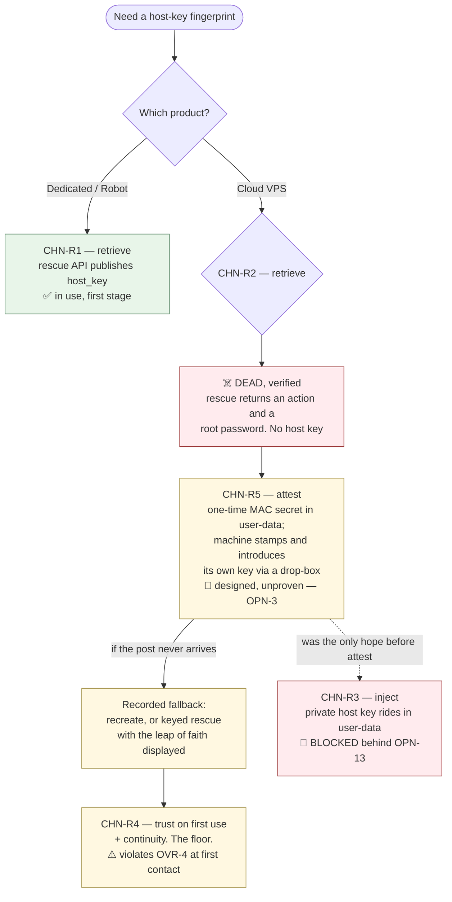
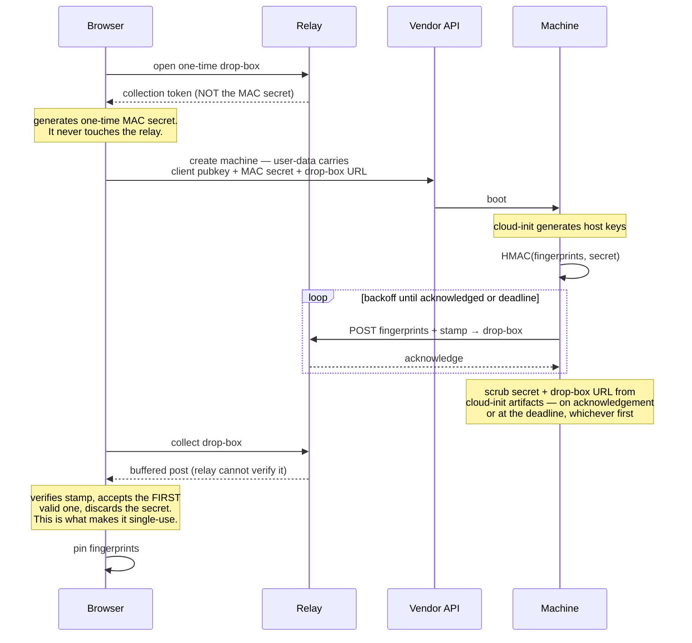

# 02 — The browser-to-machine channel

**CHN-1** The browser MUST reach a machine over SSH, verifying the host key against a
fingerprint obtained by other means, through a WebSocket-to-TCP relay
([ADR-0015](./docs/adr/0015-the-browser-reaches-a-machine-over-pinned-ssh.md)). A browser
cannot open a TCP socket to port 22 at all, so a bridge is forced regardless of who runs it.
The check that matters happens inside the SSH protocol at the application layer, so once the
right key is pinned the transport underneath is irrelevant to confidentiality and integrity.

**CHN-2** An SSH session MUST check the host key against the stored fingerprint, and a key
that does not match MUST halt the session. Exactly one moment is exempt and it is why
`CHN-R4` is a floor: under trust-on-first-use there is no stored fingerprint at first
contact, so that contact is trusted rather than verified and MUST be presented to the
operator as such. No other path may accept an unverified key.

**CHN-3** The mechanism is chosen **and demonstrated elsewhere**. Browser-resident SSH over a
WebSocket-to-TCP bridge ships in production in several independent implementations, including a
Rust one on `wasm32-unknown-unknown` using the same UI and build stack this design specifies
([ADR-0024](./docs/adr/0024-the-ssh-client-is-rust-following-a-known-good-configuration.md)).
What remains is integration and one property the references skip: **host-key pinning**
(`SEC-11`, `OPN-1`).

## The five routes to a fingerprint

Everything rests on pinning the *right* key, so the routes are part of the decision rather
than an implementation detail. They are numbered in the order they were found and listed
strongest first, which puts the fifth before the fourth.

**CHN-R1 — retrieve, dedicated servers.** Hetzner's Robot webservice exposes `host_key` on
`GET` and `POST /boot/{server-number}/rescue`. The harness activates rescue over HTTPS,
reads the authoritative host key, derives the fingerprint locally, and never performs
trust-on-first-use. Robot's browser reachability has been probed and is not an obstacle,
though that result rests on a single recorded probe and has not been re-verified. Two
caveats: Robot is a different product from Hetzner Cloud with a different auth scheme, so it
is a second integration rather than a free extension; and the contents of `host_key` are
undocumented (`OPN-6`).

Rescue boots its own sshd with its own host keys, and the installed system's are different.
That is not a gap — the installed system is put there *from inside the trusted rescue
session*, so its host keys are **generated there, per machine, and read before reboot**. No
trust-on-first-use at either hop.

**Host keys MUST NEVER be baked into a reusable image.** An image is built once and booted
on every member, so a host key inside it is the same private key on all five machines:
anyone holding the image, or compromising any one member, can then impersonate every other
member *and pass the fingerprint check*, because the fingerprint is genuinely the one that
was pinned. Reusing an image for the operating system is fine and is the point; reusing it
for identity is not.

**CHN-R2 — retrieve, cloud VPS. Dead, and verified dead.** Hetzner Cloud's rescue action
returns an action and a root password and no host key, checked against the API client. The
cloud path's identity problem belongs to the second stage; `CHN-R5` is designed for exactly
it, with `CHN-R3` and `CHN-R4` behind it.

**CHN-R3 — inject.** The browser generates the host keypair and writes it into `/etc/ssh/`
through cloud-init. No retrieval endpoint is needed at any vendor and the browser knows the
fingerprint because it made the key. The cost is that the *private* host key rides in
user-data, which the vendor stores. **This route MUST NOT be used until `OPN-13` resolves**,
and the only resolution is a narrow, named exception in the credential inventory for the
injected server host key specifically. Widening it to "vendor and inference credentials"
would strip the same protection from the SSH client keys and the relay token, opening a
larger hole than it closes. Scrubbing and rotating after first boot is a mitigation, not a
resolution.

**CHN-R5 — attest.** At creation, the browser generates a one-time MAC secret and places it
in user-data beside the client public key. A first-boot hook computes an HMAC of the
machine's freshly generated host-key fingerprints under that secret and posts
fingerprints-plus-stamp out through the relay. The browser verifies the stamp against the
secret only it held: a relay cannot substitute a key it cannot stamp, so there is no
trust-on-first-use. The vendor sees the secret and could forge a stamp — but the vendor owns
the machine's disk and memory and could replace the host keys wholesale regardless, so
attest hands it nothing it lacks. Unlike `CHN-R3`, **no private key leaves the browser and
none rides in user-data.**

**CHN-R4 — trust on first use, plus continuity.** Accept the key on first connect, pin it,
alarm on any later change. This is what ordinary SSH clients do. It needs no endpoint and
puts no key in user-data, and it still detects a **network or relay** attacker that turns
hostile later. It does **not** detect a vendor that turns hostile: the vendor can read the
host private key off the machine's disk and go on presenting the same fingerprint.
Continuity is protection against the network, not against the vendor.

Continuity also assumes the pin survives, which is what `03-state-and-recovery.md` supplies.

## The attest sequence

**CHN-4** The attest post MUST be delivered to a **drop-box**. The relay is
browser-initiated, so a first-boot machine cannot post through it without a rendezvous.

**CHN-5** Single-use MUST be enforced by the browser, not the drop-box. The relay never
holds the MAC secret, and a stamp it cannot forge it also cannot verify, so the drop-box
cannot tell a valid post from junk. What it does is buffer what arrives; the **browser**
verifies, accepts the first valid stamp, and discards the secret. Anyone holding the
drop-box URL — the vendor does — can shadow the box with garbage or a race: garbage fails
verification, and a *validly stamped* race requires the MAC secret, which only the vendor
also holds. A shadowed or empty box is a denial of service that forces the recorded
fallback, nothing more.

**CHN-6** The first-boot hook MUST retry with backoff until the relay acknowledges or a
deadline passes, and MUST scrub the voucher on whichever comes first, with the deadline
inside the voucher's expiry. Networking at first boot is exactly when routing and DNS are
least settled; a single-shot post followed by an irreversible scrub converts a transient
blip into a destroyed machine, on the one route that has no alternative.

**CHN-7** The attest voucher is a **short-lived introduction credential**, not a
non-credential. Possession of the voucher and the drop-box lets an actor stamp an
*arbitrary* fingerprint the browser will then trust — it authorizes the introduction, which
is the whole game. It carries a credential's lifecycle in `SEC-5`: it expires, it is
single-use per `CHN-5`, it is scrubbed from the machine's cloud-init artifacts, and it is
redacted from anything recorded or shown to a model. The collection token rides the
drop-box URL in the same user-data: the vendor sees both, which collapses to the same
accepted fact, and anyone else who obtains them post-boot finds them expired and consumed.

## The relay

**CHN-8** The relay MUST NOT be a generic open proxy. A WebSocket-to-arbitrary-TCP bridge
with no authentication will be abused within days of being reachable. The archived
specification's §21 requirements are the resolution: authenticate the user, enforce
destination and operation policy, prevent generic open-proxy behaviour.

**CHN-9** The relay has three duties: the SSH bridge, the attest drop-box, and — **designed
but not built** — a tunneled fallback for untyped calls (`CHN-12`).

**CHN-10** The relay MUST be **direct-first**. It is never in a path the browser can take
alone. An off-machine call goes straight from the browser to the service wherever the
service permits it; the relay carries only raw TCP (SSH), the machine-originated attest
post, and — if `CHN-12` is ever built — untyped calls whose destination refuses browser
CORS. Minimum usage is a design property, not an accident.

**CHN-11** The relay's operator is the **publisher** by default, with bring-your-own as the
escape hatch ([ADR-0019](./docs/adr/0019-the-publisher-operates-the-default-relay.md)). The
publisher's seat is a **bootstrap**: before the operator has any machine, someone must carry
the bytes that provision the first one. The product actively offers the move to a relay on
the operator's own maintained machine once one exists.

**Under out-of-band pinning a hostile relay is a denial of service and nothing worse. Under
`CHN-R4` it is not**: at first contact there is nothing to check the key against, so a
hostile relay can present its own, have it pinned, and read the session from then on.

**CHN-12** The **tunneled fallback for untyped calls is designed and unpriced, and MUST NOT
be presented as settled routing.** TLS terminating in the browser requires a TLS client
inside WebAssembly, and browsers do not expose their root certificate store to it. Such a
client therefore carries **its own bundled certificate-authority set**, which it must keep
current as authorities are distrusted, and owns the revocation problem outright. That is a
trust decision about roughly 150 parties sitting directly in a credential path — a different
and harder problem than pinning one known host key, not "the same character as the SSH
spike." Those authorities are a trusted-party growth that `SEC-10` guards, and until someone
prices them, a service refusing browser CORS is out of reach for untyped calls. No
first-stage work touches this.

## What the relay learns

**CHN-13** The relay learns the **member topology**, and the product MUST say so. Which
operator, which destination, when, accumulated over time, *is* the member set for a
federation. That is the same knowledge `TRU-E6` prices as a named trust row for the scanner,
and calling it merely "connection metadata" understates it.

It cannot read or alter a session pinned out of band, so the addition is visibility, not
authority over content. But a party that serves the bundle *and* sees every connection is a
bigger observer than one that serves the bundle alone.

**This is why Certificate Transparency was rejected, and the comparison reads stronger
stated honestly:** one party the operator chose learns the topology, against *everyone*
learning it permanently and unpublishably in a public log. Every publicly trusted
certificate is published in searchable logs and browsers require it, so a certificate for a
bare IP publishes that IP; for a federation the members' addresses appear as a correlated,
timestamped set, several issuances minutes apart across several hosting providers. Renewal
compounds it. The relay wins that comparison, and it wins it while knowing the same thing.

None of this touches an lnrent box, whose address is already public by design in its Nostr
listing. An lnrent box serving as the operator's own *relay* is the one machine that does
need a WebPKI certificate, because a browser demands `wss://`, and the objection does not
bite it.

**CHN-14** Self-hosting has its own honest price, named rather than hidden: the hosting
machine's **bound model** has box-plane reach over whatever the relay retains, so the
relay-install brief configures no connection logging, and the trust display prices the host
machine's model as a potential metadata observer regardless.
