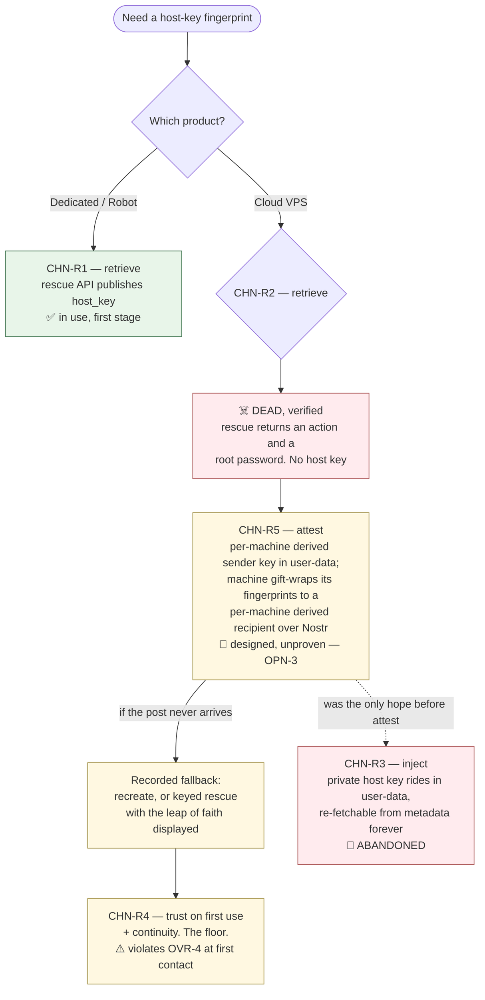
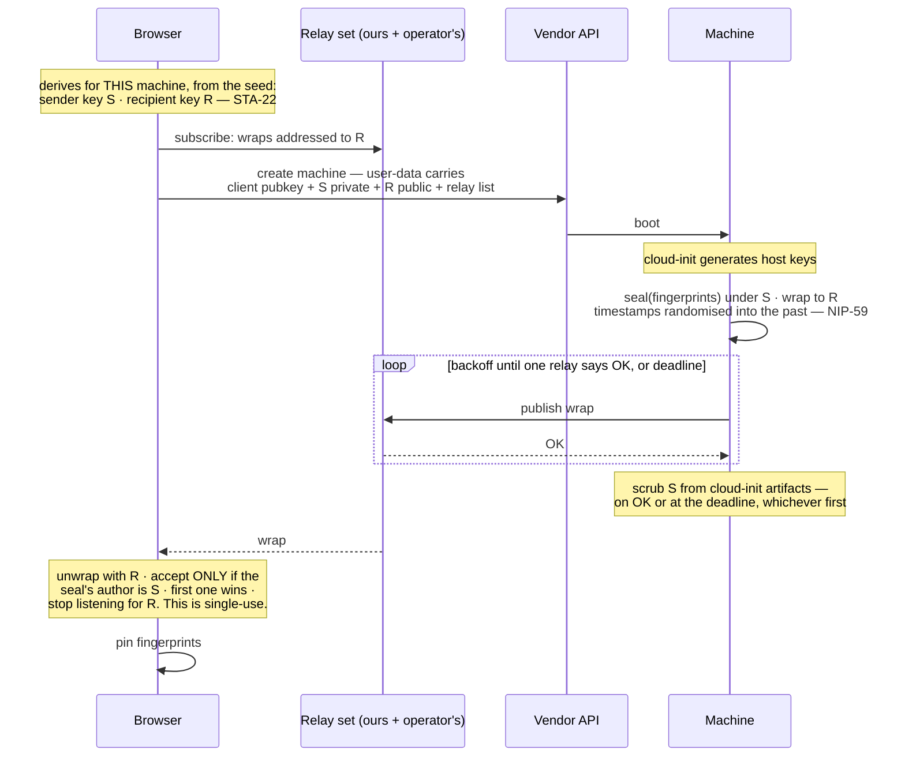

# 02 — The browser-to-machine channel

**CHN-1** The browser MUST reach a machine over SSH, verifying the host key against a
fingerprint obtained by other means, through a WebSocket-to-TCP relay
([ADR-0015](./docs/adr/0015-the-browser-reaches-a-machine-over-pinned-ssh.md)). A browser
cannot open a TCP socket to port 22 at all, so a bridge is forced regardless of who runs it.
The check that matters happens inside the SSH protocol at the application layer, so once the
right key is pinned the transport underneath is irrelevant to confidentiality and integrity.

**CHN-2** An SSH session MUST check the host key against the stored fingerprint, and a key
that does not match MUST halt the session. Exactly one moment is exempt and it is why
`CHN-R4` is a floor: under trust-on-first-use there is no stored fingerprint at first
contact, so that contact is trusted rather than verified and MUST be presented to the
operator as such. No other path may accept an unverified key.

**CHN-3** The mechanism is chosen **and demonstrated elsewhere**. Browser-resident SSH over a
WebSocket-to-TCP bridge ships in production in several Go implementations, and exists as a
single-author proof in Rust on `wasm32-unknown-unknown` using the same UI and build stack this
design specifies
([ADR-0024](./docs/adr/0024-the-ssh-client-is-rust-following-a-known-good-configuration.md)).
What remains is integration; the one property the references skip, **host-key pinning**
(`SEC-11`), was demonstrated on the spike of 2026-09-07 (`OPN-1`, closed) and `CNF-21` and
`CNF-79` carry it for the real build.

## The five routes to a fingerprint

Everything rests on pinning the *right* key, so the routes are part of the decision rather
than an implementation detail. They are numbered in the order they were found and listed
strongest first, which puts the fifth before the fourth.

**CHN-R1 — retrieve, dedicated servers.** Hetzner's Robot webservice exposes `host_key` on
`GET /boot/{server-number}/rescue/last`. **Run 2026-09-08** (`CNF-48`,
[findings](./docs/findings/2026-09-08-first-stage-rehearsal.md)): the harness activates rescue
over HTTPS (`POST /boot/{n}/rescue`, which publishes **nothing** — its `host_key` is empty),
triggers the hardware reset, then polls `GET /boot/{n}/rescue/last` until `host_key` fills,
which happens about **80 s after the reset and some 10 s before the rescue's sshd answers**,
together with a `boot_time`. The field holds **SHA-256 fingerprints, one per host-key
algorithm, and no public key material**; the browser derives the presented key's fingerprint
at first contact and compares. **Every rescue boot has fresh host keys**, so the pin is per
boot, not per machine, and the plain rescue endpoint reports inactive and empty once the boot
has consumed the activation — only `/rescue/last` knows. Never trust-on-first-use: a client
that connects before `/rescue/last` fills has nothing to check against and MUST wait. The
input side, `authorized_key[]`, takes MD5 colon fingerprints of keys registered at Robot.

**Robot is NOT reachable by a browser `fetch`, verified 2026-08-31.** An earlier probe recorded
the opposite and was wrong — almost certainly run with a tool that does not enforce CORS. Live
results against the API, on a real account: an unauthenticated preflight returns 401, and an
**authenticated** `OPTIONS` and an **authenticated** `GET` both return **200 with no
`Access-Control-*` header of any kind**. So this is not an auth-before-CORS ordering bug that
the vendor might fix; the API has no CORS support, and no browser origin can read its responses
regardless of credentials. Since Robot uses HTTP Basic, every request carries an `Authorization`
header, which forces a preflight the API will never satisfy.

**This does not kill the route — it moves it off `fetch`.** CORS is a restriction on the
browser's own HTTP stack, not on bytes. A TLS session terminated *inside* the browser and
carried over the relay is not a `fetch`, has no origin, and is subject to no CORS check — which
is exactly why the SSH channel works.

Reaching Robot therefore needs a WebAssembly TLS client — but the **pinned** kind (`CHN-12a`),
not the general kind. Robot is one destination, named at build time, so it is pinned to its
issuing authority and **no certificate-authority set beyond that one authority, and no new
trusted party, are involved**. That cost has now been paid once: a pinned client in WebAssembly
read Robot through a bridge on 2026-09-07 (`OPN-21`), and it is a far smaller cost than
`CHN-12b`.

Two further caveats stand: Robot is a different product from Hetzner Cloud with a different auth
scheme, so it is a second integration rather than a free extension; and the contents of
`host_key` are undocumented by the vendor — what the field holds is known from the run, not
from documentation (`CNF-48`), so a format change would arrive unannounced.

Rescue boots its own sshd with its own host keys, and the installed system's are different.
That is not a gap — the installed system is put there *from inside the trusted rescue
session*, so its host keys are **generated there, per machine, and read before reboot**. No
trust-on-first-use at either hop.

**Host keys MUST NEVER be baked into a reusable image.** An image is built once and booted
on every machine, so a host key inside it is the same private key on all five machines:
anyone holding the image, or compromising any one machine, can then impersonate every other
machine *and pass the fingerprint check*, because the fingerprint is genuinely the one that
was pinned. Reusing an image for the operating system is fine and is the point; reusing it
for identity is not.

**CHN-R2 — retrieve, cloud VPS. Dead, and verified dead.** Hetzner Cloud's rescue action
returns an action and a root password and no host key, checked against the API client. The
cloud path's identity problem belongs to the second stage; `CHN-R5` is designed for exactly
it, with `CHN-R4` behind it as the floor and `CHN-R3` abandoned.

**CHN-R3 — inject. Abandoned.** The browser generates the host keypair and writes it into
`/etc/ssh/` through cloud-init. No retrieval endpoint is needed at any vendor and the browser
knows the fingerprint because it made the key. **This route MUST NOT be used.**

The recorded objection was that the *private* host key rides in user-data, which the vendor
stores, contradicting the credential inventory. The objection that actually ends it is worse
and was missed: **on the vendors this design targets, boot-time user-data is served back to the
machine by the metadata endpoint for the life of the instance.** Anything running on that
machine can re-fetch the host private key at any time and impersonate the machine — passing the
fingerprint check, because it is genuinely the pinned key. The proposed mitigation cannot reach
it: scrubbing deletes cloud-init's cached copy on disk and the endpoint goes on serving the
original.

**This is vendor-dependent and must not be restated as universal.** It holds on DigitalOcean,
which documents that user data cannot be modified after creation, and in practice on Hetzner
Cloud — whose user-data route is undocumented and which removed its EC2-compatible metadata
routes in August 2026, so the surface drifts. It is **false on AWS**, where user data is mutable
on a stopped instance, can be cleared entirely, and where the metadata service can be disabled
outright. A reader porting this reasoning to another vendor must check rather than assume.

`ARC-36` sharpens it. A machine renting slices hosts parties the operator has never met, and a
guest querying the metadata endpoint obtains a permanent impersonation credential for the box it
is a guest on.

**The contrast with `CHN-R5` is the whole reason one survives and the other does not.** Attest
puts a *single-use* credential in a permanently-readable place; injection puts a *permanent*
one there. An introduction key the browser has already accepted once, and will never accept
again, is worthless to a later reader. A host private key never expires.

Attest covers the same vendors — anywhere with boot-time user-data — so nothing is lost but the
route.

**CHN-R5 — attest.** The machine introduces its own host key to the browser over Nostr, under
keys the browser **derives** rather than stores
([ADR-0029](./docs/adr/0029-the-machine-speaks-nostr-and-keys-derive-from-a-seed.md)).

At creation the browser derives two keypairs for this machine from the operator seed
(`STA-22`): a **sender key**, whose private half goes into user-data beside the SSH client
public key, and a **recipient key**, whose public half goes there too. A first-boot hook reads
the machine's freshly generated host-key fingerprints, seals them under the sender key, gift-wraps
the seal to the recipient key, and publishes the wrap to the relay set (`CHN-18`). The browser,
subscribed for that recipient since creation, unwraps with the recipient private key it
re-derives at will, and accepts the fingerprints **only if the seal's author is the sender key
it planted**. A relay cannot forge that seal, so there is no trust-on-first-use. The vendor
holds the sender key and could forge one — but it owns the machine's disk and memory and could
replace the host keys wholesale regardless, so attest hands it nothing it lacks.

**A private key does ride in user-data now, and the reason `CHN-R3` died still does not apply.**
What killed injection was what its key *authorized*: a host private key impersonates the
machine for life, and the metadata endpoint serves user-data for life. The sender key
authorizes **one introduction**, and the browser stops listening for it the moment one is
accepted (`CHN-5`). A later reader of the metadata endpoint finds a key nothing will ever
believe again. The bound is the same one the one-time secret had; only the envelope changed.

**Nothing about this needs the browser to remember anything.** Both keys re-derive from the
seed and the machine's index, so a phone that locks between creating the machine and receiving
its post loses nothing — which is the case the previous design could not survive, since a
random secret redacted from the record had nowhere to live.

**CHN-R4 — trust on first use, plus continuity.** Accept the key on first connect, pin it,
alarm on any later change. This is what ordinary SSH clients do. It needs no endpoint and
puts no key in user-data, and it still detects a **network or relay** attacker that turns
hostile later. It does **not** detect a vendor that turns hostile: the vendor can read the
host private key off the machine's disk and go on presenting the same fingerprint.
Continuity is protection against the network, not against the vendor.

Continuity also assumes the pin survives, which is what `03-state-and-recovery.md` supplies.

## The attest sequence

**CHN-4** The attest post is a **gift-wrapped Nostr event** — a NIP-59 wrap around a NIP-44
seal — published to the relay set of `CHN-18`, and the browser receives it by subscription.
*What this replaced:* a drop-box the browser had to open at the relay before creating the
machine, with a collection token to fetch it afterwards. Both are gone. The relay is
browser-initiated and a first-boot machine still needs a rendezvous; the rendezvous is now a
standard inbox that any Nostr relay provides, rather than a custom buffer only ours did.

**CHN-5** Single-use MUST be enforced by the browser, not by any relay. A relay cannot
distinguish a genuine seal from junk — it never holds the sender key — so a relay enforcing
"one post" would enforce it on the first post of *any* kind, a denial of service dressed as a
property. The **browser** unwraps, checks the seal's author against the sender key it planted,
accepts the first match, pins, and **stops listening for that recipient**. Anyone able to write
to the inbox — everyone, on a public relay — can flood it with garbage or race it: garbage fails
the author check, and a *validly sealed* race requires the sender key, which only the vendor also
holds. A flooded or empty inbox is a denial of service that forces the recorded fallback, nothing
more.

**CHN-6** The first-boot hook MUST retry with backoff until at least one relay in the set
answers OK or a deadline passes, and MUST scrub the sender key from cloud-init artifacts on
whichever comes first. Networking at first boot is exactly when routing and DNS are least
settled; a single-shot post followed by an irreversible scrub converts a transient blip into a
destroyed machine, on the one route that has no alternative.

**The only clock that matters is the browser's.** The old design had the machine's deadline
"inside the voucher's expiry", a relationship between two numbers neither of which existed.
Nothing on the machine can expire anything: the metadata endpoint serves user-data for life,
and a gift wrap's timestamps are deliberately randomised up to two days into the past, so they
say nothing about when it was sent. The window is **the browser's own clock, from machine
creation**, after which it stops listening for that recipient and presents the recorded fallback.
The machine's deadline is housekeeping — when to give up retrying and scrub — and the browser's
window MUST be set from a **measured** slowest first boot rather than a guess, and stated as an
outcome with a named fallback rather than something the operator discovers.

**The scrub is defence in depth, and MUST NOT be described as the bound.** It removes
cloud-init's cached copy from disk; the vendor's metadata endpoint goes on serving the original
user-data for the life of the instance, so the sender key stays re-fetchable by anything on the
machine. **What bounds the exposure is `CHN-5`**: the browser accepts one introduction and never
another from that key, so a later reader holds a key nothing will believe. The realistic window
is the minutes before any tenant software exists. A machine that blocks its own metadata
endpoint after first boot closes the rest, and that is a hardening step to declare (`ARC-39`)
rather than assume.

**CHN-7** The attest **sender key** is an **introduction credential**, not a non-credential.
Possession of it lets an actor seal an *arbitrary* fingerprint the browser will then trust — it
authorizes the introduction, which is the whole game. It carries a credential's lifecycle in
`SEC-5` row 7: single-use per `CHN-5`, scrubbed from the machine's cloud-init artifacts, redacted
from anything recorded or shown to a model, and **never stored in the browser**, because it is
re-derived on demand (`STA-22`). The **recipient key** is a credential too — it decrypts the
introduction — and is row 16 on the same terms. Both are per machine: user-data for machine 1
says nothing about machine 2, and an inbox on a public relay, which anyone can list, maps to one
machine and not to an operator.

**CHN-17 The notify channel.** Attest is the first use of a general rule, stated once so nobody
re-derives it when a second use arrives: **a machine may send the harness an event, and an event
is an observation.** It is typed untrusted, exactly as every box-plane output already is
(`ARC-28`); it never gates a step, never triggers an action, never enters model context as
anything but content. `ARC-1` stands because of that typing — a machine that can *tell* the
browser something is not a machine that can *make* it do something. **The list of uses is one
entry long**, and each addition is a stated design change rather than a use of an open door.
Candidates exist — a job record's completion (`STA-20`), a delivery check's result (`ARC-39`) —
and none has been added.

**CHN-18 The relay set.** The publisher's Nostr relay, on the same host as the TCP bridge
(`CHN-11`), is **mandatory**, and the operator MAY add public relays for resilience. First boot
is the one message with no other route, so it must not depend on a relay nobody runs on the
operator's behalf. Ours serves a recipient's wraps only to a subscriber who has authenticated as
that recipient (NIP-42), which is what the standard asks of relays and what three of four public
relays tested did not do: on those, anyone can list every wrap addressed to a key. Per-machine
recipients bound what that reveals, and the publisher's relay is the one place the inbox is not
public. A public relay in the set is a party the operator chose, named in `TRU-E10`.

**The first-boot tool is an artifact.** A machine needs a Nostr client before anything else is
installed. On NixOS it is a distribution package, admitted as everything there is (`ARC-25a`).
On Alpine there is no package, and the upstream release binary is glibc-linked and fails on
musl; the publisher therefore ships a static build, which is an artifact pinned under `ARC-25`
and signed under `TRU-E7`, about thirty megabytes at first boot. Two traps verified on a real
run: standard input must be redirected from the null device explicitly, since a *closed*
descriptor crashes the tool, and gift-wrapping must be told to use the identity keys directly,
or it spends seconds looking up optional keys on the network before an inbox exists.

## The relay

**CHN-8** The relay MUST NOT be a generic open proxy. A WebSocket-to-arbitrary-TCP bridge
with no authentication will be abused within days of being reachable. The archived
specification's §21 requirements are the resolution: authenticate the user, enforce
destination and operation policy, prevent generic open-proxy behaviour.

**CHN-9** The relay has two duties: the TCP bridge — the SSH channel, `ARC-26`'s surface
probes, the pinned vendor tunnel (`CHN-12a`) and a profile-declared post-harness credential's
traffic (`ARC-19a`) — and, **designed but not built**, a tunneled fallback for untyped calls
(`CHN-12b`).
Beside it, on the same host and under the same operator, runs a **Nostr relay** for the notify
channel (`CHN-18`). It is a separate, standard service rather than a third duty of the bridge,
and the attest drop-box it replaces is gone.

**"The relay" means the TCP bridge.** A Nostr relay is always called that, in full. The two
share a host and an operator and nothing else, and a sentence that says "the relay" about the
inbox is wrong.

**CHN-10** The relay MUST be **direct-first**. It is never in a path the browser can take
alone. An off-machine call goes straight from the browser to the service wherever the
service permits it; the relay carries only raw TCP — the SSH channel, `ARC-26`'s surface
probes, the pinned vendor tunnel where a vendor refuses CORS (`CHN-12a`), and whatever a
profile's post-harness credential speaks to its machines after delivery (`ARC-19a`) — and, if
`CHN-12b` is ever built, untyped calls whose destination refuses browser CORS.
The machine-originated attest post no longer crosses it at all. Minimum usage is a design
property, not an accident.

**CHN-11** The relay's operator is the **publisher** by default, with bring-your-own as the
escape hatch ([ADR-0019](./docs/adr/0019-the-publisher-operates-the-default-relay.md)). The
publisher's seat is a **bootstrap**: before the operator has any machine, someone must carry
the bytes that provision the first one. The product actively offers the move to a relay on
the operator's own maintained machine once one exists.

That move retains an **external relay route for the relay-host machine itself**, for SSH,
recovery and outside-in scans. `CHN-16a` forbids a relay from dialing its own addresses.
Before switching the default, configure and demonstrate that external route and preserve its
access metadata. It may remain the publisher's relay or another operator-chosen relay; its
availability and metadata visibility remain in the trust display. Do not claim that one
self-hosted relay eliminates this dependency. If no external route is available, migration
does not complete; never relax the self-address prohibition to make it appear successful.

**Under out-of-band pinning a hostile relay is a denial of service and nothing worse. Under
`CHN-R4` it is not**: at first contact there is nothing to check the key against, so a
hostile relay can present its own, have it pinned, and read the session from then on.

**CHN-15** Relay access is **bought, not granted**
([ADR-0025](./docs/adr/0025-relay-access-is-bought-not-granted.md)), and what is bought is
recorded against a **relay key** the browser derives from the seed (`STA-22`), one per
purchase. The browser asks for access naming that key's public half; the relay answers `402`
with an invoice over ordinary HTTPS; the operator's own wallet pays it (`ARC-30`, `SEC-13`); the
relay observes its own invoice settle and binds a **pass** — destinations, expiry, pacing — to
the key. When the WebSocket opens the relay issues a challenge and the browser signs it with the
key, in the shape NIP-42 already defines and the browser already implements for the Nostr relay.
**Nothing bearer exists.** There is no bearer string to store: the key
re-derives from the seed plus its exported pass index (`STA-22b`), and the relay remembers
the pass. Missing allocation metadata can lose access to paid quota.

*What this replaced.* The pass used to be an opaque random string presented on connect. It was
held encrypted at rest, exported nowhere, and "re-bought rather than recovered" after a lost
phone. It also could not be revoked after that loss, because the relay had no way to recognise
whoever was asking — which is what the seed's derived key gives it: a revocation is a message
signed by the key the pass is bound to.

**No account, and therefore no identity party.** That is the point: an account system is a party
that knows every operator and can deny them service, which `SEC-10` prices as a schema
migration. A relay key is not an identity: it is one random-looking public key, derived per
purchase, and the relay cannot link two purchases by their keys. What it can link is the
destination set, which `CHN-13` already prices.

**CHN-16** A pass's **destination record is the authorization**, not a separate system. A pass
is bought before the machines exist, so its destination list grows as the operator creates them
— which is the moment the relay learns topology, already priced at `CHN-13`. **Recording a
destination requires the relay key's signature**, so nobody but the key holder can widen a pass —
which a bearer string could not promise, since anyone holding it could.

**CHN-16a Destination authorization never grants access to the relay's private network.**
At registration and again on **every outbound connection**, the relay accepts only public
unicast destinations. It refuses loopback, private, link-local, unspecified, multicast,
broadcast, documentation, reserved and other non-global addresses in IPv4 and IPv6, including
metadata endpoints, IPv4-mapped IPv6 and alternate numeric spellings after normalization.
It also refuses every address belonging to the relay host itself, including its public IPs.
The implementation pins the IANA special-purpose address tables used for classification and
treats their updates as reviewed policy updates. Unknown address forms fail closed.

For a DNS destination, resolve through the relay's resolver, reject the request if **any**
answer is forbidden, and connect to the checked numeric address without a second resolution
inside the dialer. Apply the check to retries, refreshed DNS results and every port; redirects
or alternate targets are new destinations requiring the same authorization and validation.
Use an egress firewall to deny local/private/metadata routes as defense in depth. Private
proxying is not a first-stage exception: the hand-recorded relay key obeys the same rule.

**A revoked pass closes its live connections and refuses new ones**, and revocation is a
message signed by the pass's key. That is the teardown rule `CNF-60` was waiting for. What
revocation protects is stated at its real size: under `ARC-41` the relay's view equals the
world's, so a pass in the wrong hands reaches nothing the public internet does not; it spends
the operator's paid quota and gets the operator's pass blamed for the traffic. Revocation
protects money and attribution, not machines.

**A recorded destination is reachable on any port, not on the SSH port alone.** `ARC-26`'s
surface scan probes which ports answer; a relay forwarding only port 22 would report exactly one
open port on every machine whatever that machine's firewall was doing — a check that cannot fail,
which is worse than no check, because it is displayed to the operator as an observation.
`ARC-41` requires the relay-side view of a machine to *equal* the world's: forbidding privilege
keeps that view from being larger, and this keeps it from being smaller.

Payment alone does not satisfy `CHN-8`: a relay forwarding wherever it is told is a paid proxy
rather than an open one. What makes it defensible is the combination — only destinations
recorded against that pass, capped in number, **paced per destination**, and revocable the moment
abuse is seen. Payment raises the cost of abuse and makes revocation meaningful; the destination
record does the narrowing; **pacing is what makes a wide port range useless as a scanning
service**, and it is the same per-target limit `ARC-26`'s tool contract already imposes.

**The relay cannot verify that a recorded destination belongs to the operator**, and is not
asked to. Every scan target is assumed to be a machine the harness provisioned — a design
assumption, not an enforced one, and weaker than the port restriction it replaces. What bounds
the residual is that the relay is a *worse* scanner than what an attacker already has: a pass
buys a capped, paced, revocable, billed view of a handful of addresses, where the same money
rents a machine with none of those limits.

**CHN-12** A tunnel terminates TLS **inside the browser** and carries ciphertext over the
relay, so the relay stays a carrier and learns nothing of the contents. Browsers do not expose
their root certificate store to WebAssembly, so such a client must decide for itself what to
believe — and **that decision costs radically different amounts depending on where it is
going.** An earlier version of this requirement priced both cases as one and got the expensive
answer for both.

**CHN-12a — a known destination is pinned, and needs no certificate-authority set beyond the
one pinned authority.** A vendor API is named at build time and there are a handful of them.
The browser validates against a **pinned issuing authority shipped in the bundle**, exactly as
it pins a host key (`SEC-11`) and an artifact hash (`ARC-25`). **No
trusted party is added**, because a pin is a fact about one endpoint rather than a delegation
to a category. Mechanically the pin *is* a trust store holding exactly that one certificate
and nothing else, against which the TLS library's ordinary verifier checks chain, name and
validity — a store of one is a pin, a store of many is `CHN-12b`'s object. Run 2026-09-07
(`OPN-21`): Robot's response read, a valid certificate from another issuer refused before any
byte was sent. The validity check uses the browser's clock, so a phone with a badly wrong
clock refuses a good pin; that failure names rotation (`CNF-64`) and is wrong about the cause.

Its honest cost is **rotation**. A vendor changing its issuing authority makes its API
unreachable until a release ships the new pin, and briefs already ship on release cadence
(`ADR-0005`). Pinning the issuing authority rather than the leaf makes this rare rather than
routine; it does not make it impossible, and the failure mode — loss of reachability, not loss
of confidentiality — must be stated wherever a pin is relied on.

**CHN-12b — an arbitrary destination needs a general trust store, and remains unpriced and
unbuilt.** A service that refuses browser CORS cannot be known in advance, so reaching it means
carrying a certificate-authority set, keeping it current as authorities are distrusted, and
owning revocation. That is a trust decision about roughly 150 parties sitting in a credential
path, it is a growth `SEC-10` guards, and `OPN-20` still prices it. Until it is priced, **an
arbitrary service refusing browser CORS is out of reach for untyped calls.**

## What the relay learns

**CHN-13** The relay learns the **machine topology**, and the product MUST say so. Which
operator, which destination, when, accumulated over time, *is* the machine set for a
federation. That is the same knowledge `TRU-E5` prices as a named trust row for the scanner,
and calling it merely "connection metadata" understates it.

It cannot read or alter a session pinned out of band, so the addition is visibility, not
authority over content. But a party that serves the bundle *and* sees every connection is a
bigger observer than one that serves the bundle alone.

**The Nostr relay on the same host learns the same thing by a different route**, and the product
MUST say so too. It sees a cloud address publish a wrap to recipient R, and it sees the
operator's address authenticate as R to read it — one machine, one inbox. Per-machine recipients
mean it learns N unrelated inboxes rather than one operator's N machines; the operator's
subscriptions arriving from one address correlate them anyway. That is `CHN-13`'s knowledge,
held by `TRU-A2`, and nothing new. A **public** relay in the set learns the publish half without
the authentication — and, on the relays tested, serves the inbox to anyone who asks — which is
why the operator's choice to add one is a named party (`TRU-E10`) and not a free resilience knob.

**This is why Certificate Transparency was rejected, and the comparison reads stronger
stated honestly:** one party the operator chose learns the topology, against *everyone*
learning it permanently and unpublishably in a public log. Every publicly trusted
certificate is published in searchable logs and browsers require it, so a certificate for a
bare IP publishes that IP; for a federation the members' addresses appear as a correlated,
timestamped set, several issuances minutes apart across several hosting providers. Renewal
compounds it. The relay wins that comparison, and it wins it while knowing the same thing.

None of this touches an lnrent box, whose address is already public by design in its Nostr
listing. An lnrent box serving as the operator's own *relay* is the one machine that does
need a WebPKI certificate, because a browser demands `wss://`, and the objection does not
bite it.

**CHN-14** Self-hosting has its own honest price, named rather than hidden: the hosting
machine's **bound model** has box-plane reach over whatever the relay retains, so the
relay-install brief configures no connection logging, and the trust display prices the host
machine's model as a potential metadata observer regardless.
