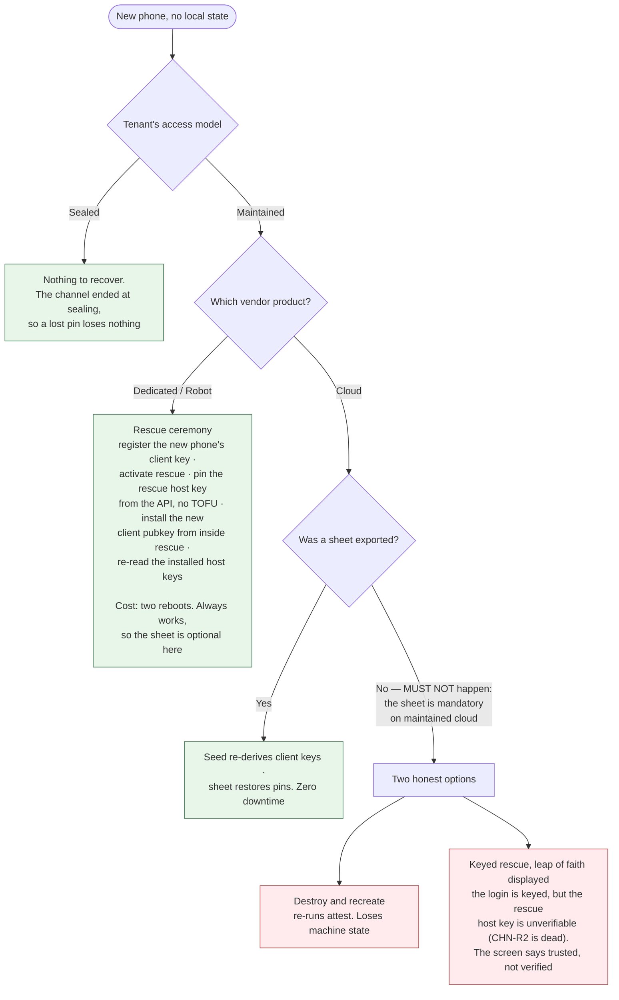

# 03 — Durable state and recovery

Two halves of one problem. **State** is what survives the worker being killed while the
phone is in the operator's hand. **Recovery** is what survives the phone being lost. The
decisions are in [ADR-0022](./docs/adr/0022-durable-state-is-an-append-only-journal.md) and
[ADR-0020](./docs/adr/0020-recovery-roots-in-the-vendor-account.md).

## Durable state

**STA-1** A single **harness worker** MUST be the only writer of durable state. Tabs,
command workers and adapters submit observations and requests; they do not mutate canonical
state.

**STA-2** Canonical state MUST be an **append-only event journal** with replayable
transitions, held in origin-private storage. Content-addressed with periodic compact
snapshots; in-memory state is authoritative only while a worker is running.

**STA-3** A canonical event MUST be durably appended **before** it is applied to in-memory
state. If the append fails, the transition does not occur.

**STA-4** A side-effecting call MUST have a durable record, an approval decision, and an
idempotency identity **before execution begins**. For an off-machine call this is `SEC-12`;
for box-plane work it is the per-command record of `ARC-8`.

**STA-5** Every tool MUST declare its retry safety: pure, idempotent with a key strategy,
reconcile-before-retry, or never-retry-automatically.

**STA-6 Box-plane work is never-retry-automatically.** Arbitrary shell on a remote machine
cannot declare itself idempotent, so no honest declaration other than this exists. Its
recovery path is `ARC-10`: reconnect, read the machine's state, converge.

**STA-7** After a crash the worker MUST acquire its lock, load the latest snapshot, replay
subsequent events, classify incomplete calls, cancel those that cannot still exist,
reconcile or surface uncertain ones, and resume only where policy permits. **No model turn
is silently resumed from an uncertain destructive operation.**

**STA-8** A call that may have produced an external effect but has no terminal event MUST
enter an unresolved state requiring evidence or operator inspection to leave. It MUST NOT be
retried automatically and no timer may clear it. Establishing *what happened* by a status
query is permitted and required where a tool supports one; doing it *again* is not.

**STA-9 The journal records what was sent, not what the machine did with it.** This is the
honest limit of `STA-2` across the channel. A phone that locks mid-install kills the worker
and the SSH session with it; on reconnect the journal knows exactly which commands were
transmitted and nothing about which completed. Four outcomes are indistinguishable from the
journal alone: never arrived, started and died with the session, **still running**, or finished
with the output lost. Re-running is safe for three of them and is the corruption case for the
third.

**STA-20 Every box-plane command runs as a durable job**, and the machine keeps a record of it
on persistent disk holding: the **command as received**, its output, its exit code once it has
one, and enough to tell whether it is still alive. On reconnect the session reads that record
rather than guessing — exit code present means finished, process alive means wait, neither
means it died and `ARC-10`'s convergence applies.

*Uniformly, rather than only for commands somebody marked long.* Nobody can reliably predict
which command is slow — a package install is ten seconds most days and ten minutes when a
mirror is struggling — and the mispredicted one is precisely the command that outlives its
session. Removing the prediction removes the failure. `ARC-7` already pays a round trip per
command, so the marginal cost is small against latency already being spent.

**STA-20a Output MUST be captured by redirection to a file, never by reading a pipe the job
holds open.** A command that starts a background process leaves that process holding the pipe's
write end, so a reader blocks until *the background process* exits rather than until the command
does. Measured on both declared distributions: a command that prints and exits immediately
returns after twenty seconds when captured through a pipe and immediately when redirected to a
file. This is not a liveness subtlety — it is `STA-20`'s "its output" field hanging, and it
inverts the failure mode in the damaging direction, since the record then reads *still running*
indefinitely and `CNF-40` requires the returning session to wait on exactly that.

**No orphan test may rest on a reparented process's new parent.** Verified: an orphan reparents
to PID 1 on one declared distribution and to a user-level subreaper on the other, so `PPID == 1`
is precisely the kind of check that is false on the other distribution.

The mechanism is POSIX and holds no init-system opinion, because `ARC-24` declares two
distributions with different init systems and anything specific to one would be false on the
other. **Those two are not the same constraint, and `OPN-22` is open on which one binds** —
POSIX offers no way to observe a process that has left its session, so the wider reading of
"still alive" is unreachable under it. **Jobs may be hosted inside a terminal multiplexer** so a human can attach and watch a
long install — useful during `STG-2`'s by-hand rehearsal — but that is an observation
convenience and never the record. The multiplexer dies with the machine; the files do not, and
after a reboot their absence correctly reads as "died".

**STA-21 The job record is machine-reported and advisory.** The browser journal is authoritative
for what was **sent** (`STA-3`, `ARC-8`); the machine's record says what it **received** and what
happened next. Comparing the two catches truncation, quoting damage and a mangled multi-line
command — the honest-mistake class, and a real one. It catches nothing against a machine that
lies, because such a machine writes whatever it likes. This stands exactly where the
deterministic verifier stands and MUST NOT be reported as more (`SEC-2`).

## The exposure ledger

**STA-10** The **exposure ledger** is the per-machine history of every configured model that
has ever touched a machine. It is how `SEC-1`'s permanence clause is tracked, it lives in the
encrypted-at-rest store, and it is exported in the recovery sheet.

**STA-11 The ledger's staleness rules bind only a tenant that is both maintained and
threshold-bearing, and none currently is.** The two halves cancel, and stating so keeps an
implementer from building machinery that governs nothing:

- Where exposure **matters** — a tenant with a threshold — btc-policy **seals** its machines,
  so nothing re-enters, so the ledger is complete when setup ends and never changes again. A
  recovery sheet's snapshot is therefore always current.
- Where the ledger **drifts** — a maintained machine, re-entered by later sessions — there is
  no threshold, so nothing depends on the count. One machine has no collision to display.

For a tenant that is both, which is possible and does not yet exist, the rules below apply.
They are recorded rather than deleted for that reason.

**STA-12** A restored ledger is a **floor, not a census**. The sheet records its export time;
the app requires a re-export whenever the ledger mutates; and a restored ledger is displayed
"as of" its export. Where it may be stale, re-entry binds only a configured model not
currently assigned to any other machine.

**STA-13** A machine recovered *without* a ledger carries **unknown past exposure**, displayed
as such, and re-entry then binds only a configured model not currently assigned to any other
machine — the conservative reading, since the unknown history could contain any of them.

## What survives a lost phone

**STA-14** The operator's **vendor account is the recovery root**. It survives because it
lives in their head or their password manager and is recoverable through the vendor's own
processes, and it is the one party that always knows which machines exist.

| Dies with the phone | Survives |
|---|---|
| Host-key pins | The vendor login |
| The machine inventory | **The seed** — in the operator's head or seed backup, never on the phone alone (`STA-22`) |
| The relay pass | **The SSH client keys, re-derived from the seed** — they used to be in the left column, and moving them is the whole reason the seed exists |
| Action transcripts | The app URL |
| Provenance records | A relay pass, **re-bought** rather than recovered (`CHN-15`) |
| The exposure ledger | The recovery sheet, **if exported** |
| **The inference account credential**, unless exported: it is bearer, there is no account behind it, and nothing re-derives it | The inference balance — **only** through the sheet (`SEC-5` row 14) |
| The vendor API credential and the session inference key — re-supplied or re-minted per session, deliberately not persisted | |

**Transcripts and provenance are gone and stated as gone.** They were records, not secrets;
nothing re-derives the past.

**STA-22 The operator holds a seed, and every per-machine credential the browser needs derives
from it.** A BIP-39 mnemonic, held encrypted at rest and backed up by the operator the way
this audience already backs up seeds. For machine *m*, the browser derives at index *m*: the
SSH client keypair (`SEC-5` row 3), the attest sender key (row 7) and the attest recipient key
(row 16). Derivation is BIP-32 by account index — NIP-06's path for the Nostr keys, which
upstream now labels *unrecommended* in favour of a single key; that is a wallet-interoperability
warning, and nothing outside the harness ever needs to reproduce these keys, so it does not
apply. Cite it with the label rather than without
([ADR-0029](./docs/adr/0029-the-machine-speaks-nostr-and-keys-derive-from-a-seed.md)).

- **No session and no machine ever sees the seed.** What machine *m* receives is its client
  public key, its sender private key and its recipient public key — three values nothing
  derives *from*. `SEC-1`'s cryptographic enforcement is untouched: machine 3 still holds
  machine 3's public key alone.
- **A machine's index is journaled before the create call and never reused.** The same index
  on two machines is the same client key on two machines, which is `SEC-1` broken by
  bookkeeping. `STA-3` already requires the record before the effect; the index is part of
  that record, and indices are monotonic.
- **The sheet no longer carries keys.** It holds pins, the ledger and the inference account
  credential (`STA-16`). A lost phone re-derives every client key from twelve words; what it
  cannot re-derive — pins, the ledger, the balance — is what the sheet is for.
- **A stolen seed is not revocable.** Replace (`STA-17`) is therefore a **new seed**, from which
  new client keys derive, with the old public keys removed from every maintained machine during
  re-entry — the same flow as before, with a different origin for the new keys and one more
  thing to back up again.

*What this reverses.* ADR-0020 rooted recovery in the vendor account and rejected a seed-shaped
root by omission; the sheet existed because nothing re-derived the client keys. The vendor
account still roots **inventory** — it is the one party that always knows which machines exist.
The seed roots **credentials**. Both are stated, and neither does the other's job.

## Recovery, by access model and vendor

**STA-15** The recovery sheet MUST be exported before a **maintained cloud** machine's setup
completes. On Robot the ceremony always works, so there the sheet is an optimisation and
stays optional. A sealed tenant's machines need none: their pins die at sealing, and a phone
lost mid-setup is answered by the tenant's own all-or-nothing rule — abandon and recreate.
This asymmetry is stated, not smoothed over.

**STA-16** The recovery sheet holds host-key fingerprints, the exposure ledger, and — on the
procured path — the **inference account credential**, wrapped under a passphrase the operator
chooses. **It no longer carries the SSH client keys**, which re-derive from the seed
(`STA-22`). The export screen MUST say what the sheet can do in the wrong hands with the
passphrase: **spend the remaining inference balance**. Reaching a machine needs the seed, and
the seed is never in the sheet.

**The balance is in the sheet because the alternative is worse, not because it is comfortable.**
The account credential is bearer and unrevocable (`SEC-5` row 14), so exporting it raises the
value of a stolen sheet. Leaving it out means a lost phone burns whatever the operator funded,
with no recovery path at all. Now that the keys have moved to the seed, the balance is the
**most** valuable thing in the sheet rather than an addition to something worse, and the screen
must say so plainly rather than inheriting the old warning.

**STA-17** Recovery after a *lost* phone revokes; restore after a *dead* one may not. A
stolen phone's encrypted store may eventually be unlocked, so the flows are named and
distinct, and the screen says which one is happening:

- **Replace** (the default, for a phone that is lost): a **new seed** (`STA-22`), from which
  new client keypairs derive; the old public keys removed from every maintained machine during
  re-entry; and the relay pass re-issued with the old one revoked. The old seed is not
  revocable — a thief who unlocks the store has it — which is why the keys it derives are
  removed from the machines rather than merely stopped being used.
- **Restore** (for a phone that died in hand): the same seed re-derives the same keys,
  explicitly presented as non-revoking.

**Replace cannot cover the inference account credential, and MUST say so.** Every other item in
the flow has an issuer that can kill the old value; this one has no account behind it, so there
is nothing to revoke against (`SEC-5` row 14). What Replace *can* do is revoke every session key
minted from it and mint no more — which stops the harness's own use and does nothing about a
thief's. The only real remedy is to spend the balance down or move it, and the screen should
offer that rather than implying the Replace flow handled it.

**STA-18** Inventory recovery makes the vendor list authoritative. Listing the account is how
a new phone learns what exists. That listing is performed by the deterministic recovery flow
under the operator's approval, **before any session exists**, so it is not a session
operation and `SEC-4`'s machine-binding rule for typed operations is not in play.

**STA-19** Transcript retention has no policy yet. A maintained machine accumulates command
records for its whole life in an encrypted store on a phone, and nothing states when they
compact or expire. `OPN-19` tracks it.
