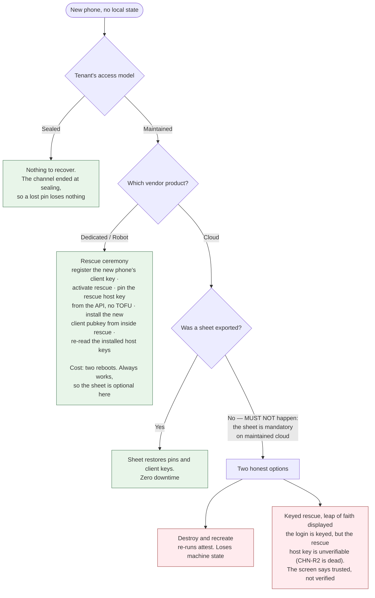

# 03 — Durable state and recovery

Two halves of one problem. **State** is what survives the worker being killed while the
phone is in the operator's hand. **Recovery** is what survives the phone being lost. The
decisions are in [ADR-0022](./docs/adr/0022-durable-state-is-an-append-only-journal.md) and
[ADR-0020](./docs/adr/0020-recovery-roots-in-the-vendor-account.md).

## Durable state

**STA-1** A single **harness worker** MUST be the only writer of durable state. Tabs,
command workers and adapters submit observations and requests; they do not mutate canonical
state.

**STA-2** Canonical state MUST be an **append-only event journal** with replayable
transitions, held in origin-private storage. Content-addressed with periodic compact
snapshots; in-memory state is authoritative only while a worker is running.

**STA-3** A canonical event MUST be durably appended **before** it is applied to in-memory
state. If the append fails, the transition does not occur.

**STA-4** A side-effecting call MUST have a durable record, an approval decision, and an
idempotency identity **before execution begins**. For an off-machine call this is `SEC-12`;
for box-plane work it is the per-command record of `ARC-8`.

**STA-5** Every tool MUST declare its retry safety: pure, idempotent with a key strategy,
reconcile-before-retry, or never-retry-automatically.

**STA-6 Box-plane work is never-retry-automatically.** Arbitrary shell on a remote machine
cannot declare itself idempotent, so no honest declaration other than this exists. Its
recovery path is `ARC-10`: reconnect, read the machine's state, converge.

**STA-7** After a crash the worker MUST acquire its lock, load the latest snapshot, replay
subsequent events, classify incomplete calls, cancel those that cannot still exist,
reconcile or surface uncertain ones, and resume only where policy permits. **No model turn
is silently resumed from an uncertain destructive operation.**

**STA-8** A call that may have produced an external effect but has no terminal event MUST
enter an unresolved state requiring evidence or operator inspection to leave. It MUST NOT be
retried automatically and no timer may clear it. Establishing *what happened* by a status
query is permitted and required where a tool supports one; doing it *again* is not.

**STA-9 The journal records what was sent, not what the machine did with it.** This is the
honest limit of `STA-2` across the channel. A phone that locks mid-install kills the worker
and the SSH session with it; on reconnect the journal knows exactly which commands were
transmitted and nothing about which completed. Convergence (`ARC-10`) is the answer for
short commands. For a long-running one — a build, a disk write — a **durable remote job
record** with an authoritative status a reconnecting session can query is what closes the
gap, and `OPN-18` tracks it. A declarative distribution (`ARC-24`) narrows the problem
substantially without removing it.

## The exposure ledger

**STA-10** The **exposure ledger** is the per-machine history of every configured model that
has ever touched a machine. It is how `SEC-1`'s permanence clause is tracked, it lives in the
encrypted-at-rest store, and it is exported in the recovery sheet.

**STA-11 The ledger's staleness rules bind only a tenant that is both maintained and
threshold-bearing, and none currently is.** The two halves cancel, and stating so keeps an
implementer from building machinery that governs nothing:

- Where exposure **matters** — a tenant with a threshold — btc-policy **seals** its machines,
  so nothing re-enters, so the ledger is complete when setup ends and never changes again. A
  recovery sheet's snapshot is therefore always current.
- Where the ledger **drifts** — a maintained machine, re-entered by later sessions — there is
  no threshold, so nothing depends on the count. One machine has no collision to display.

For a tenant that is both, which is possible and does not yet exist, the rules below apply.
They are recorded rather than deleted for that reason.

**STA-12** A restored ledger is a **floor, not a census**. The sheet records its export time;
the app requires a re-export whenever the ledger mutates; and a restored ledger is displayed
"as of" its export. Where it may be stale, re-entry binds only a configured model not
currently assigned to any other machine.

**STA-13** A machine recovered *without* a ledger carries **unknown past exposure**, displayed
as such, and re-entry then binds only a configured model not currently assigned to any other
machine — the conservative reading, since the unknown history could contain any of them.

## What survives a lost phone

**STA-14** The operator's **vendor account is the recovery root**. It survives because it
lives in their head or their password manager and is recoverable through the vendor's own
processes, and it is the one party that always knows which machines exist.

| Dies with the phone | Survives |
|---|---|
| Host-key pins | The vendor login |
| The SSH client private keys | The inference account |
| The machine inventory | The app URL |
| The relay token | A relay token re-issued out of band |
| Action transcripts | The recovery sheet, **if exported** |
| Provenance records | |
| The exposure ledger | |
| The vendor API credential and the inference key — re-supplied per session by the operator, deliberately not persisted | |

**Transcripts and provenance are gone and stated as gone.** They were records, not secrets;
nothing re-derives the past.

## Recovery, by access model and vendor

**STA-15** The recovery sheet MUST be exported before a **maintained cloud** machine's setup
completes. On Robot the ceremony always works, so there the sheet is an optimisation and
stays optional. A sealed tenant's machines need none: their pins die at sealing, and a phone
lost mid-setup is answered by the tenant's own all-or-nothing rule — abandon and recreate.
This asymmetry is stated, not smoothed over.

**STA-16** The recovery sheet holds host-key fingerprints, the exposure ledger, and the SSH
client keys wrapped under a passphrase the operator chooses. The export screen MUST say what
the sheet can do in the wrong hands with the passphrase: reach every maintained machine. This
is the same posture the target audience already holds toward seed backups.

**STA-17** Recovery after a *lost* phone revokes; restore after a *dead* one may not. A
stolen phone's encrypted store may eventually be unlocked, so the flows are named and
distinct, and the screen says which one is happening:

- **Replace** (the default, for a phone that is lost): new client keypairs, the old public
  keys removed from every maintained machine during re-entry, and the relay token re-issued
  with the old one revoked.
- **Restore** (for a phone that died in hand): the sheet's same keys, explicitly presented as
  non-revoking.

**STA-18** Inventory recovery makes the vendor list authoritative. Listing the account is how
a new phone learns what exists. That listing is performed by the deterministic recovery flow
under the operator's approval, **before any session exists**, so it is not a session
operation and `SEC-4`'s machine-binding rule for typed operations is not in play.

**STA-19** Transcript retention has no policy yet. A maintained machine accumulates command
records for its whole life in an encrypted store on a phone, and nothing states when they
compact or expire. `OPN-19` tracks it.
