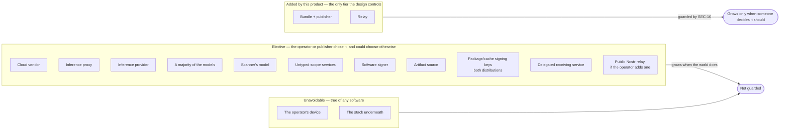

# 05 — What must still be trusted

Everything runs on something. The phone's silicon, its operating system, the browser, the
model, whoever serves it, the cloud vendor, the server's firmware — any of them could carry a
backdoor, and following that regress to the end leaves you hand-fabricating chips in a
Faraday cage. **There is no zero.** So this document does not try to be short. It tries to be
accurate, and it sorts the parties by the one distinction that changes what anybody can do
about them: **who chose them.**

## Unavoidable

True of any software anyone runs, and not improved by this design.

**TRU-U1 — The operator's device**, its silicon, its operating system, its browser. It holds
the credentials, runs the bundle, and carries all concurrent sessions, so it is common-mode
across every machine. A deliberate trade: requiring five devices would defend against a
compromised phone while guaranteeing that an operator who owns one phone never finishes setup.

**TRU-U2 — The stack underneath everything**: the operating systems on the machines, their
package repositories, the certificate authorities. Trusted here no more and no less than
anywhere else. Naming each one would make this list unbounded without making it more honest.

## Elective

Real trust, and **the operator or the publisher chose it and could choose otherwise.** This is
exactly the set a hosted service picks on your behalf, silently and unlisted.

**TRU-E1 — The cloud vendor**, under every design considered. It owns the machine's memory and
disk. Host-key pinning buys transport safety, not vendor independence; vendor independence is
what placing machines at several vendors buys.

**TRU-E2 — The inference proxy: the one the operator funds, and the aggregator it appears to
route through.** Procured inference means the publisher picks the models, and it has one
aggregator that reaches them all, so the normal configuration is several sets of weights behind
a single funded proxy. That proxy can alter every prompt and response it carries, which makes it
the thinnest layer in the default product even when the weights count looks healthy. Adding a
second is a supported move, not a redesign.

**The row also carries a second name, by inference, dated 2026-09-23: OpenRouter.** A request
carrying a provider selection (`only`) comes back in OpenRouter's response schema — `gen-`
ids, `native_finish_reason`, `usage.is_byok`, `cost_details.upstream_inference_cost` equal to
`usage.cost` — while a request carrying `zdr` alone does not switch, and the funded aggregator's
`api-docs` page (read 2026-09-23) still accepts a legacy `"type": "openrouter:web_search"`
alias (`docs/findings/2026-09-22-provider-routing.md`). An OpenRouter-compatible router run by
the funded aggregator itself would produce the same schema, which is why this is inference and
not verification. The harness sends a selection on every call, so if the inference holds the
default path transits two aggregators. `SEC-10` says "The trusted-party list MUST NOT grow
silently"; a dated name here is the opposite of silence, and whether the inferred party earns a
row of its own — with its own retention posture and jurisdiction, about which nothing is
recorded — waits on the confirmation `OPN-23` now asks for. Two things this row does not cover:
the paragraph below is about the funded aggregator alone, and if a second proxy (`OPN-7`) resold
the same upstream, two proxy domains would share a party and no display shows that today.

**What is known about the default one, verified 2026-09-05 against its own pages and its live
API.** It states that it stores no prompts, keeping only token counts against a random
identifier, and it offers three retention tiers of which the weakest is the API's default
(`ARC-31a`). It holds the operator's funds prepaid and non-withdrawable. Against that: **it
names no legal entity, no jurisdiction and no governing law**, its own About and Contact pages
are linked and return 404, its arbitration clause specifies no forum or seat, and its terms bind
the user to a usage policy and a sharing policy **that do not exist yet** and take effect on
posting. There is no status page and no published reliability record. It is a real, actively
shipping, two-named-person operation with essentially no corporate transparency, and the
exposure is bounded by the balance the operator chose to fund — which is the only reason that
combination is acceptable at all.

**TRU-E3 — The inference provider behind the proxy.** The aggregator does not run the weights;
it routes to whoever does, and that party sees and can rewrite every prompt and response sent
to it. It stays named here because observation is not separation.

**This party is now requested per machine, not observed after the fact.** The row used to promise
an *observed* count read from a response header; checked against the default aggregator on
2026-09-05, **no response field or header named the provider that served a request**, and the
browser could not read one if it did. On 2026-09-22 a `provider` field appeared on the
`provider.only` path, as the proxy's own report (`docs/findings/2026-09-22-provider-routing.md`).
So the harness **asks** for a provider in each call, using the aggregator's routing object, and
the display shows what was asked (`ARC-14`). The aggregator's documentation was recorded as
saying it may override the request — that is this row's trust exactly, not a new one, since the
proxy above it can already alter everything it carries (`TRU-E2`). What cannot be shown is
whether the request was honoured, and the label *requested* is what keeps that honest (`SEC-9`).
The aggregator now reports a provider in its responses to a selection; `SEC-9` says "A
response's own report of the provider is compared, never shown as a count", and `OPN-23`'s
standing ask is for the report's semantics and its name mapping, which no response can supply.

**TRU-E4 — A majority of the models**, being both honest *and* competent.

**TRU-E5 — The scanner's model, when the operator engages one** — trusted to see the machine
topology and to report honestly, never with access. A lying scanner cannot touch a machine;
what it can do is steer the operator, which is why its findings are reports and never triggers.

**TRU-E6 — Any service an approved untyped call reaches.** The operator hands it a credential
whose authority the harness cannot bound, so for the life of that key the service is trusted
with everything the key can do. This class cannot be enumerated in advance — which is why it is
named here as a class, and why each approved scope must appear in the trust display until its
credential is revoked or rotated, not merely while the approval stands.

**TRU-E7 — Whoever signs the software the machines run.** For a single machine the signer is
trusted for that machine, the same shape as any installed software. For a federation it is
sharper: briefs install the same release on every machine, so the signer is common-mode across
the federation in the same shape as the bundle. `ARC-25` pins the bootstrap and `ARC-25a` fixes
which package signers are accepted; neither removes a signer's authority over the packages it
signs later, which is `TRU-E8a`. Software the tenant itself ships is bounded only by its own
release signing.

**TRU-E8 — The artifact source.** The chosen distributions (`ARC-24`) are not offered by the
dedicated vendor's automatic installer, so the system is written from inside rescue and the
bits come from somewhere: an image, a mirror, a channel. **Whoever controls that source decides
what every machine runs**, which is the same blast radius as the bundle. It is pinned from the
browser against a value that ships in the signed bundle (`ARC-25`), which makes it detectable
rather than trusted blindly, in the same discipline as the machine pinned by host key. Until the
pin exists in an implementation, this party is trusted outright.

**TRU-E8a — The package or binary-cache signing key holders.** Both declared distributions
rely on them (`ARC-25a`). Alpine's minirootfs hash does not cover the kernel, SSH server and
other packages fetched afterwards; those are admitted through its signed repositories.
NixOS admits additional store paths through its binary-cache signatures. The bundle fixes
which signing keys are accepted, but a holder of an accepted key can supply changed binaries.
This authority is elective through the package/cache policy, and choosing Alpine does not
remove it. The trust display names the actual accepted signers and never presents a bootstrap
image hash as a hash of the complete installed system.

**TRU-E10 — A public Nostr relay the operator adds to the relay set** (`CHN-18`). Elective in
the plainest sense: the publisher's relay is mandatory and sufficient, and this is a resilience
choice. What it costs is stated because it is not obvious: it sees a cloud address publish a
wrap to an inbox, and — on three of the four public relays tested — it serves that inbox to
**anyone who asks**, not only to the authenticated recipient. It cannot read the introduction
or forge one. Per-machine recipients mean one listable inbox maps to one machine and not to an
operator; the operator's own subscriptions from one address are what correlate them, and that
correlation is available to the relay and to nobody else.

**TRU-E9 — A delegated receiving service, where a tenant uses one.** Under `ARC-38` a runtime
obligation may be met at a third party that notifies the machine, and for Lightning that is the
only way to keep spending authority off a multi-tenant box. That party sees the payment flow and
custodies value between receipt and sweep. It is elective — the operator picks it and can pick
another — and it is named here rather than absorbed, because `SEC-10` prices an unlisted addition
as a schema migration. The exposure is bounded by how often the operator sweeps.

## Added by this product

The only set the design controls, and therefore the only one worth an invariant. **`SEC-10`
guards this tier.** The other two grow when the world does; this one grows only when someone
decides it should.

**TRU-A1 — The app bundle, and the publisher who serves it.** This is the application itself
rather than a third party, but it is not diversified across machines and it carries the briefs,
so a compromised host can serve one build that misbehaves on every machine — and can serve a
good bundle to anyone who looks like a checker. **The largest concentrated risk in the design.**
`ARC-33`'s strict `script-src` is the one cheap control that binds it, and reproducible builds
plus watchdogs (`OPN-15`) are the mitigation that would matter and does not exist yet.

On the default path the publisher also selects the models, which is acceptable only because it
is already trusted for the bundle and because bring-your-own inference exists as the escape
hatch. If that hatch is ever dropped, the arrangement stops being defensible. **That is now the
whole of its procured-path role**: the operator funds the balance and holds the credential, so
the publisher handles no money and issues no credential (`ARC-31a`,
[ADR-0028](./docs/adr/0028-procured-inference-is-the-operators-balance.md)). Model selection
ships in the signed bundle (`bundle/inference.toml`), so this adds nothing the bundle did not
already carry.

**This entry covers governance as well as compromise.** Because briefs ship in the bundle, the
publisher decides which tenants can exist and when a tenant's change reaches operators
(`ARC-40`). That is authority exercised legitimately rather than a failure mode, and it is
listed here because an unnamed power is exactly what this section exists to prevent. It is a
bootstrap seat with a stated trajectory, not a resting state.

**TRU-A1a — The publisher's allowlist of proprietary models.** `TRU-A1` says "On the default
path the publisher also selects the models" and "Model selection ships in the signed bundle
(`bundle/inference.toml`)"; the allowlist is that selection exercised by name. The **allowlist**
of proprietary models that route zero-retention is the publisher's judgement, carried in the
signed bundle (`bundle/inference.toml`; its schema is TASKS T37's next step), each entry named
by the publisher. An allowlisted model is admitted to the eligible set beside the models
carrying the aggregator's zero-retention badge (`ARC-31a`) and is never ordered by the
publisher: the order is `ARC-31b`'s, and the allowlist admits candidates without ranking them.
The proposing job probes each allowlisted entry with the model, the pinned provider and `zdr`
together — the bundle's routing shape, case G of
`docs/findings/2026-09-22-provider-routing.md` — and proposes removal when one stops routing.
What the job does with a proposal, its credential and its spend are `ARC-31b`'s contract, and
this entry states no part of it. What the allowlist carries is a risk ADR-0033 records:
"proprietary models are usually served by their maker, which is `SEC-9`'s same-party case by
default".

**TRU-A2 — The relay**, once it exists. It cannot read or alter a session whose host key was
pinned out of band, but **it learns the machine topology** — which operator, which destination,
when, accumulated, is the machine set (`CHN-13`) — and one that authenticates callers and
constrains destinations decides who may connect where. Under trust-on-first-use it is trusted
outright at first contact. **The Nostr relay beside it** (`CHN-18`) is the same party learning
the same thing by another route — a cloud address publishes to an inbox, the operator's address
reads it — and it cannot forge an introduction, since it never holds a sender key. It is not a
new row.

On the default path its operator is **the publisher**, so the entry is less a new party than
the publisher's second capability — bundle plus topology — and the trust display names the
operator. The publisher's seat is a **bootstrap**: the relay is direct-first and minimum-usage
by design, and the product moves the operator to a relay on a maintained machine of their own
once one exists. That machine's own bound model then becomes a potential metadata observer,
priced rather than hidden (`CHN-14`). An external relay still carries management and scans
of the relay-host machine itself (`CHN-11`); self-hosting does not eliminate that route's
availability or topology exposure.

**TRU-A3 — Retired. The coordinator is not a party this product adds.** It was listed because
its reach was believed broader than anything else the application does — every machine's client
keypair, held at once. `ARC-19a` establishes that post-harness machinery holds no channel at
any point and at most the credential its profile declares; btc-policy's coordinator runs after
sealing, when no member has SSH to reach, and its credential is peer-equivalent to a
member's. Its reach is therefore narrower than the application's own, since the application
holds every session. It is deterministic code from the signed bundle, so whatever trust it
needs is already `TRU-A1`'s, and the federation it forms is the tenant's object rather than the
harness's.

The row is kept as a retirement rather than deleted because "the coordinator reaches inside
every member" is the intuitive reading of what a coordinator is, and a reader who re-derives it
should find the answer here.
[ADR-0026](./docs/adr/0026-the-coordinator-is-the-tenants-and-runs-after-sealing.md) carries the
reasoning.

## What this product actually removes

The party that would otherwise pick every entry in the elective tier and hold the credentials
besides: **the service operator.** That is the whole of the claim. It is a smaller claim than
"trustless" and it is one that survives contact with the regress above.
