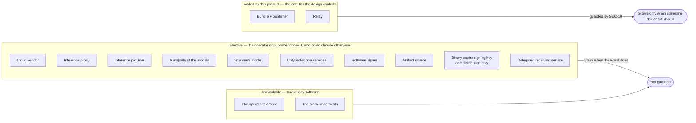

# 05 — What must still be trusted

Everything runs on something. The phone's silicon, its operating system, the browser, the
model, whoever serves it, the cloud vendor, the server's firmware — any of them could carry a
backdoor, and following that regress to the end leaves you hand-fabricating chips in a
Faraday cage. **There is no zero.** So this document does not try to be short. It tries to be
accurate, and it sorts the parties by the one distinction that changes what anybody can do
about them: **who chose them.**

## Unavoidable

True of any software anyone runs, and not improved by this design.

**TRU-U1 — The operator's device**, its silicon, its operating system, its browser. It holds
the credentials, runs the bundle, and carries all concurrent sessions, so it is common-mode
across every member. A deliberate trade: requiring five devices would defend against a
compromised phone while guaranteeing that an operator who owns one phone never finishes setup.

**TRU-U2 — The stack underneath everything**: the operating systems on the machines, their
package repositories, the certificate authorities. Trusted here no more and no less than
anywhere else. Naming each one would make this list unbounded without making it more honest.

## Elective

Real trust, and **the operator or the publisher chose it and could choose otherwise.** This is
exactly the set a hosted service picks on your behalf, silently and unlisted.

**TRU-E1 — The cloud vendor**, under every design considered. It owns the machine's memory and
disk. Host-key pinning buys transport safety, not vendor independence; vendor independence is
what multi-vendor membership buys.

**TRU-E2 — The inference proxy, and on the default path there is only one of it.** Procured
inference means the publisher picks the models, and it has one aggregator that reaches them
all, so the normal configuration is several sets of weights behind a single proxy. That proxy
can alter every prompt and response it carries, which makes it the thinnest layer in the
default product even when the weights count looks healthy. Adding a second is a supported move,
not a redesign.

**TRU-E3 — The inference provider behind the proxy.** The aggregator does not run the weights;
it routes to whoever does, and that party sees and can rewrite every prompt and response sent
to it. Two machines served by the same one share a party the **observed** third count reports —
historically, per response, never as a forward promise. It stays named here because observation
is not separation.

**TRU-E4 — A majority of the models**, being both honest *and* competent.

**TRU-E5 — The scanner's model, when the operator engages one** — trusted to see the member
topology and to report honestly, never with access. A lying scanner cannot touch a machine;
what it can do is steer the operator, which is why its findings are reports and never triggers.

**TRU-E6 — Any service an approved untyped call reaches.** The operator hands it a credential
whose authority the harness cannot bound, so for the life of that key the service is trusted
with everything the key can do. This class cannot be enumerated in advance — which is why it is
named here as a class, and why each approved scope must appear in the trust display until its
credential is revoked or rotated, not merely while the approval stands.

**TRU-E7 — Whoever signs the software the machines run.** For a single machine the signer is
trusted for that machine, the same shape as any installed software. For a federation it is
sharper: briefs install the same release on every member, so the signer is common-mode across
the federation in the same shape as the bundle. Artifact pinning would bound this; nothing here
specifies it yet.

**TRU-E8 — The artifact source.** The chosen distributions (`ARC-24`) are not offered by the
dedicated vendor's automatic installer, so the system is written from inside rescue and the
bits come from somewhere: an image, a mirror, a channel. **Whoever controls that source decides
what every machine runs**, which is the same blast radius as the bundle. It is pinned from the
browser against a value that ships in the signed bundle (`ARC-25`), which makes it detectable
rather than trusted blindly, in the same discipline as the relay pinned by host key. Until the
pin exists in an implementation, this party is trusted outright.

**TRU-E8a — The binary cache's signing key holder, on the distribution that has one.** `ARC-25a`
records that only one of the two declared distributions admits artifacts by content hash. The
other admits them by **signature**, against a key baked into its installer, and the browser has
no way to supply an expected hash for what actually gets installed. That key's holder decides
what every machine on that path runs — `TRU-E8`'s blast radius exactly — and **no pin removes
them**, which is what separates this row from the one above it. It is elective in the only sense
that matters: it follows from choosing that distribution, and choosing the other one avoids it
entirely.

The party is real whether or not it is written down, and it was not. That is the whole reason
for the row: `SEC-10` prices an unlisted party as a schema migration, and an unlisted party
already relied on is worse than a listed one.

**TRU-E9 — A delegated receiving service, where a tenant uses one.** Under `ARC-38` a runtime
obligation may be met at a third party that notifies the machine, and for Lightning that is the
only way to keep spending authority off a multi-tenant box. That party sees the payment flow and
custodies value between receipt and sweep. It is elective — the operator picks it and can pick
another — and it is named here rather than absorbed, because `SEC-10` prices an unlisted addition
as a schema migration. The exposure is bounded by how often the operator sweeps.

## Added by this product

The only set the design controls, and therefore the only one worth an invariant. **`SEC-10`
guards this tier.** The other two grow when the world does; this one grows only when someone
decides it should.

**TRU-A1 — The app bundle, and the publisher who serves it.** This is the application itself
rather than a third party, but it is not diversified across members and it carries the briefs,
so a compromised host can serve one build that misbehaves on every member — and can serve a
good bundle to anyone who looks like a checker. **The largest concentrated risk in the design.**
`ARC-33`'s strict `script-src` is the one cheap control that binds it, and reproducible builds
plus watchdogs (`OPN-15`) are the mitigation that would matter and does not exist yet.

On the default path the publisher also selects the models, which is acceptable only because it
is already trusted for the bundle and because bring-your-own inference exists as the escape
hatch. If that hatch is ever dropped, the arrangement stops being defensible.

**This entry covers governance as well as compromise.** Because briefs ship in the bundle, the
publisher decides which tenants can exist and when a tenant's change reaches operators
(`ARC-40`). That is authority exercised legitimately rather than a failure mode, and it is
listed here because an unnamed power is exactly what this section exists to prevent. It is a
bootstrap seat with a stated trajectory, not a resting state.

**TRU-A2 — The relay**, once it exists. It cannot read or alter a session whose host key was
pinned out of band, but **it learns the member topology** — which operator, which destination,
when, accumulated, is the member set (`CHN-13`) — and one that authenticates callers and
constrains destinations decides who may connect where. Under trust-on-first-use it is trusted
outright at first contact.

On the default path its operator is **the publisher**, so the entry is less a new party than
the publisher's second capability — bundle plus topology — and the trust display names the
operator. The publisher's seat is a **bootstrap**: the relay is direct-first and minimum-usage
by design, and the product moves the operator to a relay on a maintained machine of their own
once one exists. That machine's own bound model then becomes a potential metadata observer,
priced rather than hidden (`CHN-14`).

**TRU-A3 — Retired. The coordinator is not a party this product adds.** It was listed because
its reach was believed broader than anything else the application does — every machine's client
keypair, held at once. `ARC-19a` establishes that it holds no channel at any point: it runs
after sealing, when no member has SSH to reach, and its credential is peer-equivalent to a
member's. Its reach is therefore narrower than the application's own, since the application
holds every session. It is deterministic code from the signed bundle, so whatever trust it
needs is already `TRU-A1`'s, and the federation it forms is the tenant's object rather than the
harness's.

The row is kept as a retirement rather than deleted because "the coordinator reaches inside
every member" is the intuitive reading of what a coordinator is, and a reader who re-derives it
should find the answer here.
[ADR-0026](./docs/adr/0026-the-coordinator-is-the-tenants-and-runs-after-sealing.md) carries the
reasoning.

## What this product actually removes

The party that would otherwise pick every entry in the elective tier and hold the credentials
besides: **the service operator.** That is the whole of the claim. It is a smaller claim than
"trustless" and it is one that survives contact with the regress above.
