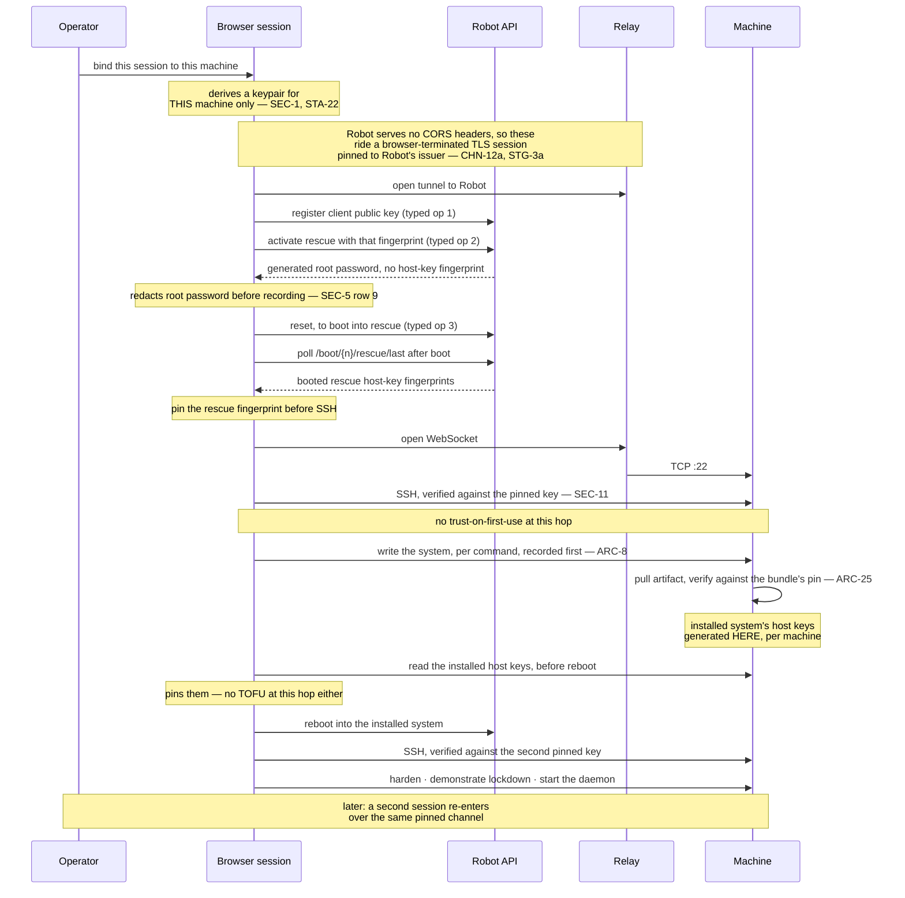

# 06 — What the first stage must demonstrate

**STG-1** The first stage provisions **one lnrent box on a dedicated server, over the full
channel** ([ADR-0018](./docs/adr/0018-first-stage-is-one-lnrent-box-on-dedicated.md)). One
session, one machine, one real tenant.

**Dedicated because it is the only place the identity chain closes.** On Cloud there is no way
today to obtain a host key without trusting first contact — `CHN-R2` is dead, `CHN-R3` is
abandoned, `CHN-R5` is unproven — so `OVR-4` is satisfied nowhere. On dedicated it closes at both
hops. The corollary is that Robot offers no boot-time user-data at all, so nothing can be done
to the machine except through the channel: a cost this stage accepts, not a benefit it seeks.

It replaces the two-cloud-machine diversity demo the design session chose: that staged a
vault argument the platform no longer leads with, proved the easy machinery, and deferred
both hard problems.

**STG-2 Construction gates on the installation and identity-chain rehearsal, once, first.** Activate rescue on a
disposable dedicated server; read what `host_key` actually returns; read what the automatic
Linux install operation returns in the same sitting; rehearse the ceremony end to end; then
write the briefs from the captured install transcript. "By hand" means no harness code:
`curl` against Robot and `ssh` from a workstation, scripted only so that every value is
captured once and no credential is typed twice (`prototypes/first-stage-rehearsal/`).

**Run 2026-09-08** (`docs/findings/2026-09-08-first-stage-rehearsal.md`). The three briefs
this stage needs are: **(1) install** — from a pinned rescue session to an installed,
reachable system whose host keys the harness already holds; **(2) lock-down** — harden and
demonstrate against the tenant's delivery declaration (`ARC-39`, `ARC-17`); **(3) the
tenant's daemon** — installed and started to the tenant's declared lifecycle, authored from
the tenant's declaration rather than by this project (a brief keyed on the tenant's software
is the tenant's, ADR-0030; the publisher still signs it, `ARC-40`). Rescue activation and the
host-key pin are **not** brief content: they are the harness's typed ceremony (`CHN-R1`,
`STG-4`), deterministic by design, and no improvising model owns the identity chain. Only
brief 1 has evidence today and is written
([`docs/briefs/01-install.md`](./docs/briefs/01-install.md)); briefs 2 and 3 wait on a
lock-down checklist (`OPN-14`) and a delivery declaration that do not yet exist.

The reason is that the two risks are wildly mismatched, and research has widened the gap
rather than narrowed it. The SSH client is no longer a bet: a deployed Rust implementation
exists on the same target, with the same UI and build stack this design specifies, and its
configuration is published
([ADR-0024](./docs/adr/0024-the-ssh-client-is-rust-following-a-known-good-configuration.md)).
The unknown was Robot's rescue response (`OPN-6`); the September 8 rehearsal closed it.
Harness construction can now start. Completing the stage still requires the tenant-owned
lockdown declaration/checklist and briefs 2–3 (`OPN-14`), plus the integrated acceptance
checks listed in `07-conformance.md`. A successful installation rehearsal is not completion
of the first stage.

## Why the install runs from inside rescue

**STG-3** Two reasons, both load-bearing, and neither was previously recorded:

1. **The rescue endpoint is what publishes the host key** — precisely, `/boot/{n}/rescue/last`
   publishes the booted rescue system's fingerprints about 80 s after the reset (`CHN-R1`,
   run 2026-09-08). It is the only route on any product today that pins out of band without
   putting a private key in user-data.
2. **The chosen distributions are not on offer.** Robot's automatic Linux installation takes a
   fixed catalog, and neither Alpine nor NixOS is in it (`ARC-24`). Custom image installation
   is therefore mandatory on this path rather than the optimisation ADR-0011 calls it.

Either reason alone would justify rescue. Together they close the question of whether a
single typed install operation could replace the whole flow: it could not, because it cannot
install what this design runs.

## The sequence

## Acceptance

**STG-3a Every Robot call rides the tunnel, not `fetch`.** Robot serves no CORS
headers at all, so no browser origin can read its responses (`CHN-R1`, verified 2026-08-31).
The typed adapter therefore opens a TLS session inside the browser, pinned to Robot's issuing
authority, and carries it over the relay as ciphertext (`CHN-12a`). The relay learns a
destination and nothing else, and no trusted party is added.

This is a prerequisite the stage did not previously have; it gated as `OPN-21` until the spike
of 2026-09-07 closed it, and `CNF-62` carries it for the real build.

**STG-4** The session registers its SSH client public key with Robot as a **typed
operation** — Robot's `authorized_key` field takes fingerprints of keys already registered
there, not raw keys — then activates rescue the same way, passing that fingerprint, and
triggers the reboot the same way, since activation only configures the next boot and the
reset call is its own typed operation. It then polls `/boot/{n}/rescue/last` until the booted
rescue's host-key fingerprints appear — the activation response itself publishes none — and
connects with **no trust-on-first-use at either hop**: the rescue key is pinned from the
API, and the installed system's host keys are generated inside the rescue session, per
machine, and read before reboot. **Run 2026-09-08, both hops, on a disposable auction
server** (`docs/findings/2026-09-08-first-stage-rehearsal.md`). The activation response also
carries a generated **root password**; it is never used on this route, and it is **redacted
before the response is recorded or reaches a model**.

**Every Robot mutation journals intent before it is sent (`STA-4`) and is confirmed by
observable state, never by its own response and never by a clock.** `POST /reset` returns
`running` immediately and carries no request identity, and `/rescue/last`'s `boot_time` is
zone-less local time, so neither can be compared to the browser's intent. The predicates are:

- **Activation** is confirmed when `GET /boot/{n}/rescue` reports `active: true` **and** its
  `authorized_key` echoes exactly the session's registered fingerprint and the requested OS.
  Active with another key is a stale activation, not this one.
- **The reset into rescue** is confirmed when `/rescue/last` shows a host-key set **different
  from the one journaled before the reset** — every rescue boot has fresh keys (`CHN-R1`).
- **The reset into the installed system** is confirmed when sshd answers with the installed
  pin.

Anything not confirmed stays unresolved under `STA-8` and the operator decides; the adapter is
reconcile-before-retry (`STA-5`). `STG-11` is the test, and `CNF-38` lists its cases. The host
keys are read and the pins journaled by the harness's own `ready_to_reset` job before the
reset is offered (`ARC-43`).

**STG-5** The system is installed and hardened entirely through box-plane work over the
pinned channel, **command by command**, each recorded before transmission (`ARC-8`), and the
transcript matches what was sent.

**STG-6** The artifact the install pulls is **verified against a value supplied by the browser
from the signed bundle** (`ARC-25`), and a mismatch halts the install. The URL pinned is the
immutable versioned one, never a moving alias. The download and the comparison are the
harness's `fetch_artifact` job (`ARC-43`); the model requests it and never reports a hash.

**The stage MUST record the distribution and both layers of artifact admission** (`ARC-25a`):
the bootstrap URL/hash and the package/cache signing keys and repository policy. On Alpine,
record the repository branch, index digests and installed versions; on NixOS, record the
source revision and cache keys. Neither path may report the bootstrap hash as covering the
complete installed system. Reject untrusted package signatures before delivery (`CNF-67`).

**STG-7** The machine ends **locked down and demonstrated**: the deliverable of `ARC-17`,
with the tenant's daemon running.

*`STG-8` retired.* It required a real tenant outcome — a published listing and a delivered
order — or a written statement of why not. Both halves were wrong. The first tested **lnrent**
rather than tau-web, which is the boundary ADR-0016 exists to draw. The second was an opt-out,
making it the only criterion here an essay could satisfy. What the harness owes is covered by
`STG-7` against `ARC-17`, and that a declaration exists at all is `CNF-49`. Identifiers are not
positional, so nothing renumbers.

**STG-9** The machine is **maintained**, and the story is exercised: at least one later
session re-enters over the same pinned channel and re-runs the check.

**STG-10** No credential — the Robot credential, the rescue root password, the session inference key,
the SSH client private key, or the relay key — appears in a request to the app origin, in
any model request body, or in any log; and none appears in origin-private storage, local
storage, or service-worker caches outside the encrypted-at-rest store `SEC-5` names.
Cleartext nowhere. The local store unlocks and locks under `STA-23`; killing the worker
requires a new unlock and replay, never a plaintext fallback.

**STG-11** A rescue activation or its reset, interrupted between intent and confirmation,
then resumed, results in exactly one rescue session and one install.

**STG-12** A brief interrupted mid-run — by a phone lock, a killed worker, a dropped session
— and re-run from the top **converges** rather than duplicating (`ARC-10`). This is the
predicate most likely to fail under tab suspension — Android's, which is tested, and iOS's,
which would be harsher if it were — and the one the by-hand rehearsal should be designed to
stress.

**STG-13** A channel access that does not present the bound session's own keypair — however
well-formed the attempt — is **refused, by SSH**. With one machine, nothing exercises the
access rule by accident: this predicate shows the refusal is enforced by mechanism rather
than satisfied by scarcity, and it is distinguishable from `STG-9`'s re-entry precisely
because binding is the operator's act, not the connection's.

**STG-14** All of the above pass on a physical Android Chrome, through a normal HTTPS URL,
with no install. iOS Safari is not a test target (`OVR-1`).

## Measurements, required but not pass/fail

**STG-15** Peak memory of one session during a full install, on Android Chrome, with
the five-session projection stated against that platform's tab budget. The concurrency
decision (`ARC-13`) rests on five sessions sharing a phone, chosen against an acknowledged
high memory risk, and no number has ever been taken. One session is what this stage runs,
which makes it the only cheap opportunity to learn whether five is possible.

**STG-16** Wall-clock duration of a full install over the channel, and the transcript size it
produces. *Measured by hand 2026-09-08, not yet over the channel:* rescue activation to a
pinned login on the installed Alpine in **4 min 34 s** when nothing goes wrong (reset →
rescue pin 82 s; install 60 s; reset → installed sshd 69 s), transcript 16.9 KB. The
rehearsal itself took 2 h 27 min, because a machine that does not boot is invisible over the
network and the recipe was wrong four times; see `STG-20`.

## Provenance in the first stage

**STG-17** Provenance is still recorded — vendor, model, requested provider, surviving reload
and restart — and the per-layer counts are still shown per `SEC-9`. All three read one: one set
of weights, one proxy on the procured path, one requested provider, and no proxy entry at all
under local inference. The provider column carries its *requested* label even at one machine,
because a first stage that shows the label correctly is worth more than one that shows a number
nothing produced. The smaller claim, stated as numbers.

What waits is comparison: with one machine there is no collision to display, so the collision
display and the operable panel arrive with the tenant that needs them. And with one model slug
in `bundle/inference.toml`, `ARC-16`'s middle rung has no stronger model to escalate to: the
first stage offers rungs one and three only, and says so.

## What the first stage does not test

**STG-18** Stated because a passing stage would otherwise read as a working product.

- **Acquisition.** The stage assumes an existing vendor account, an already-rented dedicated
  server, and a Robot webservice user. It tests none of them.
- **Relay enrolment.** The operator's relay **public** key, derived from the seed (`CHN-15`),
  is handed to the publisher out of band and recorded by hand. Nothing secret crosses and
  nothing is pasted into the app. The publisher configures the allowed public destinations
  and connection/probe limits; fresh challenge authentication, destination restriction and
  private-address refusal still apply (`CNF-81`, `CNF-87`). There is no purchase flow or tested reacquisition story;
  that is `OPN-2`.
- **Inference funding.** Assumed already funded.
- **Tenant-secret delivery.** `CNF-16` is not first-stage work, so no tenant secret is placed
  on the machine. If lnrent's declaration puts the receiving-service credential on the box
  (its profile, `SEC-5` row 12), first-stage delivery stops short of Lightning receiving until
  injection is enabled.
- **The general tunnel.** The stage builds only the **pinned** kind (`CHN-12a`), for one known
  vendor. Reaching an arbitrary CORS-refusing service needs `CHN-12b`'s certificate-authority
  store, which `OPN-20` still prices and this stage does not touch.
- **A phone-only non-technical operator getting started at all.** A developer can pass every
  predicate above while the target operator still cannot begin. That gap is the product
  thesis, and nothing in this stage measures it.

**STG-19 "If the maximal path works, the rest is subsetting" is too strong.** Dedicated rescue
demonstrates the channel, the pinning chain, the box plane, the transcript and one re-entry.
It demonstrates **none** of: attestation (`CHN-R5`), boot-time user-data, recovery-sheet
handling, second-vendor reachability, concurrent sessions, federation formation, or threshold
isolation. Those are orthogonal systems that arrive with the second stage, not subsets of this
one. The honest claim is that this stage de-risks the channel, which is the item everything
else waits on.

**STG-20 A machine that does not come back is reinstalled, not diagnosed.** A dedicated server
that fails to boot after the install is **invisible over the network**: the vendor API reports
`running`, nothing answers, and no log can be read. The rehearsal of 2026-09-08 hit this five
resets in a row, for four different reasons, and none was findable from the browser. So the
harness's response is `ARC-16`'s bottom rung applied to this path: if the installed system
does not answer on the channel within `installed.wait_max` (`bundle/timing.toml`) of the
reset that should have booted it, the session declares the install failed, tells
the operator, and **offers a return to rescue and reinstallation from the brief** — the same
ceremony, and cheap (about five minutes when it works). **Each readiness probe is the pinned
SSH attempt itself**, every `installed.probe_interval`: a TCP refusal or timeout means sshd is
not listening yet and the wait continues; anything sshd says — success, or a pin halt — ends
the wait one way or the other. A bare connect-and-close probe is never used, because it
accrues OpenSSH's per-source penalty (`ARC-41`) and the harness would read its own lockout
as an unbootable machine.
Unreachability is not proof of boot failure: a relay or network outage can look the same.
The timeout does not clear an unresolved action or authorize a wipe. The operator must choose
the destructive reinstall, with the selected disks shown; normal typed approvals and journal
ordering apply. Resume first follows `STA-20b`. The harness does not reach for the vendor's console.

That console exists — Hetzner's vKVM rescue boots the installed disk inside a virtual machine
with a screen — and it is **the operator's own tool, by hand, outside the harness**, for a
brief that is wrong in a way reinstalling will not fix. It is password-only (the rescue
activation's `password`, `SEC-5` row 9, which the harness therefore still never uses), it
sits behind a self-signed certificate that no pin can vouch for, and its virtual machine
boots UEFI regardless of what the board does. A brief for this path encodes what the
rehearsal learned instead: a bootloader on every selected installation disk, the distribution's own kernel
arguments for its initramfs, both BIOS and EFI loaders, the distribution's full boot-time
service set, and disk identifiers taken from the environment the command runs in. Each of
those was a silent failure once. And a brief distinguishes **resuming** an interrupted
install (`ARC-10`, `STG-12`: inspect what is there and continue) from this rung's
**reinstall**, which wipes: the rehearsal's recipe only knew how to wipe.

## The second stage

Brings the vault: Cloud machines, multiple concurrent sessions, the trust panel, the
coordinator, federation formation, all-or-nothing creation — and Cloud's identity problem:
`CHN-R2` dead, `CHN-R3` abandoned, `CHN-R5` designed for exactly this and unproven. It reuses the channel the first stage proved. If the SSH client fails instead, the
fallback is the old cloud-first stage with the channel question reopened.
