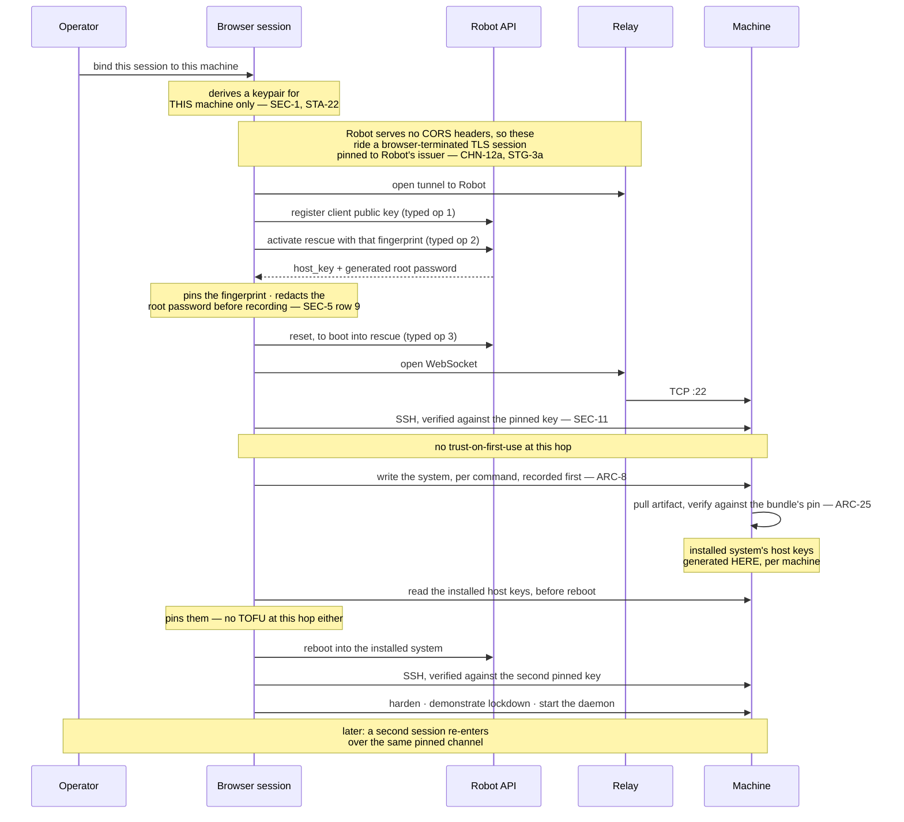

# 06 — What the first stage must demonstrate

**STG-1** The first stage provisions **one lnrent box on a dedicated server, over the full
channel** ([ADR-0018](./docs/adr/0018-first-stage-is-one-lnrent-box-on-dedicated.md)). One
session, one machine, one real tenant.

**Dedicated because it is the only place the identity chain closes.** On Cloud there is no way
today to obtain a host key without trusting first contact — `CHN-R2` is dead, `CHN-R3` is
abandoned, `CHN-R5` is unproven — so `OVR-4` is satisfied nowhere. On dedicated it closes at both
hops. The corollary is that Robot offers no boot-time user-data at all, so nothing can be done
to the machine except through the channel: a cost this stage accepts, not a benefit it seeks.

It replaces the two-cloud-machine diversity demo the design session chose: that staged a
vault argument the platform no longer leads with, proved the easy machinery, and deferred
both hard problems.

**STG-2 Construction gates on running the stage by hand, once, first.** Activate rescue on a
disposable dedicated server; read what `host_key` actually returns; read what the automatic
Linux install operation returns in the same sitting; rehearse the ceremony end to end; write
the three briefs from the real install as you go.

The reason is that the two risks are wildly mismatched, and research has widened the gap
rather than narrowed it. The SSH client is no longer a bet: a deployed Rust implementation
exists on the same target, with the same UI and build stack this design specifies, and its
configuration is published
([ADR-0024](./docs/adr/0024-the-ssh-client-is-rust-following-a-known-good-configuration.md)).
What is genuinely unanswered is what Robot's rescue endpoint returns (`OPN-6`), and that costs
one authenticated call while the whole identity chain rests on it. Spending weeks of
construction before making that call is the wrong order.

## Why the install runs from inside rescue

**STG-3** Two reasons, both load-bearing, and neither was previously recorded:

1. **The rescue endpoint is what publishes the host key.** That is `CHN-R1`, and it is the
   only route on any product today that pins out of band without putting a private key in
   user-data.
2. **The chosen distributions are not on offer.** Robot's automatic Linux installation takes a
   fixed catalog, and neither Alpine nor NixOS is in it (`ARC-24`). Custom image installation
   is therefore mandatory on this path rather than the optimisation ADR-0011 calls it.

Either reason alone would justify rescue. Together they close the question of whether a
single typed install operation could replace the whole flow: it could not, because it cannot
install what this design runs.

## The sequence

## Acceptance

**STG-3a The three Robot operations ride the tunnel, not `fetch`.** Robot serves no CORS
headers at all, so no browser origin can read its responses (`CHN-R1`, verified 2026-08-31).
The typed adapter therefore opens a TLS session inside the browser, pinned to Robot's issuing
authority, and carries it over the relay as ciphertext (`CHN-12a`). The relay learns a
destination and nothing else, and no trusted party is added.

This is a prerequisite the stage did not previously have, and it is why `OPN-21` gates.

**STG-4** The session registers its SSH client public key with Robot as a **typed
operation** — Robot's `authorized_key` field takes fingerprints of keys already registered
there, not raw keys — then activates rescue the same way, passing that fingerprint, and
triggers the reboot the same way, since activation only configures the next boot and the
reset call is its own typed operation. It retrieves the rescue host key from the API response
and connects with **no trust-on-first-use at either hop**: the rescue key is pinned from the
API, and the installed system's host keys are generated inside the rescue session, per
machine, and read before reboot. The response also carries a generated **root password**; it
is never used, and it is **redacted before the response is recorded or reaches a model**.

**STG-5** The system is installed and hardened entirely through box-plane work over the
pinned channel, **command by command**, each recorded before transmission (`ARC-8`), and the
transcript matches what was sent.

**STG-6** The artifact the install pulls is **verified against a value supplied by the browser
from the signed bundle** (`ARC-25`), and a mismatch halts the install. The URL pinned is the
immutable versioned one, never a moving alias.

**The stage MUST record which distribution it ran**, because the two do not have the same trust
root (`ARC-25a`): on one the pin is a content hash over the artifact, on the other it covers the
installer image while the installed system is admitted on a cache signature — a different party
(`TRU-E8a`) and a different claim. A stage that leaves this unrecorded cannot say afterwards
which of the two it demonstrated.

**STG-7** The machine ends **locked down and demonstrated**: the deliverable of `ARC-17`,
with the tenant's daemon running.

*`STG-8` retired.* It required a real tenant outcome — a published listing and a delivered
order — or a written statement of why not. Both halves were wrong. The first tested **lnrent**
rather than tau-web, which is the boundary ADR-0016 exists to draw. The second was an opt-out,
making it the only criterion here an essay could satisfy. What the harness owes is covered by
`STG-7` against `ARC-17`, and that a declaration exists at all is `CNF-49`. Identifiers are not
positional, so nothing renumbers.

**STG-9** The machine is **maintained**, and the story is exercised: at least one later
session re-enters over the same pinned channel and re-runs the check.

**STG-10** No credential — the Robot credential, the rescue root password, the inference key,
the SSH client private key, or the relay key — appears in a request to the app origin, in
any model request body, or in any log; and none appears in origin-private storage, local
storage, or service-worker caches outside the encrypted-at-rest store `SEC-5` names.
Cleartext nowhere.

**STG-11** A rescue activation or its reset, interrupted between intent and confirmation,
then resumed, results in exactly one rescue session and one install.

**STG-12** A brief interrupted mid-run — by a phone lock, a killed worker, a dropped session
— and re-run from the top **converges** rather than duplicating (`ARC-10`). This is the
predicate most likely to fail on iOS, and the one the by-hand rehearsal should be designed to
stress.

**STG-13** A channel access that does not present the bound session's own keypair — however
well-formed the attempt — is **refused, by SSH**. With one machine, nothing exercises the
access rule by accident: this predicate shows the refusal is enforced by mechanism rather
than satisfied by scarcity, and it is distinguishable from `STG-9`'s re-entry precisely
because binding is the operator's act, not the connection's.

**STG-14** All of the above pass on Android Chrome and iOS Safari, through a normal HTTPS
URL, with no install.

## Measurements, required but not pass/fail

**STG-15** Peak memory of one session during a full install, on both mobile browsers, with
the five-session projection stated against each platform's tab budget. The concurrency
decision (`ARC-13`) rests on five sessions sharing a phone, chosen against an acknowledged
high memory risk, and no number has ever been taken. One session is what this stage runs,
which makes it the only cheap opportunity to learn whether five is possible.

**STG-16** Wall-clock duration of a full install over the channel, and the transcript size it
produces.

## Provenance in the first stage

**STG-17** Provenance is still recorded — vendor, model, surviving reload and restart — and the
per-layer counts are still shown per `SEC-9`. The configured counts read one: one set of
weights, one proxy on the procured path, no proxy entry at all under local inference. **The
observed provider count is absent**, because the chosen aggregator reports no provider and
`SEC-9` forbids deriving one from the model name (`OPN-23`). The smaller claim, stated as
numbers — and one of them stated as missing, which is the more useful thing for a first stage
to demonstrate than a number nothing produced.

What waits is comparison: with one machine there is no collision to display, so the collision
display and the operable panel arrive with the tenant that needs them.

## What the first stage does not test

**STG-18** Stated because a passing stage would otherwise read as a working product.

- **Acquisition.** The stage assumes an existing vendor account, an already-rented dedicated
  server, and a Robot webservice user. It tests none of them.
- **Relay enrolment.** The operator's relay **public** key, derived from the seed (`CHN-15`),
  is handed to the publisher out of band and recorded by hand. Nothing secret crosses and
  nothing is pasted into the app. There is still no purchase flow and no reacquisition story;
  that is `OPN-2`.
- **Inference funding.** Assumed already funded.
- **The general tunnel.** The stage builds only the **pinned** kind (`CHN-12a`), for one known
  vendor. Reaching an arbitrary CORS-refusing service needs `CHN-12b`'s certificate-authority
  store, which `OPN-20` still prices and this stage does not touch.
- **A phone-only non-technical operator getting started at all.** A developer can pass every
  predicate above while the target operator still cannot begin. That gap is the product
  thesis, and nothing in this stage measures it.

**STG-19 "If the maximal path works, the rest is subsetting" is too strong.** Dedicated rescue
demonstrates the channel, the pinning chain, the box plane, the transcript and one re-entry.
It demonstrates **none** of: attestation (`CHN-R5`), boot-time user-data, recovery-sheet
handling, second-vendor reachability, concurrent sessions, federation formation, or threshold
isolation. Those are orthogonal systems that arrive with the second stage, not subsets of this
one. The honest claim is that this stage de-risks the channel, which is the item everything
else waits on.

## The second stage

Brings the vault: Cloud machines, multiple concurrent sessions, the trust panel, the
coordinator, federation formation, all-or-nothing creation — and Cloud's identity problem:
`CHN-R2` dead, `CHN-R3` abandoned, `CHN-R5` designed for exactly this and unproven. It reuses the channel the first stage proved. If the SSH client fails instead, the
fallback is the old cloud-first stage with the channel question reopened.
