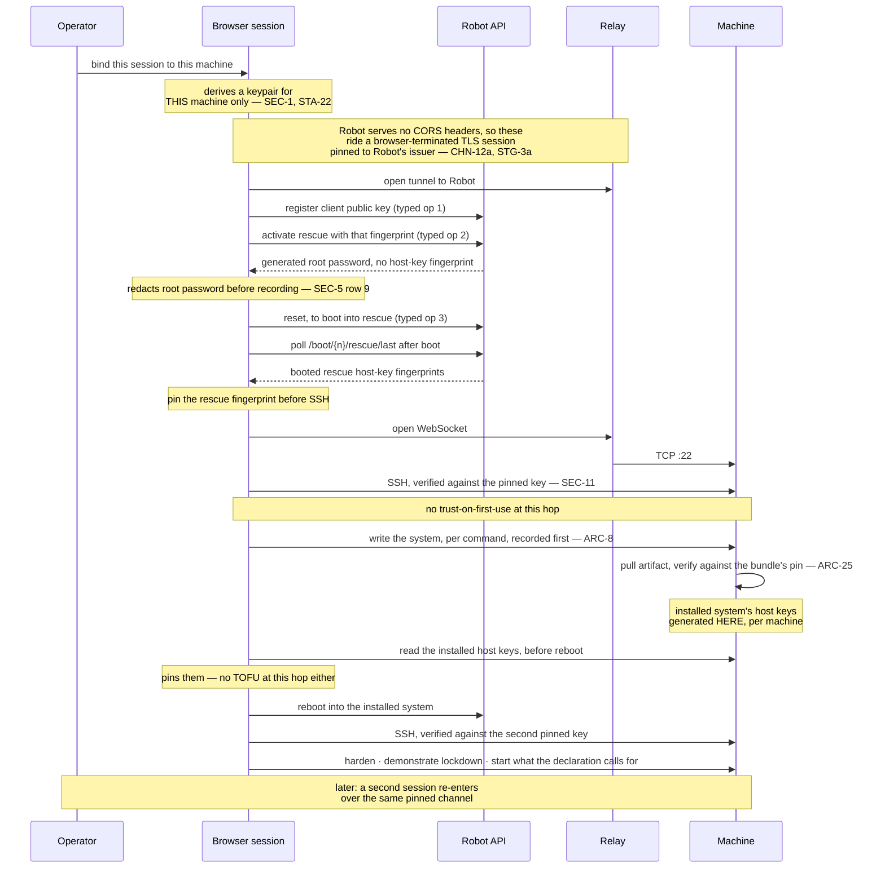

# 06 — The stages, and what the first must demonstrate

## The stages

The work is staged in four, re-drawn on 2026-10-05 around the general case: an operator with a
goal and no tenant
([ADR-0034](./docs/adr/0034-general-case-first-tenants-are-optional-skills.md)).

- **Stage 0 — the probes**, run now and in parallel with construction. The LNVPS probe
  (`OPN-24`): boot-time user-data or host-key exposure, browser reachability, the billing
  minimum, an Arch image. Attest on a real first boot (`OPN-3`). And Omarchy's server edition,
  or plain Arch in its place (`OPN-25`). None of it needs the harness.
- **Stage 1 — the owner's scenario, with no tenant** (`STG-21`).
- **Stage 2 — any vendor** (`STG-22`).
- **Stage 3 — tenants, as skills** (`STG-23`).

Typed comes before untyped for a reason of order, not of preference: an untyped vendor scope
needs the jump host for its machines' first contact (`SEC-4`), and the jump host needs a jump
vendor whose creation the harness composes — a typed adapter — plus attest to pin it
(`CHN-R6`).

**What each identifier below gates.** No identifier was renumbered when the stages were
re-drawn; the ones written for the dedicated path say so here.

| Identifiers | Gate |
|---|---|
| `STG-21`; `STG-5`, `STG-6` where the installation is pinned, `STG-7`, `STG-9`, `STG-10`, `STG-12`, `STG-13`, `STG-14` | Stage 1 |
| `STG-15`, `STG-16`, `STG-17` | Stage 1, as recorded measurements and provenance |
| `STG-1`, `STG-3`, `STG-3a`, `STG-4`, `STG-11`, `STG-20` | The dedicated path — the construction test bed now, and a path offered to an operator no earlier than stage 3 |
| `STG-2` | Nothing further: construction admission, closed 2026-09-08 |
| `STG-18`, `STG-19` | Nothing: they state what a passing stage does not show |
| `STG-22`, `STG-23` | Stages 2 and 3 |

**STG-21 Stage 1 is the owner's scenario: one goal, one machine, no tenant.** "Launch a VPS
paid in Bitcoin and install Hermes on Omarchy." One session works from that goal alone
(`ARC-11a`), under the ad-hoc profile (`ARC-44`). The machine is a VPS at LNVPS, created through
a **typed adapter**, paid for by a Lightning invoice from the operator's own wallet (`ARC-30`),
and first contacted by attest (`CHN-R5`). Hermes is installed on Omarchy — or on Arch, if
`OPN-25` closes that way — as the operator's application (`ARC-1a`). Beyond the channel and the
journal, the stage needs:

- **goal input, and the harness's own questions** for machine class and the declaration
  (`ARC-36a`, `ARC-39`);
- **`place_secret`**, for the application's key (`ARC-43`, `CNF-16`);
- **the unpinned label, or a publisher pin for Arch** (`ARC-25`);
- **delivered against handed over with findings**, and a generic signed lockdown checklist
  (`ARC-17`, `OPN-14`);
- **invoice relay for a machine** (`ARC-29`, `ARC-30`);
- **interrupted resume** (`STG-12`); and
- **one re-entry** (`STG-9`).

**If LNVPS fails its probe**, stage 1 — and no later stage — runs on Hetzner Cloud with attest
and a card account.

**STG-22 Stage 2 is any vendor.** A vendor with no adapter, reached through an untyped vendor
scope on `SEC-4`'s conditions; the jump-host route (`CHN-R6`), with LNVPS as the jump vendor;
bound sets of more than one machine (`SEC-1`); and a second vendor, which is what closes
`OPN-5`.

**STG-23 Stage 3 is tenants, as skills.** lnrent's skill, on the dedicated path. And
btc-policy's vault, with everything it brings: a declared independence bound, sealing, the
coordinator, concurrent sessions and the trust panel. What shape those take is `OPN-27`.

## The construction test bed: one machine on a dedicated server

**STG-1** The construction test bed is **one machine on a dedicated server, over the full
channel**: rescue, a pinned host key at both hops, an install through the box plane, one
re-entry. It is where construction exercises the channel, the pinning chain, the box plane and
the transcript before any stage's vendor is ready, and its rehearsal evidence and brief 1
stand. It gates no stage by itself; it gates offering a dedicated-server path to an operator.

*What this requirement used to say* was that the first stage provisions one lnrent box on a
dedicated server — one session, one machine, one real tenant
([ADR-0018](./docs/adr/0018-first-stage-is-one-lnrent-box-on-dedicated.md), superseded by
[ADR-0034](./docs/adr/0034-general-case-first-tenants-are-optional-skills.md)). The
first stage is now `STG-21`'s. Neither the tenant's daemon, nor brief 3, nor lnrent's
declaration gates it.

**Dedicated came first because it was the only place the identity chain closed.** On Cloud
there was no way to obtain a host key without trusting first contact — `CHN-R2` is dead,
`CHN-R3` is abandoned, `CHN-R5` is unproven. On dedicated it closes at both hops. The corollary
is that Robot offers no boot-time user-data at all, so nothing can be done to the machine
except through the channel: a cost the test bed accepts, not a benefit it seeks. What changed
is not that argument but what is refused: a first contact with no pin is no longer a route of
last resort (`CHN-R4`), so the cloud path's own route has to run before anything ships there,
and stage 0 is where it does.

**STG-2 Construction gates on the installation and identity-chain rehearsal, once, first.** Activate rescue on a
disposable dedicated server; read what `host_key` actually returns; read what the automatic
Linux install operation returns in the same sitting; rehearse the ceremony end to end; then
write the briefs from the captured install transcript. "By hand" means no harness code:
`curl` against Robot and `ssh` from a workstation, scripted only so that every value is
captured once and no credential is typed twice (`prototypes/first-stage-rehearsal/`).

**Run 2026-09-08** (`docs/findings/2026-09-08-first-stage-rehearsal.md`). The three briefs
the dedicated path was planned around are: **(1) install** — from a pinned rescue session to an installed,
reachable system whose host keys the harness already holds; **(2) lock-down** — harden and
demonstrate against the tenant's delivery declaration (`ARC-39`, `ARC-17`); **(3) the
tenant's daemon** — installed and started to the tenant's declared lifecycle, authored from
the tenant's declaration rather than by this project (a brief keyed on the tenant's software
is the tenant's, ADR-0030; the publisher still signs it, `ARC-40`). Rescue activation and the
host-key pin are **not** brief content: they are the harness's typed ceremony (`CHN-R1`,
`STG-4`), deterministic by design, and no improvising model owns the identity chain. Only
brief 1 has evidence today and is written
([`docs/briefs/01-install.md`](./docs/briefs/01-install.md)); briefs 2 and 3 wait on a
lock-down checklist (`OPN-14`) and a delivery declaration that do not yet exist, and they gate
stage 3, not stage 1.

The reason is that the two risks are wildly mismatched, and research has widened the gap
rather than narrowed it. The SSH client is no longer a bet: a deployed Rust implementation
exists on the same target, with the same UI and build stack this design specifies, and its
configuration is published
([ADR-0024](./docs/adr/0024-the-ssh-client-is-rust-following-a-known-good-configuration.md)).
The unknown was Robot's rescue response (`OPN-6`); the September 8 rehearsal closed it.
Harness construction can now start. Completing stage 1 requires what `STG-21` lists and the
integrated acceptance checks in `07-conformance.md`. A successful installation rehearsal is not
completion of any stage.

## Why the install runs from inside rescue

**STG-3** Two reasons, both load-bearing, and neither was previously recorded:

1. **The rescue endpoint is what publishes the host key** — precisely, `/boot/{n}/rescue/last`
   publishes the booted rescue system's fingerprints about 80 s after the reset (`CHN-R1`,
   run 2026-09-08). It is the only route on any product today that pins out of band without
   putting a private key in user-data.
2. **The chosen distributions are not on offer.** Robot's automatic Linux installation takes a
   fixed catalog, and neither Alpine nor NixOS is in it (`ARC-24`). Custom image installation
   is therefore mandatory on this path rather than the optimisation ADR-0011 calls it.

Either reason alone would justify rescue. Together they close the question of whether a
single typed install operation could replace the whole flow: it could not, because it cannot
install what this design runs.

## The sequence

```mermaid
sequenceDiagram
    participant OP as Operator
    participant B as Browser session
    participant RB as Robot API
    participant RL as Relay
    participant M as Machine

    OP->>B: bind this session to this machine
    Note over B: derives a keypair for<br/>THIS machine only — SEC-1, STA-22
    Note over B,RL: Robot serves no CORS headers, so these<br/>ride a browser-terminated TLS session<br/>pinned to Robot's issuer — CHN-12a, STG-3a
    B->>RL: open tunnel to Robot
    B->>RB: register client public key (typed op 1)
    B->>RB: activate rescue with that fingerprint (typed op 2)
    RB-->>B: generated root password, no host-key fingerprint
    Note over B: redacts root password before recording — SEC-5 row 9
    B->>RB: reset, to boot into rescue (typed op 3)
    B->>RB: poll /boot/{n}/rescue/last after boot
    RB-->>B: booted rescue host-key fingerprints
    Note over B: pin the rescue fingerprint before SSH
    B->>RL: open WebSocket
    RL->>M: TCP :22
    B->>M: SSH, verified against the pinned key — SEC-11
    Note over B,M: no trust-on-first-use at this hop
    B->>M: write the system, per command, recorded first — ARC-8
    M->>M: pull artifact, verify against the bundle's pin — ARC-25
    Note over M: installed system's host keys<br/>generated HERE, per machine
    B->>M: read the installed host keys, before reboot
    Note over B: pins them — no TOFU at this hop either
    B->>RB: reboot into the installed system
    B->>M: SSH, verified against the second pinned key
    B->>M: harden · demonstrate lockdown · start what the declaration calls for
    Note over OP,M: later: a second session re-enters<br/>over the same pinned channel
```

## Acceptance

The identifiers in this section were written for the dedicated path. The table under *The
stages* says which of them gate stage 1.

**STG-3a Every Robot call rides the tunnel, not `fetch`.** Robot serves no CORS
headers at all, so no browser origin can read its responses (`CHN-R1`, verified 2026-08-31).
The typed adapter therefore opens a TLS session inside the browser, pinned to Robot's issuing
authority, and carries it over the relay as ciphertext (`CHN-12a`). The relay learns a
destination and nothing else, and no trusted party is added.

This is a prerequisite the stage did not previously have; it gated as `OPN-21` until the spike
of 2026-09-07 closed it, and `CNF-62` carries it for the real build.

**STG-4** The session registers its SSH client public key with Robot as a **typed
operation** — Robot's `authorized_key` field takes fingerprints of keys already registered
there, not raw keys — then activates rescue the same way, passing that fingerprint, and
triggers the reboot the same way, since activation only configures the next boot and the
reset call is its own typed operation. It then polls `/boot/{n}/rescue/last` until the booted
rescue's host-key fingerprints appear — the activation response itself publishes none — and
connects with **no trust-on-first-use at either hop**: the rescue key is pinned from the
API, and the installed system's host keys are generated inside the rescue session, per
machine, and read before reboot. **Run 2026-09-08, both hops, on a disposable auction
server** (`docs/findings/2026-09-08-first-stage-rehearsal.md`). The activation response also
carries a generated **root password**; it is never used on this route, and it is **redacted
before the response is recorded or reaches a model**.

**Every Robot mutation journals intent before it is sent (`STA-4`) and is confirmed by
observable state, never by its own response and never by a clock.** `POST /reset` returns
`running` immediately and carries no request identity, and `/rescue/last`'s `boot_time` is
zone-less local time, so neither can be compared to the browser's intent. The predicates are:

- **Activation** is confirmed when `GET /boot/{n}/rescue` reports `active: true` **and** its
  `authorized_key` echoes exactly the fingerprint of the machine's registered client key and the requested OS.
  Active with another key is a stale activation, not this one.
- **The reset into rescue** is confirmed when `/rescue/last` shows a host-key set **different
  from the one journaled before the reset** — every rescue boot has fresh keys (`CHN-R1`).
- **The reset into the installed system** is confirmed when sshd answers with the installed
  pin.
- **Key registration** is confirmed when the account's key listing carries the machine's client
  key under the fingerprint the intent recorded. Its resource is the machine's approved entry
  (`STA-24`), and an unresolved registration blocks the activation that would name the
  fingerprint.

**None of these has a negative form.** A rescue sshd still answering after the reset call shows
the reset has not landed, not that it will not; `/rescue/last` unchanged means the same. "It
did not happen" is therefore always the operator's disposition (`STA-24`) and never evidence,
and whether a Robot reset can be delayed or dropped is not known: the rehearsal's three cycles
at about eighty seconds are the only data.

Anything not confirmed stays unresolved under `STA-8` and the operator decides; the adapter is
reconcile-before-retry (`STA-5`), and a second request for the same mutation under a new call
id is refused while the first is unresolved (`STA-24`). `STG-11` is the test, and `CNF-38` lists its cases. The host
keys are read and the pins journaled by the harness's own `ready_to_reset` job before the
reset is offered (`ARC-43`). The order above — each mutation dispatched once its predecessor is
confirmed, and the box-plane work only after the reset is — is `TauWeb.Dispatch.ceremony_trace`
(ADR-0032), decided.

**STG-5** The system is installed and hardened entirely through box-plane work over the
pinned channel, **command by command**, each recorded before transmission (`ARC-8`), and the
transcript matches what was sent.

**STG-6** The artifact the install pulls is **verified against a value supplied by the browser
from the signed bundle** (`ARC-25`), and a mismatch halts the install. The URL pinned is the
immutable versioned one, never a moving alias. The download and the comparison are the
harness's `fetch_artifact` job (`ARC-43`); the model requests it and never reports a hash.

**The stage MUST record the distribution and both layers of artifact admission** (`ARC-25a`):
the bootstrap URL/hash and the package/cache signing keys and repository policy. On Alpine,
record the repository branch, index digests and installed versions; on NixOS, record the
source revision and cache keys. Neither path may report the bootstrap hash as covering the
complete installed system. Reject untrusted package signatures before delivery (`CNF-67`). An
unpinned installation records that it is unpinned, and names neither layer (`ARC-25`).

**STG-7** The machine ends **delivered**: locked down and demonstrated, the deliverable of
`ARC-17`, with the software its declaration calls for running. In stage 1 that is the
operator's application; a tenant's daemon is stage 3's.

*`STG-8` retired.* It required a real tenant outcome — a published listing and a delivered
order — or a written statement of why not. Both halves were wrong. The first tested **lnrent**
rather than tau-web, which is the boundary ADR-0016 exists to draw. The second was an opt-out,
making it the only criterion here an essay could satisfy. What the harness owes is covered by
`STG-7` against `ARC-17`, and that a declaration exists at all is `CNF-49`. Identifiers are not
positional, so nothing renumbers.

**STG-9** The machine is **maintained**, and the story is exercised: at least one later
session re-enters over the same pinned channel and re-runs the check.

**STG-10** No credential — the vendor credential, a vendor-generated root password in a typed
adapter's response, the session inference key, the SSH client private key, the relay key, or a
placed application secret — appears in a request to the app origin, in
any model request body, or in any log; and none appears in origin-private storage, local
storage, or service-worker caches outside the encrypted-at-rest store `SEC-5` names.
Cleartext nowhere. The local store unlocks and locks under `STA-23`; killing the worker
requires a new unlock and replay, never a plaintext fallback.

**STG-11** A rescue activation or its reset, interrupted between intent and confirmation,
then resumed, results in exactly one rescue session and one install.

**STG-12** An install interrupted mid-run — by a phone lock, a killed worker, a dropped session
— and resumed, a brief re-run from the top included, **converges** rather than duplicating
(`ARC-10`). This is the
predicate most likely to fail under tab suspension — Android's, which is tested, and iOS's,
which would be harsher if it were — and the one the by-hand rehearsal should be designed to
stress.

**STG-13** A channel access that does not present the bound machine's own keypair — however
well-formed the attempt — is **refused, by SSH**. With one machine, nothing exercises the
access rule by accident: this predicate shows the refusal is enforced by mechanism rather
than satisfied by scarcity, and it is distinguishable from `STG-9`'s re-entry precisely
because binding is the operator's act, not the connection's.

**STG-14** All of the above pass on a physical Android Chrome, through a normal HTTPS URL,
with no install. iOS Safari is not a test target (`OVR-1`).

## Measurements, required but not pass/fail

**STG-15** Peak memory of one session during a full install, on Android Chrome, with
the five-session projection stated against that platform's tab budget. The concurrency
decision (`ARC-13`) rests on five sessions sharing a phone, chosen against an acknowledged
high memory risk, and no number has ever been taken. One session is what this stage runs,
which makes it the only cheap opportunity to learn whether five is possible.

**STG-16** Wall-clock duration of a full install over the channel, and the transcript size it
produces. *Measured by hand 2026-09-08, not yet over the channel:* rescue activation to a
pinned login on the installed Alpine in **4 min 34 s** when nothing goes wrong (reset →
rescue pin 82 s; install 60 s; reset → installed sshd 69 s), transcript 16.9 KB. The
rehearsal itself took 2 h 27 min, because a machine that does not boot is invisible over the
network and the recipe was wrong four times; see `STG-20`.

## Provenance in the first stage

**STG-17** Provenance is still recorded — vendor, model, requested provider, surviving reload
and restart — and the per-layer counts are still shown per `SEC-9`. On the procured path the
model recorded is the candidate `ARC-31b`'s session-start selection took, never the first slug
of the order. All three read one: one set of weights, one proxy on the procured path, one
requested provider, and no proxy entry at all under local inference. The provider column
carries its *requested* label even at one machine, because a first stage that shows the label
correctly is worth more than one that shows a number nothing produced. The smaller claim,
stated as numbers.

What waits is comparison: with one machine there is no collision to display, so the collision
display and the operable panel arrive with the tenant that needs them. And
`bundle/inference.toml` carries a candidate order (`ARC-31b`) ordered for availability and not
for strength, so `ARC-16`'s middle rung has no stronger model to escalate to. `ARC-16` says
"then escalate to a stronger model behind the same proxy", and the harness **MUST NOT** use the
candidate order as that rung: the first stage offers rungs one and three only, and says so. An
availability fallback on a successor session is new weights on that machine and stays inside
`SEC-1` like any other configured model — `SEC-1` says "A model that has touched a machine
counts as touching it until that machine is destroyed".

## What the first stage does not test

**STG-18** Stated because a passing stage would otherwise read as a working product.

- **Acquisition beyond one invoice.** Stage 1 buys one machine by one invoice at one
  account-free vendor. It tests no account, no card, and no second vendor (`OPN-5`); on the
  dedicated test bed the server is already rented.
- **Relay enrolment.** The operator's relay **public** key, derived from the seed (`CHN-15`),
  is handed to the publisher out of band and recorded by hand. Nothing secret crosses and
  nothing is pasted into the app. The publisher configures the allowed public destinations
  and connection/probe limits (paid-tcp-relay `PAS-6`, its `bundle/timing.toml`); fresh
  challenge authentication, destination restriction and private-address refusal still apply
  (`CNF-81`, `CNF-87`). There is no purchase flow or tested reacquisition story;
  that is `OPN-2`.
- **Inference funding.** Assumed already funded.
- **Any vendor but one, and any set but one machine.** Untyped vendor scopes, the jump host and
  bound sets above one are stage 2's (`STG-22`); tenants are stage 3's (`STG-23`).
- **The general tunnel.** Only the **pinned** kind is built (`CHN-12a`), for a vendor known at
  build time. Reaching an arbitrary CORS-refusing service needs `CHN-12b`'s certificate-authority
  store, which `OPN-20` still prices and this stage does not touch.
- **A phone-only non-technical operator getting started at all.** A developer can pass every
  predicate above while the target operator still cannot begin. That gap is the product
  thesis, and nothing in this stage measures it.

**STG-19 "If the maximal path works, the rest is subsetting" is too strong.** The dedicated
test bed demonstrates the channel, the pinning chain, the box plane, the transcript and one
re-entry. It demonstrates **none** of: attestation (`CHN-R5`), boot-time user-data,
recovery-sheet handling, second-vendor reachability, concurrent sessions, federation formation,
or threshold isolation. Those are orthogonal systems, not subsets of it: stage 1 walks the
first three on its own evidence, and the rest arrive with stages 2 and 3. The honest claim is
that the test bed de-risks the channel, which is the item everything else waits on.

**STG-20 A machine that does not come back is reinstalled, not diagnosed.** A dedicated server
that fails to boot after the install is **invisible over the network**: the vendor API reports
`running`, nothing answers, and no log can be read. The rehearsal of 2026-09-08 hit this five
resets in a row, for four different reasons, and none was findable from the browser. So the
harness's response is `ARC-16`'s bottom rung applied to this path: if the installed system
does not answer on the channel within `installed.wait_max` (`bundle/timing.toml`) of the
reset that should have booted it, the session declares the install failed, tells
the operator, and **offers a return to rescue and reinstallation from the brief** — the same
ceremony, and cheap (about five minutes when it works). **Each readiness probe is the pinned
SSH attempt itself**, every `installed.probe_interval`: a TCP refusal or timeout means sshd is
not listening yet and the wait continues; anything sshd says — success, or a pin halt — ends
the wait one way or the other. A bare connect-and-close probe is never used, because it
accrues OpenSSH's per-source penalty (`ARC-41`) and the harness would read its own lockout
as an unbootable machine.
Unreachability is not proof of boot failure: a relay or network outage can look the same.
The timeout does not clear an unresolved action or authorize a wipe. The operator must choose
the destructive reinstall, with the selected disks shown; normal typed approvals and journal
ordering apply. Resume first follows `STA-20b`. The harness does not reach for the vendor's console.

That console exists — Hetzner's vKVM rescue boots the installed disk inside a virtual machine
with a screen — and it is **the operator's own tool, by hand, outside the harness**, for a
brief that is wrong in a way reinstalling will not fix. It is password-only (the rescue
activation's `password`, `SEC-5` row 9, which the harness therefore still never uses), it
sits behind a self-signed certificate that no pin can vouch for, and its virtual machine
boots UEFI regardless of what the board does. A brief for this path encodes what the
rehearsal learned instead: a bootloader on every selected installation disk, the distribution's own kernel
arguments for its initramfs, both BIOS and EFI loaders, the distribution's full boot-time
service set, and disk identifiers taken from the environment the command runs in. Each of
those was a silent failure once. And a brief distinguishes **resuming** an interrupted
install (`ARC-10`, `STG-12`: inspect what is there and continue) from this rung's
**reinstall**, which wipes: the rehearsal's recipe only knew how to wipe.

## After the first stage

`STG-22` and `STG-23` say what stages 2 and 3 bring. Both reuse the channel, the journal and
the delivery check that stage 1 proves; neither is a subset of it.
